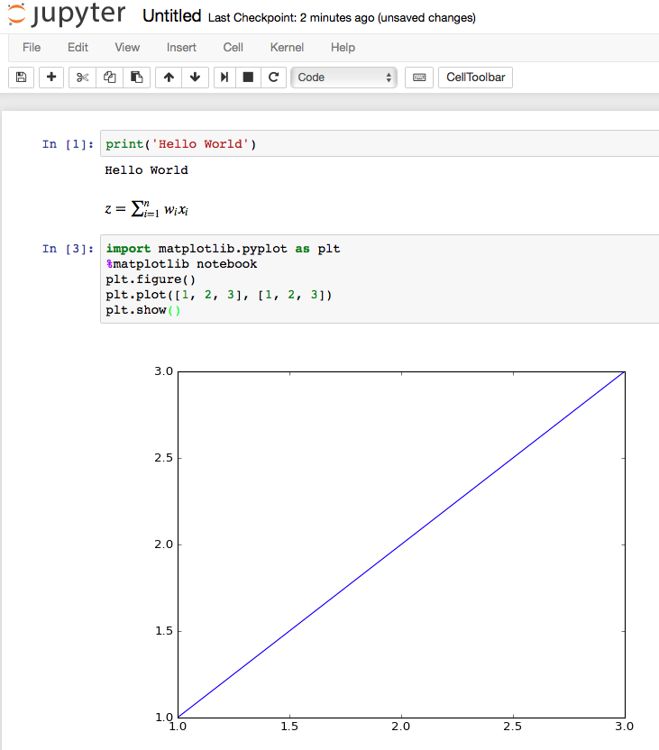

# Python Machine Learning Notebooks

[](#)
[](LICENSE.txt)

## Setting up Development Environment

This repository uses Docker container with all the required packages and libraries to run the code and jupyter notebooks. You can use the provided Dockerfile to build the image and run the container. The Dockerfile is provided in the root of the repository.

### Build and run Provided Docker File

- install Docker on your machine
- see [Docker Installation](https://docs.docker.com/get-docker/)

```bash
   bash run.sh # run interactive container/Terminal
   bash run-jupyter.sh # run jupyter notebook server
```

### Installing Python Packages

This notebook and the original book is written for Python version `>= 3.7.0`, and it is recommended
you use the most recent version of Python 3 and the machine learning packages and libraries that are currently available.

- update the requirements.txt file to include the required packages


## Anaconda/Miniconda

The Anaconda installer can be downloaded at [https://docs.anaconda.com/anaconda/install/](https://docs.anaconda.com/anaconda/install/), and an Anaconda quick start-guide is available at [https://docs.anaconda.com/anaconda/user-guide/getting-started/](https://docs.anaconda.com/anaconda/user-guide/getting-started/).

After successfully installing Anaconda/Miniconda, we can create virtual environment with a particular version of Python and install new Python packages in that environment using the following commands:

```bash
    conda update conda
    conda env list # list current environments
    conda env remove -n <environment_name> # remove existing environment
```

### Use yaml file to create env and install packages

- ml.yml file is provided with the repository
- this automates the createtion of new environemnt and installation of dependent packages
- if needed, change prefix to the right path where you want the environment and packages to install
- the provided file expects you've **miniconda** in your home folder, e.g., /Users/rbasnet/miniconda

```bash
    conda env create -f ml.yml
```

## Manually create env and install packages

```bash
    conda create -n ml python=3.10 # create new ml environment
    conda env list # list all the avialable virtual environments
    conda activate ml #activate ml environment
    conda install <SomePackage> #install packages
    conda deactivate # exit out the current environment
```

### Update Existing Packages

#### NOTE: Must always activate ml virtual enviornment to install and run ML-related libraries

```bash
    conda activate ml
    conda update <SomePackage>
    conda deactivate
```

Throughout this book, we will mainly use NumPy's multi-dimensional arrays to store and manipulate data. Occasionally, we will make use of pandas, which is a library built on top of NumPy that provides additional higher level data manipulation tools that make working with tabular data even more convenient. To augment our learning experience and visualize quantitative data, which is often extremely useful to intuitively make sense of it, we will use the very customizable matplotlib library.

### Manually Install Core Packages

The version numbers of the major Python packages that were used for writing this book are listed below. Please make sure that the version numbers of your installed packages are equal to, or greater than, those version numbers to ensure the code examples run correctly:

- [NumPy](http://www.numpy.org) >= 1.17.4
- [SciPy](http://www.scipy.org) >= 1.3.1
- [scikit-learn](http://scikit-learn.org/stable/) >= 0.22.0
- [matplotlib](http://matplotlib.org) >= 3.1.0
- [pandas](http://pandas.pydata.org) >= 0.25.3
- you can use python_environment_check.py file to check if correct version of required packages are installed

```bash
    conda activate ml
    conda install numpy
    conda install scipy
    conda install scikit-learn
    conda install matplotlib
    conda install pandas
```

### Jupyter Notebook

Jupyter notebooks allow us to have everything in one place: Our code, the results from executing the code, plots of our data, and documentation that supports the handy Markdown and powerful LaTeX syntax!
Notebooks are provided in **notebooks** folder. You can run the notebooks using Jupyter Notebook server.



We can use the **conda** command if we have Anaconda or Miniconda installed:

```bash
    conda activate ml
    conda install jupyter notebook
    conda install -c conda-forge retrolab
```

### Cloning and Using this Repository

- on Windows use, [Git Bash](https://git-scm.com/downloads)
- using terminal to clone this repository
- to open a Jupyter notebook, we `cd` to the directory that contains your notebooks, e.g,.

```bash
    cd ~/Python-Machine-Learning
    bash run-jupyter.sh
```

Jupyter will start in our default browser (typically running at [http://localhost:8888/](http://localhost:8888/)). Browse into the notebooks folder and simply select the notebook you wish to open from the Jupyter menu.

- use the Table of Contents to navigate through the notebooks


For more information about the Jupyter notebook, I recommend the [Jupyter Beginner Guide](http://jupyter-notebook-beginner-guide.readthedocs.org/en/latest/what_is_jupyter.html) and [Jupyter Notebook Basics](https://jupyter-notebook.readthedocs.io/en/stable/examples/Notebook/Notebook%20Basics.html).
