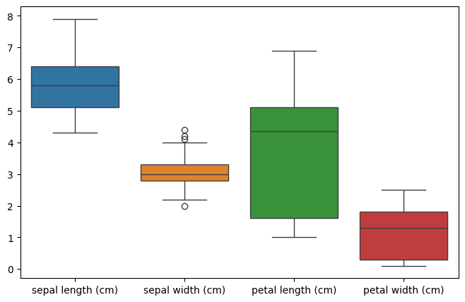
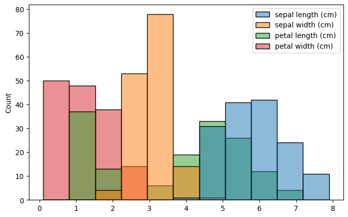
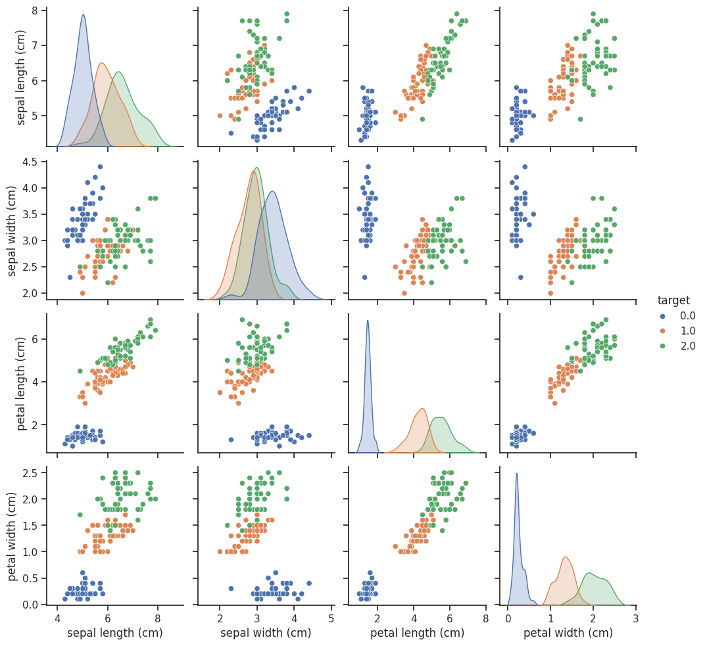
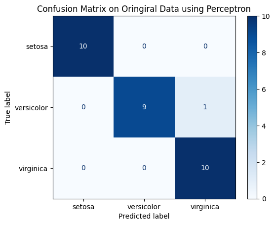
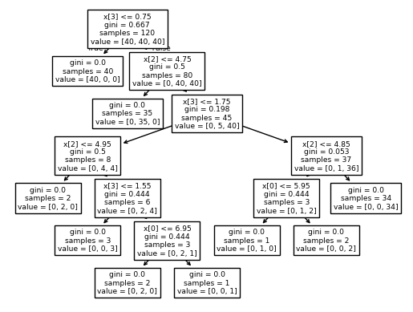
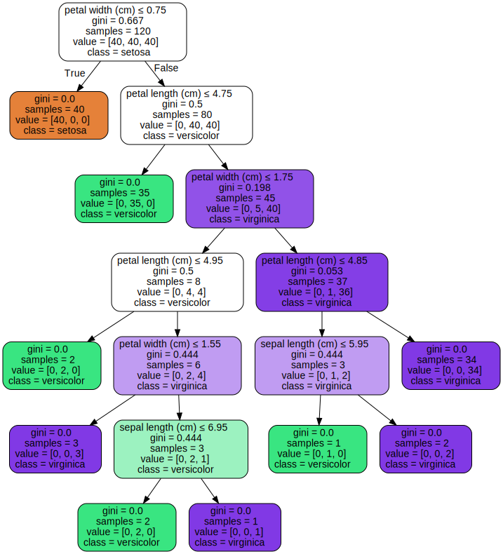
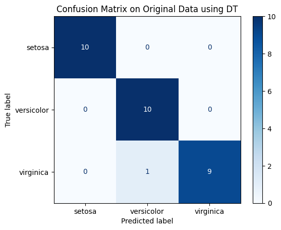

# Machine Learning Classifiers using Scikit-Learn

## Scikit-Learn

- scikit-learn library provides varietes of classification, regression and clustering algorithms
- provides user-friendly and consistent interface for using those algorithms efficiently and productively
- popular in academia as well as in industry
- for more info see [https://scikit-learn.org/](https://scikit-learn.org/stable/)

## Machine Learning Steps

- recall from introduction:


- the following are the typical steps:
    1. Load data
    2. Analyze data
    3. Visualize data
    4. Split data into train-test set
    5. Train and test a handful of models
    6. Select the best model
    7. Deploy the model
    
- next we'll dive into each step

## Load data

- loading the Iris dataset from scikit-learn
- the third column represents the petal length, and the fourth column the petal width of the flower examples
- the classes are already converted to integer labels where:
    - 0=Iris-Setosa, 1=Iris-Versicolor, 2=Iris-Virginica
- [https://archive.ics.uci.edu/ml/datasets/iris](https://archive.ics.uci.edu/ml/datasets/iris)
- `sklearn.datasets.load_iris` API - https://scikit-learn.org/stable/modules/generated/sklearn.datasets.load_iris.html#sklearn.datasets.load_iris


```python
from sklearn import datasets
import numpy as np
import matplotlib.pyplot as plt
import pandas as pd
import seaborn as sns
```


```python
from IPython.display import Image
%matplotlib inline
```


```python
iris = datasets.load_iris()
```


```python
iris
```


    {'data': array([[5.1, 3.5, 1.4, 0.2],
            [4.9, 3. , 1.4, 0.2],
            [4.7, 3.2, 1.3, 0.2],
            [4.6, 3.1, 1.5, 0.2],
            [5. , 3.6, 1.4, 0.2],
            [5.4, 3.9, 1.7, 0.4],
            [4.6, 3.4, 1.4, 0.3],
            [5. , 3.4, 1.5, 0.2],
            [4.4, 2.9, 1.4, 0.2],
            [4.9, 3.1, 1.5, 0.1],
            [5.4, 3.7, 1.5, 0.2],
            [4.8, 3.4, 1.6, 0.2],
            [4.8, 3. , 1.4, 0.1],
            [4.3, 3. , 1.1, 0.1],
            [5.8, 4. , 1.2, 0.2],
            [5.7, 4.4, 1.5, 0.4],
            [5.4, 3.9, 1.3, 0.4],
            [5.1, 3.5, 1.4, 0.3],
            [5.7, 3.8, 1.7, 0.3],
            [5.1, 3.8, 1.5, 0.3],
            [5.4, 3.4, 1.7, 0.2],
            [5.1, 3.7, 1.5, 0.4],
            [4.6, 3.6, 1. , 0.2],
            [5.1, 3.3, 1.7, 0.5],
            [4.8, 3.4, 1.9, 0.2],
            [5. , 3. , 1.6, 0.2],
            [5. , 3.4, 1.6, 0.4],
            [5.2, 3.5, 1.5, 0.2],
            [5.2, 3.4, 1.4, 0.2],
            [4.7, 3.2, 1.6, 0.2],
            [4.8, 3.1, 1.6, 0.2],
            [5.4, 3.4, 1.5, 0.4],
            [5.2, 4.1, 1.5, 0.1],
            [5.5, 4.2, 1.4, 0.2],
            [4.9, 3.1, 1.5, 0.2],
            [5. , 3.2, 1.2, 0.2],
            [5.5, 3.5, 1.3, 0.2],
            [4.9, 3.6, 1.4, 0.1],
            [4.4, 3. , 1.3, 0.2],
            [5.1, 3.4, 1.5, 0.2],
            [5. , 3.5, 1.3, 0.3],
            [4.5, 2.3, 1.3, 0.3],
            [4.4, 3.2, 1.3, 0.2],
            [5. , 3.5, 1.6, 0.6],
            [5.1, 3.8, 1.9, 0.4],
            [4.8, 3. , 1.4, 0.3],
            [5.1, 3.8, 1.6, 0.2],
            [4.6, 3.2, 1.4, 0.2],
            [5.3, 3.7, 1.5, 0.2],
            [5. , 3.3, 1.4, 0.2],
            [7. , 3.2, 4.7, 1.4],
            [6.4, 3.2, 4.5, 1.5],
            [6.9, 3.1, 4.9, 1.5],
            [5.5, 2.3, 4. , 1.3],
            [6.5, 2.8, 4.6, 1.5],
            [5.7, 2.8, 4.5, 1.3],
            [6.3, 3.3, 4.7, 1.6],
            [4.9, 2.4, 3.3, 1. ],
            [6.6, 2.9, 4.6, 1.3],
            [5.2, 2.7, 3.9, 1.4],
            [5. , 2. , 3.5, 1. ],
            [5.9, 3. , 4.2, 1.5],
            [6. , 2.2, 4. , 1. ],
            [6.1, 2.9, 4.7, 1.4],
            [5.6, 2.9, 3.6, 1.3],
            [6.7, 3.1, 4.4, 1.4],
            [5.6, 3. , 4.5, 1.5],
            [5.8, 2.7, 4.1, 1. ],
            [6.2, 2.2, 4.5, 1.5],
            [5.6, 2.5, 3.9, 1.1],
            [5.9, 3.2, 4.8, 1.8],
            [6.1, 2.8, 4. , 1.3],
            [6.3, 2.5, 4.9, 1.5],
            [6.1, 2.8, 4.7, 1.2],
            [6.4, 2.9, 4.3, 1.3],
            [6.6, 3. , 4.4, 1.4],
            [6.8, 2.8, 4.8, 1.4],
            [6.7, 3. , 5. , 1.7],
            [6. , 2.9, 4.5, 1.5],
            [5.7, 2.6, 3.5, 1. ],
            [5.5, 2.4, 3.8, 1.1],
            [5.5, 2.4, 3.7, 1. ],
            [5.8, 2.7, 3.9, 1.2],
            [6. , 2.7, 5.1, 1.6],
            [5.4, 3. , 4.5, 1.5],
            [6. , 3.4, 4.5, 1.6],
            [6.7, 3.1, 4.7, 1.5],
            [6.3, 2.3, 4.4, 1.3],
            [5.6, 3. , 4.1, 1.3],
            [5.5, 2.5, 4. , 1.3],
            [5.5, 2.6, 4.4, 1.2],
            [6.1, 3. , 4.6, 1.4],
            [5.8, 2.6, 4. , 1.2],
            [5. , 2.3, 3.3, 1. ],
            [5.6, 2.7, 4.2, 1.3],
            [5.7, 3. , 4.2, 1.2],
            [5.7, 2.9, 4.2, 1.3],
            [6.2, 2.9, 4.3, 1.3],
            [5.1, 2.5, 3. , 1.1],
            [5.7, 2.8, 4.1, 1.3],
            [6.3, 3.3, 6. , 2.5],
            [5.8, 2.7, 5.1, 1.9],
            [7.1, 3. , 5.9, 2.1],
            [6.3, 2.9, 5.6, 1.8],
            [6.5, 3. , 5.8, 2.2],
            [7.6, 3. , 6.6, 2.1],
            [4.9, 2.5, 4.5, 1.7],
            [7.3, 2.9, 6.3, 1.8],
            [6.7, 2.5, 5.8, 1.8],
            [7.2, 3.6, 6.1, 2.5],
            [6.5, 3.2, 5.1, 2. ],
            [6.4, 2.7, 5.3, 1.9],
            [6.8, 3. , 5.5, 2.1],
            [5.7, 2.5, 5. , 2. ],
            [5.8, 2.8, 5.1, 2.4],
            [6.4, 3.2, 5.3, 2.3],
            [6.5, 3. , 5.5, 1.8],
            [7.7, 3.8, 6.7, 2.2],
            [7.7, 2.6, 6.9, 2.3],
            [6. , 2.2, 5. , 1.5],
            [6.9, 3.2, 5.7, 2.3],
            [5.6, 2.8, 4.9, 2. ],
            [7.7, 2.8, 6.7, 2. ],
            [6.3, 2.7, 4.9, 1.8],
            [6.7, 3.3, 5.7, 2.1],
            [7.2, 3.2, 6. , 1.8],
            [6.2, 2.8, 4.8, 1.8],
            [6.1, 3. , 4.9, 1.8],
            [6.4, 2.8, 5.6, 2.1],
            [7.2, 3. , 5.8, 1.6],
            [7.4, 2.8, 6.1, 1.9],
            [7.9, 3.8, 6.4, 2. ],
            [6.4, 2.8, 5.6, 2.2],
            [6.3, 2.8, 5.1, 1.5],
            [6.1, 2.6, 5.6, 1.4],
            [7.7, 3. , 6.1, 2.3],
            [6.3, 3.4, 5.6, 2.4],
            [6.4, 3.1, 5.5, 1.8],
            [6. , 3. , 4.8, 1.8],
            [6.9, 3.1, 5.4, 2.1],
            [6.7, 3.1, 5.6, 2.4],
            [6.9, 3.1, 5.1, 2.3],
            [5.8, 2.7, 5.1, 1.9],
            [6.8, 3.2, 5.9, 2.3],
            [6.7, 3.3, 5.7, 2.5],
            [6.7, 3. , 5.2, 2.3],
            [6.3, 2.5, 5. , 1.9],
            [6.5, 3. , 5.2, 2. ],
            [6.2, 3.4, 5.4, 2.3],
            [5.9, 3. , 5.1, 1.8]]),
     'target': array([0, 0, 0, 0, 0, 0, 0, 0, 0, 0, 0, 0, 0, 0, 0, 0, 0, 0, 0, 0, 0, 0,
            0, 0, 0, 0, 0, 0, 0, 0, 0, 0, 0, 0, 0, 0, 0, 0, 0, 0, 0, 0, 0, 0,
            0, 0, 0, 0, 0, 0, 1, 1, 1, 1, 1, 1, 1, 1, 1, 1, 1, 1, 1, 1, 1, 1,
            1, 1, 1, 1, 1, 1, 1, 1, 1, 1, 1, 1, 1, 1, 1, 1, 1, 1, 1, 1, 1, 1,
            1, 1, 1, 1, 1, 1, 1, 1, 1, 1, 1, 1, 2, 2, 2, 2, 2, 2, 2, 2, 2, 2,
            2, 2, 2, 2, 2, 2, 2, 2, 2, 2, 2, 2, 2, 2, 2, 2, 2, 2, 2, 2, 2, 2,
            2, 2, 2, 2, 2, 2, 2, 2, 2, 2, 2, 2, 2, 2, 2, 2, 2, 2]),
     'frame': None,
     'target_names': array(['setosa', 'versicolor', 'virginica'], dtype='<U10'),
     'DESCR': '.. _iris_dataset:\n\nIris plants dataset\n--------------------\n\n**Data Set Characteristics:**\n\n:Number of Instances: 150 (50 in each of three classes)\n:Number of Attributes: 4 numeric, predictive attributes and the class\n:Attribute Information:\n    - sepal length in cm\n    - sepal width in cm\n    - petal length in cm\n    - petal width in cm\n    - class:\n            - Iris-Setosa\n            - Iris-Versicolour\n            - Iris-Virginica\n\n:Summary Statistics:\n\n============== ==== ==== ======= ===== ====================\n                Min  Max   Mean    SD   Class Correlation\n============== ==== ==== ======= ===== ====================\nsepal length:   4.3  7.9   5.84   0.83    0.7826\nsepal width:    2.0  4.4   3.05   0.43   -0.4194\npetal length:   1.0  6.9   3.76   1.76    0.9490  (high!)\npetal width:    0.1  2.5   1.20   0.76    0.9565  (high!)\n============== ==== ==== ======= ===== ====================\n\n:Missing Attribute Values: None\n:Class Distribution: 33.3% for each of 3 classes.\n:Creator: R.A. Fisher\n:Donor: Michael Marshall (MARSHALL%PLU@io.arc.nasa.gov)\n:Date: July, 1988\n\nThe famous Iris database, first used by Sir R.A. Fisher. The dataset is taken\nfrom Fisher\'s paper. Note that it\'s the same as in R, but not as in the UCI\nMachine Learning Repository, which has two wrong data points.\n\nThis is perhaps the best known database to be found in the\npattern recognition literature.  Fisher\'s paper is a classic in the field and\nis referenced frequently to this day.  (See Duda & Hart, for example.)  The\ndata set contains 3 classes of 50 instances each, where each class refers to a\ntype of iris plant.  One class is linearly separable from the other 2; the\nlatter are NOT linearly separable from each other.\n\n.. dropdown:: References\n\n  - Fisher, R.A. "The use of multiple measurements in taxonomic problems"\n    Annual Eugenics, 7, Part II, 179-188 (1936); also in "Contributions to\n    Mathematical Statistics" (John Wiley, NY, 1950).\n  - Duda, R.O., & Hart, P.E. (1973) Pattern Classification and Scene Analysis.\n    (Q327.D83) John Wiley & Sons.  ISBN 0-471-22361-1.  See page 218.\n  - Dasarathy, B.V. (1980) "Nosing Around the Neighborhood: A New System\n    Structure and Classification Rule for Recognition in Partially Exposed\n    Environments".  IEEE Transactions on Pattern Analysis and Machine\n    Intelligence, Vol. PAMI-2, No. 1, 67-71.\n  - Gates, G.W. (1972) "The Reduced Nearest Neighbor Rule".  IEEE Transactions\n    on Information Theory, May 1972, 431-433.\n  - See also: 1988 MLC Proceedings, 54-64.  Cheeseman et al"s AUTOCLASS II\n    conceptual clustering system finds 3 classes in the data.\n  - Many, many more ...\n',
     'feature_names': ['sepal length (cm)',
      'sepal width (cm)',
      'petal length (cm)',
      'petal width (cm)'],
     'filename': 'iris.csv',
     'data_module': 'sklearn.datasets.data'}


```python
iris.data[:10]
```


    array([[5.1, 3.5, 1.4, 0.2],
           [4.9, 3. , 1.4, 0.2],
           [4.7, 3.2, 1.3, 0.2],
           [4.6, 3.1, 1.5, 0.2],
           [5. , 3.6, 1.4, 0.2],
           [5.4, 3.9, 1.7, 0.4],
           [4.6, 3.4, 1.4, 0.3],
           [5. , 3.4, 1.5, 0.2],
           [4.4, 2.9, 1.4, 0.2],
           [4.9, 3.1, 1.5, 0.1]])


```python
# dataset is a data Bunch type in sci-kit learn
type(iris)
```


    sklearn.utils._bunch.Bunch


```python
# the data itself is numpy's ndarray
type(iris.data)
```


    numpy.ndarray


```python
# list all the attributes of iris Bunch object
dir(iris)
```


    ['DESCR',
     'data',
     'data_module',
     'feature_names',
     'filename',
     'frame',
     'target',
     'target_names']


```python
iris.target_names
```


    array(['setosa', 'versicolor', 'virginica'], dtype='<U10')


```python
iris.feature_names
```


    ['sepal length (cm)',
     'sepal width (cm)',
     'petal length (cm)',
     'petal width (cm)']


```python
iris.target
```


    array([0, 0, 0, 0, 0, 0, 0, 0, 0, 0, 0, 0, 0, 0, 0, 0, 0, 0, 0, 0, 0, 0,
           0, 0, 0, 0, 0, 0, 0, 0, 0, 0, 0, 0, 0, 0, 0, 0, 0, 0, 0, 0, 0, 0,
           0, 0, 0, 0, 0, 0, 1, 1, 1, 1, 1, 1, 1, 1, 1, 1, 1, 1, 1, 1, 1, 1,
           1, 1, 1, 1, 1, 1, 1, 1, 1, 1, 1, 1, 1, 1, 1, 1, 1, 1, 1, 1, 1, 1,
           1, 1, 1, 1, 1, 1, 1, 1, 1, 1, 1, 1, 2, 2, 2, 2, 2, 2, 2, 2, 2, 2,
           2, 2, 2, 2, 2, 2, 2, 2, 2, 2, 2, 2, 2, 2, 2, 2, 2, 2, 2, 2, 2, 2,
           2, 2, 2, 2, 2, 2, 2, 2, 2, 2, 2, 2, 2, 2, 2, 2, 2, 2])


```python
# list all the members of data (ndarray) object
dir(iris.data)
```


    ['T',
     '__abs__',
     '__add__',
     '__and__',
     '__array__',
     '__array_finalize__',
     '__array_function__',
     '__array_interface__',
     '__array_namespace__',
     '__array_priority__',
     '__array_struct__',
     '__array_ufunc__',
     '__array_wrap__',
     '__bool__',
     '__buffer__',
     '__class__',
     '__class_getitem__',
     '__complex__',
     '__contains__',
     '__copy__',
     '__deepcopy__',
     '__delattr__',
     '__delitem__',
     '__dir__',
     '__divmod__',
     '__dlpack__',
     '__dlpack_device__',
     '__doc__',
     '__eq__',
     '__float__',
     '__floordiv__',
     '__format__',
     '__ge__',
     '__getattribute__',
     '__getitem__',
     '__getstate__',
     '__gt__',
     '__hash__',
     '__iadd__',
     '__iand__',
     '__ifloordiv__',
     '__ilshift__',
     '__imatmul__',
     '__imod__',
     '__imul__',
     '__index__',
     '__init__',
     '__init_subclass__',
     '__int__',
     '__invert__',
     '__ior__',
     '__ipow__',
     '__irshift__',
     '__isub__',
     '__iter__',
     '__itruediv__',
     '__ixor__',
     '__le__',
     '__len__',
     '__lshift__',
     '__lt__',
     '__matmul__',
     '__mod__',
     '__mul__',
     '__ne__',
     '__neg__',
     '__new__',
     '__or__',
     '__pos__',
     '__pow__',
     '__radd__',
     '__rand__',
     '__rdivmod__',
     '__reduce__',
     '__reduce_ex__',
     '__repr__',
     '__rfloordiv__',
     '__rlshift__',
     '__rmatmul__',
     '__rmod__',
     '__rmul__',
     '__ror__',
     '__rpow__',
     '__rrshift__',
     '__rshift__',
     '__rsub__',
     '__rtruediv__',
     '__rxor__',
     '__setattr__',
     '__setitem__',
     '__setstate__',
     '__sizeof__',
     '__str__',
     '__sub__',
     '__subclasshook__',
     '__truediv__',
     '__xor__',
     'all',
     'any',
     'argmax',
     'argmin',
     'argpartition',
     'argsort',
     'astype',
     'base',
     'byteswap',
     'choose',
     'clip',
     'compress',
     'conj',
     'conjugate',
     'copy',
     'ctypes',
     'cumprod',
     'cumsum',
     'data',
     'device',
     'diagonal',
     'dot',
     'dtype',
     'dump',
     'dumps',
     'fill',
     'flags',
     'flat',
     'flatten',
     'getfield',
     'imag',
     'item',
     'itemset',
     'itemsize',
     'mT',
     'max',
     'mean',
     'min',
     'nbytes',
     'ndim',
     'newbyteorder',
     'nonzero',
     'partition',
     'prod',
     'ptp',
     'put',
     'ravel',
     'real',
     'repeat',
     'reshape',
     'resize',
     'round',
     'searchsorted',
     'setfield',
     'setflags',
     'shape',
     'size',
     'sort',
     'squeeze',
     'std',
     'strides',
     'sum',
     'swapaxes',
     'take',
     'to_device',
     'tobytes',
     'tofile',
     'tolist',
     'tostring',
     'trace',
     'transpose',
     'var',
     'view']


## Analyze data
- use Pandas DataFrame object to analyze and visualize dataset
- convert data Bunch object to Pandas DataFrame
- use DataFrame object's various methods and attibutes to learn about the data:
- typically:
    1. learn the dimension of the dataset
    2. peek at the data itself
    3. see the statistical summary of all attributes
    4. see breakdown of the data by the class variable


```python
# use np.c_ numpy's concatenate function
df = pd.DataFrame(data=np.c_[iris['data'], iris['target']], columns=iris.feature_names + ['target'])
```


```python
type(df)
```


    pandas.core.frame.DataFrame


```python
df
```


<div>
<style scoped>
    .dataframe tbody tr th:only-of-type {
        vertical-align: middle;
    }

    .dataframe tbody tr th {
        vertical-align: top;
    }

    .dataframe thead th {
        text-align: right;
    }
</style>
<table border="1" class="dataframe">
  <thead>
    <tr style="text-align: right;">
      <th></th>
      <th>sepal length (cm)</th>
      <th>sepal width (cm)</th>
      <th>petal length (cm)</th>
      <th>petal width (cm)</th>
      <th>target</th>
    </tr>
  </thead>
  <tbody>
    <tr>
      <th>0</th>
      <td>5.1</td>
      <td>3.5</td>
      <td>1.4</td>
      <td>0.2</td>
      <td>0.0</td>
    </tr>
    <tr>
      <th>1</th>
      <td>4.9</td>
      <td>3.0</td>
      <td>1.4</td>
      <td>0.2</td>
      <td>0.0</td>
    </tr>
    <tr>
      <th>2</th>
      <td>4.7</td>
      <td>3.2</td>
      <td>1.3</td>
      <td>0.2</td>
      <td>0.0</td>
    </tr>
    <tr>
      <th>3</th>
      <td>4.6</td>
      <td>3.1</td>
      <td>1.5</td>
      <td>0.2</td>
      <td>0.0</td>
    </tr>
    <tr>
      <th>4</th>
      <td>5.0</td>
      <td>3.6</td>
      <td>1.4</td>
      <td>0.2</td>
      <td>0.0</td>
    </tr>
    <tr>
      <th>...</th>
      <td>...</td>
      <td>...</td>
      <td>...</td>
      <td>...</td>
      <td>...</td>
    </tr>
    <tr>
      <th>145</th>
      <td>6.7</td>
      <td>3.0</td>
      <td>5.2</td>
      <td>2.3</td>
      <td>2.0</td>
    </tr>
    <tr>
      <th>146</th>
      <td>6.3</td>
      <td>2.5</td>
      <td>5.0</td>
      <td>1.9</td>
      <td>2.0</td>
    </tr>
    <tr>
      <th>147</th>
      <td>6.5</td>
      <td>3.0</td>
      <td>5.2</td>
      <td>2.0</td>
      <td>2.0</td>
    </tr>
    <tr>
      <th>148</th>
      <td>6.2</td>
      <td>3.4</td>
      <td>5.4</td>
      <td>2.3</td>
      <td>2.0</td>
    </tr>
    <tr>
      <th>149</th>
      <td>5.9</td>
      <td>3.0</td>
      <td>5.1</td>
      <td>1.8</td>
      <td>2.0</td>
    </tr>
  </tbody>
</table>
<p>150 rows × 5 columns</p>
</div>


```python
# Convert target column to string dtype to avoid dtype conflict
#df['target'] = df['target'].astype(str)

# update target id with target name
for i in range(3):
    # df.loc[df['target'] == str(i), ['target']] = iris.target_names[i]
    df.loc[df['target'] == i, ['target']] = iris.target_names[i]
```

    /tmp/ipykernel_14919/2951524723.py:7: FutureWarning: Setting an item of incompatible dtype is deprecated and will raise an error in a future version of pandas. Value 'setosa' has dtype incompatible with float64, please explicitly cast to a compatible dtype first.
      df.loc[df['target'] == i, ['target']] = iris.target_names[i]


```python
df['target']
```


    0         setosa
    1         setosa
    2         setosa
    3         setosa
    4         setosa
             ...    
    145    virginica
    146    virginica
    147    virginica
    148    virginica
    149    virginica
    Name: target, Length: 150, dtype: object


```python
# peek the data; head and tail
df
```


<div>
<style scoped>
    .dataframe tbody tr th:only-of-type {
        vertical-align: middle;
    }

    .dataframe tbody tr th {
        vertical-align: top;
    }

    .dataframe thead th {
        text-align: right;
    }
</style>
<table border="1" class="dataframe">
  <thead>
    <tr style="text-align: right;">
      <th></th>
      <th>sepal length (cm)</th>
      <th>sepal width (cm)</th>
      <th>petal length (cm)</th>
      <th>petal width (cm)</th>
      <th>target</th>
    </tr>
  </thead>
  <tbody>
    <tr>
      <th>0</th>
      <td>5.1</td>
      <td>3.5</td>
      <td>1.4</td>
      <td>0.2</td>
      <td>setosa</td>
    </tr>
    <tr>
      <th>1</th>
      <td>4.9</td>
      <td>3.0</td>
      <td>1.4</td>
      <td>0.2</td>
      <td>setosa</td>
    </tr>
    <tr>
      <th>2</th>
      <td>4.7</td>
      <td>3.2</td>
      <td>1.3</td>
      <td>0.2</td>
      <td>setosa</td>
    </tr>
    <tr>
      <th>3</th>
      <td>4.6</td>
      <td>3.1</td>
      <td>1.5</td>
      <td>0.2</td>
      <td>setosa</td>
    </tr>
    <tr>
      <th>4</th>
      <td>5.0</td>
      <td>3.6</td>
      <td>1.4</td>
      <td>0.2</td>
      <td>setosa</td>
    </tr>
    <tr>
      <th>...</th>
      <td>...</td>
      <td>...</td>
      <td>...</td>
      <td>...</td>
      <td>...</td>
    </tr>
    <tr>
      <th>145</th>
      <td>6.7</td>
      <td>3.0</td>
      <td>5.2</td>
      <td>2.3</td>
      <td>virginica</td>
    </tr>
    <tr>
      <th>146</th>
      <td>6.3</td>
      <td>2.5</td>
      <td>5.0</td>
      <td>1.9</td>
      <td>virginica</td>
    </tr>
    <tr>
      <th>147</th>
      <td>6.5</td>
      <td>3.0</td>
      <td>5.2</td>
      <td>2.0</td>
      <td>virginica</td>
    </tr>
    <tr>
      <th>148</th>
      <td>6.2</td>
      <td>3.4</td>
      <td>5.4</td>
      <td>2.3</td>
      <td>virginica</td>
    </tr>
    <tr>
      <th>149</th>
      <td>5.9</td>
      <td>3.0</td>
      <td>5.1</td>
      <td>1.8</td>
      <td>virginica</td>
    </tr>
  </tbody>
</table>
<p>150 rows × 5 columns</p>
</div>


```python
# find the dimension
df.shape
```


    (150, 5)


```python
# statistical summary
df.describe()
```


<div>
<style scoped>
    .dataframe tbody tr th:only-of-type {
        vertical-align: middle;
    }

    .dataframe tbody tr th {
        vertical-align: top;
    }

    .dataframe thead th {
        text-align: right;
    }
</style>
<table border="1" class="dataframe">
  <thead>
    <tr style="text-align: right;">
      <th></th>
      <th>sepal length (cm)</th>
      <th>sepal width (cm)</th>
      <th>petal length (cm)</th>
      <th>petal width (cm)</th>
    </tr>
  </thead>
  <tbody>
    <tr>
      <th>count</th>
      <td>150.000000</td>
      <td>150.000000</td>
      <td>150.000000</td>
      <td>150.000000</td>
    </tr>
    <tr>
      <th>mean</th>
      <td>5.843333</td>
      <td>3.057333</td>
      <td>3.758000</td>
      <td>1.199333</td>
    </tr>
    <tr>
      <th>std</th>
      <td>0.828066</td>
      <td>0.435866</td>
      <td>1.765298</td>
      <td>0.762238</td>
    </tr>
    <tr>
      <th>min</th>
      <td>4.300000</td>
      <td>2.000000</td>
      <td>1.000000</td>
      <td>0.100000</td>
    </tr>
    <tr>
      <th>25%</th>
      <td>5.100000</td>
      <td>2.800000</td>
      <td>1.600000</td>
      <td>0.300000</td>
    </tr>
    <tr>
      <th>50%</th>
      <td>5.800000</td>
      <td>3.000000</td>
      <td>4.350000</td>
      <td>1.300000</td>
    </tr>
    <tr>
      <th>75%</th>
      <td>6.400000</td>
      <td>3.300000</td>
      <td>5.100000</td>
      <td>1.800000</td>
    </tr>
    <tr>
      <th>max</th>
      <td>7.900000</td>
      <td>4.400000</td>
      <td>6.900000</td>
      <td>2.500000</td>
    </tr>
  </tbody>
</table>
</div>


```python
# class distribution
print(df.groupby('target').size())
```

    target
    setosa        50
    versicolor    50
    virginica     50
    dtype: int64


## Visualize data
- visualize may help us understand the dataset visually
- two types of plots:
    1. Univariate plot to better understand each attribute
    2. Multivariate plot to better understand the relationships between attributes


```python
# create boxplot as univariate plot
fig, ax = plt.subplots(figsize=(8, 5))
sns.boxplot(data=df.loc[:, iris.feature_names], ax=ax)
```


    <Axes: >


    

    


```python
# histograms of each feature
fig, ax = plt.subplots(figsize=(8, 5))
sns.histplot(data=df.loc[:, iris.feature_names], ax=ax)
```


    <Axes: ylabel='Count'>


    

    


```python
# use seaborn's pairplot for pair-wise scatter matrix
sns.set_theme(style="ticks")
sns.pairplot(data=df, hue="target")
```


    <seaborn.axisgrid.PairGrid at 0x79ab646c0d30>


    

    


```python
# just use petal-length and petal width features
# X and y are conventions used to represet X as a matrix of features and y as a vector of labels
X = iris.data
y = iris.target
```


```python
# print the list of unique labels
print('Class labels:', np.unique(y))
```

    Class labels: [0 1 2]


```python
# let's look at the first 10 rows of data
X[:10]
```


    array([[5.1, 3.5, 1.4, 0.2],
           [4.9, 3. , 1.4, 0.2],
           [4.7, 3.2, 1.3, 0.2],
           [4.6, 3.1, 1.5, 0.2],
           [5. , 3.6, 1.4, 0.2],
           [5.4, 3.9, 1.7, 0.4],
           [4.6, 3.4, 1.4, 0.3],
           [5. , 3.4, 1.5, 0.2],
           [4.4, 2.9, 1.4, 0.2],
           [4.9, 3.1, 1.5, 0.1]])


## Split data into training and test set

- training set is used to fit a model
- test set needs to be set aside to evaluate the model
    - gives some metric on how well the model will likely to perform if deployed on unseen real-world data
- typical split is 80/20 or 75/25 - 80% or 75% training and 20% or 25% test data
    - rule of thumb: if you've fewer data, use 80/20 
    - if you've larger data set, use 75/25 or 70/30 or 60/40

```python
sklearn.model_selection.train_test_split(*arrays, test_size=None, train_size=None, random_state=None, shuffle=True, stratify=None)
```

- https://scikit-learn.org/stable/modules/generated/sklearn.model_selection.train_test_split.html
- use random seed to reproduce the same random numbers
- use stratification; means the training and test subset splits have the same proportions of class labels as the input dataset


```python
from sklearn.model_selection import train_test_split

X_train, X_test, y_train, y_test = train_test_split(
    X, y, test_size=0.2, random_state=1, stratify=y)
```


```python
print('Labels counts in y:', np.bincount(y))
print('Labels counts in y_train:', np.bincount(y_train))
print('Labels counts in y_test:', np.bincount(y_test))
```

    Labels counts in y: [50 50 50]
    Labels counts in y_train: [40 40 40]
    Labels counts in y_test: [10 10 10]


## Select a classifier
- choosing appropriate algorithm for a particular problem requires practice and experience
    - each algorithm has its own quirks and is based on certain assumptions
- **No free lunch theorem** by David H. Wolpert
    - no single classifier works best across all possible scenarios
- it is always recommended that you compare the performance of at least a handful of different learning algorithms to select the best model for the particular problem

### Training a Perceptron classifier
- perceptron is one of the earliest machine learning algorithms that models human brain neurons
- https://scikit-learn.org/stable/modules/generated/sklearn.linear_model.Perceptron.html

### Artificial neurons - an early history
- in order to design AI, the first concept of a simplified brain cell called **McCulloch-Pitts (MCP)** neuron in 1943
    - named after the scientists
- Neurons are interconnected nerve cells in the brain that are involved in the processing and transmitting of chemical and electrical signals

- nerve cell is a simple logic gate with binary outputs
- multiple signals arrive at the dendrites, then integrated into the cell body, and, if the accumulated signal exceeds a certain threshold, an output signal is generated that will be passed on by the axon
- in 1957, Frank Rosenblatt published the first concept of the perceptron learning rule based on the MCP neuron model
- the proposed algorithm is a rule that would automatically learn the optimal weight coefficients that would then be multiplied with the input features in order to make a decision of whether a neuron fires (transmits a signal) or not
- in supervised learning and binary classification problem, such an algorithm could then be used to predict whether a new data point belongs to one class or the other
- we'll use the Perceptron and a few other classification algorithms implemented in scikit-learn library
- most algorithms in scikit-learn already support multiclass classification by default using **one-vs.-rest (OvR)** method
    - allowing us to feed all samples with 3 different classes/labels to the perceptron algorithm


```python
from sklearn.linear_model import Perceptron

# eta0 - constant by which updates are multiplied
# random_state - used to shuffle the training data, when shuffle is True (by default)
ppn = Perceptron(eta0=0.1, random_state=1)
ppn.fit(X_train, y_train)
```


<style>#sk-container-id-1 {
  /* Definition of color scheme common for light and dark mode */
  --sklearn-color-text: #000;
  --sklearn-color-text-muted: #666;
  --sklearn-color-line: gray;
  /* Definition of color scheme for unfitted estimators */
  --sklearn-color-unfitted-level-0: #fff5e6;
  --sklearn-color-unfitted-level-1: #f6e4d2;
  --sklearn-color-unfitted-level-2: #ffe0b3;
  --sklearn-color-unfitted-level-3: chocolate;
  /* Definition of color scheme for fitted estimators */
  --sklearn-color-fitted-level-0: #f0f8ff;
  --sklearn-color-fitted-level-1: #d4ebff;
  --sklearn-color-fitted-level-2: #b3dbfd;
  --sklearn-color-fitted-level-3: cornflowerblue;

  /* Specific color for light theme */
  --sklearn-color-text-on-default-background: var(--sg-text-color, var(--theme-code-foreground, var(--jp-content-font-color1, black)));
  --sklearn-color-background: var(--sg-background-color, var(--theme-background, var(--jp-layout-color0, white)));
  --sklearn-color-border-box: var(--sg-text-color, var(--theme-code-foreground, var(--jp-content-font-color1, black)));
  --sklearn-color-icon: #696969;

  @media (prefers-color-scheme: dark) {
    /* Redefinition of color scheme for dark theme */
    --sklearn-color-text-on-default-background: var(--sg-text-color, var(--theme-code-foreground, var(--jp-content-font-color1, white)));
    --sklearn-color-background: var(--sg-background-color, var(--theme-background, var(--jp-layout-color0, #111)));
    --sklearn-color-border-box: var(--sg-text-color, var(--theme-code-foreground, var(--jp-content-font-color1, white)));
    --sklearn-color-icon: #878787;
  }
}

#sk-container-id-1 {
  color: var(--sklearn-color-text);
}

#sk-container-id-1 pre {
  padding: 0;
}

#sk-container-id-1 input.sk-hidden--visually {
  border: 0;
  clip: rect(1px 1px 1px 1px);
  clip: rect(1px, 1px, 1px, 1px);
  height: 1px;
  margin: -1px;
  overflow: hidden;
  padding: 0;
  position: absolute;
  width: 1px;
}

#sk-container-id-1 div.sk-dashed-wrapped {
  border: 1px dashed var(--sklearn-color-line);
  margin: 0 0.4em 0.5em 0.4em;
  box-sizing: border-box;
  padding-bottom: 0.4em;
  background-color: var(--sklearn-color-background);
}

#sk-container-id-1 div.sk-container {
  /* jupyter's `normalize.less` sets `[hidden] { display: none; }`
     but bootstrap.min.css set `[hidden] { display: none !important; }`
     so we also need the `!important` here to be able to override the
     default hidden behavior on the sphinx rendered scikit-learn.org.
     See: https://github.com/scikit-learn/scikit-learn/issues/21755 */
  display: inline-block !important;
  position: relative;
}

#sk-container-id-1 div.sk-text-repr-fallback {
  display: none;
}

div.sk-parallel-item,
div.sk-serial,
div.sk-item {
  /* draw centered vertical line to link estimators */
  background-image: linear-gradient(var(--sklearn-color-text-on-default-background), var(--sklearn-color-text-on-default-background));
  background-size: 2px 100%;
  background-repeat: no-repeat;
  background-position: center center;
}

/* Parallel-specific style estimator block */

#sk-container-id-1 div.sk-parallel-item::after {
  content: "";
  width: 100%;
  border-bottom: 2px solid var(--sklearn-color-text-on-default-background);
  flex-grow: 1;
}

#sk-container-id-1 div.sk-parallel {
  display: flex;
  align-items: stretch;
  justify-content: center;
  background-color: var(--sklearn-color-background);
  position: relative;
}

#sk-container-id-1 div.sk-parallel-item {
  display: flex;
  flex-direction: column;
}

#sk-container-id-1 div.sk-parallel-item:first-child::after {
  align-self: flex-end;
  width: 50%;
}

#sk-container-id-1 div.sk-parallel-item:last-child::after {
  align-self: flex-start;
  width: 50%;
}

#sk-container-id-1 div.sk-parallel-item:only-child::after {
  width: 0;
}

/* Serial-specific style estimator block */

#sk-container-id-1 div.sk-serial {
  display: flex;
  flex-direction: column;
  align-items: center;
  background-color: var(--sklearn-color-background);
  padding-right: 1em;
  padding-left: 1em;
}


/* Toggleable style: style used for estimator/Pipeline/ColumnTransformer box that is
clickable and can be expanded/collapsed.
- Pipeline and ColumnTransformer use this feature and define the default style
- Estimators will overwrite some part of the style using the `sk-estimator` class
*/

/* Pipeline and ColumnTransformer style (default) */

#sk-container-id-1 div.sk-toggleable {
  /* Default theme specific background. It is overwritten whether we have a
  specific estimator or a Pipeline/ColumnTransformer */
  background-color: var(--sklearn-color-background);
}

/* Toggleable label */
#sk-container-id-1 label.sk-toggleable__label {
  cursor: pointer;
  display: flex;
  width: 100%;
  margin-bottom: 0;
  padding: 0.5em;
  box-sizing: border-box;
  text-align: center;
  align-items: start;
  justify-content: space-between;
  gap: 0.5em;
}

#sk-container-id-1 label.sk-toggleable__label .caption {
  font-size: 0.6rem;
  font-weight: lighter;
  color: var(--sklearn-color-text-muted);
}

#sk-container-id-1 label.sk-toggleable__label-arrow:before {
  /* Arrow on the left of the label */
  content: "▸";
  float: left;
  margin-right: 0.25em;
  color: var(--sklearn-color-icon);
}

#sk-container-id-1 label.sk-toggleable__label-arrow:hover:before {
  color: var(--sklearn-color-text);
}

/* Toggleable content - dropdown */

#sk-container-id-1 div.sk-toggleable__content {
  max-height: 0;
  max-width: 0;
  overflow: hidden;
  text-align: left;
  /* unfitted */
  background-color: var(--sklearn-color-unfitted-level-0);
}

#sk-container-id-1 div.sk-toggleable__content.fitted {
  /* fitted */
  background-color: var(--sklearn-color-fitted-level-0);
}

#sk-container-id-1 div.sk-toggleable__content pre {
  margin: 0.2em;
  border-radius: 0.25em;
  color: var(--sklearn-color-text);
  /* unfitted */
  background-color: var(--sklearn-color-unfitted-level-0);
}

#sk-container-id-1 div.sk-toggleable__content.fitted pre {
  /* unfitted */
  background-color: var(--sklearn-color-fitted-level-0);
}

#sk-container-id-1 input.sk-toggleable__control:checked~div.sk-toggleable__content {
  /* Expand drop-down */
  max-height: 200px;
  max-width: 100%;
  overflow: auto;
}

#sk-container-id-1 input.sk-toggleable__control:checked~label.sk-toggleable__label-arrow:before {
  content: "▾";
}

/* Pipeline/ColumnTransformer-specific style */

#sk-container-id-1 div.sk-label input.sk-toggleable__control:checked~label.sk-toggleable__label {
  color: var(--sklearn-color-text);
  background-color: var(--sklearn-color-unfitted-level-2);
}

#sk-container-id-1 div.sk-label.fitted input.sk-toggleable__control:checked~label.sk-toggleable__label {
  background-color: var(--sklearn-color-fitted-level-2);
}

/* Estimator-specific style */

/* Colorize estimator box */
#sk-container-id-1 div.sk-estimator input.sk-toggleable__control:checked~label.sk-toggleable__label {
  /* unfitted */
  background-color: var(--sklearn-color-unfitted-level-2);
}

#sk-container-id-1 div.sk-estimator.fitted input.sk-toggleable__control:checked~label.sk-toggleable__label {
  /* fitted */
  background-color: var(--sklearn-color-fitted-level-2);
}

#sk-container-id-1 div.sk-label label.sk-toggleable__label,
#sk-container-id-1 div.sk-label label {
  /* The background is the default theme color */
  color: var(--sklearn-color-text-on-default-background);
}

/* On hover, darken the color of the background */
#sk-container-id-1 div.sk-label:hover label.sk-toggleable__label {
  color: var(--sklearn-color-text);
  background-color: var(--sklearn-color-unfitted-level-2);
}

/* Label box, darken color on hover, fitted */
#sk-container-id-1 div.sk-label.fitted:hover label.sk-toggleable__label.fitted {
  color: var(--sklearn-color-text);
  background-color: var(--sklearn-color-fitted-level-2);
}

/* Estimator label */

#sk-container-id-1 div.sk-label label {
  font-family: monospace;
  font-weight: bold;
  display: inline-block;
  line-height: 1.2em;
}

#sk-container-id-1 div.sk-label-container {
  text-align: center;
}

/* Estimator-specific */
#sk-container-id-1 div.sk-estimator {
  font-family: monospace;
  border: 1px dotted var(--sklearn-color-border-box);
  border-radius: 0.25em;
  box-sizing: border-box;
  margin-bottom: 0.5em;
  /* unfitted */
  background-color: var(--sklearn-color-unfitted-level-0);
}

#sk-container-id-1 div.sk-estimator.fitted {
  /* fitted */
  background-color: var(--sklearn-color-fitted-level-0);
}

/* on hover */
#sk-container-id-1 div.sk-estimator:hover {
  /* unfitted */
  background-color: var(--sklearn-color-unfitted-level-2);
}

#sk-container-id-1 div.sk-estimator.fitted:hover {
  /* fitted */
  background-color: var(--sklearn-color-fitted-level-2);
}

/* Specification for estimator info (e.g. "i" and "?") */

/* Common style for "i" and "?" */

.sk-estimator-doc-link,
a:link.sk-estimator-doc-link,
a:visited.sk-estimator-doc-link {
  float: right;
  font-size: smaller;
  line-height: 1em;
  font-family: monospace;
  background-color: var(--sklearn-color-background);
  border-radius: 1em;
  height: 1em;
  width: 1em;
  text-decoration: none !important;
  margin-left: 0.5em;
  text-align: center;
  /* unfitted */
  border: var(--sklearn-color-unfitted-level-1) 1pt solid;
  color: var(--sklearn-color-unfitted-level-1);
}

.sk-estimator-doc-link.fitted,
a:link.sk-estimator-doc-link.fitted,
a:visited.sk-estimator-doc-link.fitted {
  /* fitted */
  border: var(--sklearn-color-fitted-level-1) 1pt solid;
  color: var(--sklearn-color-fitted-level-1);
}

/* On hover */
div.sk-estimator:hover .sk-estimator-doc-link:hover,
.sk-estimator-doc-link:hover,
div.sk-label-container:hover .sk-estimator-doc-link:hover,
.sk-estimator-doc-link:hover {
  /* unfitted */
  background-color: var(--sklearn-color-unfitted-level-3);
  color: var(--sklearn-color-background);
  text-decoration: none;
}

div.sk-estimator.fitted:hover .sk-estimator-doc-link.fitted:hover,
.sk-estimator-doc-link.fitted:hover,
div.sk-label-container:hover .sk-estimator-doc-link.fitted:hover,
.sk-estimator-doc-link.fitted:hover {
  /* fitted */
  background-color: var(--sklearn-color-fitted-level-3);
  color: var(--sklearn-color-background);
  text-decoration: none;
}

/* Span, style for the box shown on hovering the info icon */
.sk-estimator-doc-link span {
  display: none;
  z-index: 9999;
  position: relative;
  font-weight: normal;
  right: .2ex;
  padding: .5ex;
  margin: .5ex;
  width: min-content;
  min-width: 20ex;
  max-width: 50ex;
  color: var(--sklearn-color-text);
  box-shadow: 2pt 2pt 4pt #999;
  /* unfitted */
  background: var(--sklearn-color-unfitted-level-0);
  border: .5pt solid var(--sklearn-color-unfitted-level-3);
}

.sk-estimator-doc-link.fitted span {
  /* fitted */
  background: var(--sklearn-color-fitted-level-0);
  border: var(--sklearn-color-fitted-level-3);
}

.sk-estimator-doc-link:hover span {
  display: block;
}

/* "?"-specific style due to the `<a>` HTML tag */

#sk-container-id-1 a.estimator_doc_link {
  float: right;
  font-size: 1rem;
  line-height: 1em;
  font-family: monospace;
  background-color: var(--sklearn-color-background);
  border-radius: 1rem;
  height: 1rem;
  width: 1rem;
  text-decoration: none;
  /* unfitted */
  color: var(--sklearn-color-unfitted-level-1);
  border: var(--sklearn-color-unfitted-level-1) 1pt solid;
}

#sk-container-id-1 a.estimator_doc_link.fitted {
  /* fitted */
  border: var(--sklearn-color-fitted-level-1) 1pt solid;
  color: var(--sklearn-color-fitted-level-1);
}

/* On hover */
#sk-container-id-1 a.estimator_doc_link:hover {
  /* unfitted */
  background-color: var(--sklearn-color-unfitted-level-3);
  color: var(--sklearn-color-background);
  text-decoration: none;
}

#sk-container-id-1 a.estimator_doc_link.fitted:hover {
  /* fitted */
  background-color: var(--sklearn-color-fitted-level-3);
}
</style><div id="sk-container-id-1" class="sk-top-container"><div class="sk-text-repr-fallback"><pre>Perceptron(eta0=0.1, random_state=1)</pre><b>In a Jupyter environment, please rerun this cell to show the HTML representation or trust the notebook. <br />On GitHub, the HTML representation is unable to render, please try loading this page with nbviewer.org.</b></div><div class="sk-container" hidden><div class="sk-item"><div class="sk-estimator fitted sk-toggleable"><input class="sk-toggleable__control sk-hidden--visually" id="sk-estimator-id-1" type="checkbox" checked><label for="sk-estimator-id-1" class="sk-toggleable__label fitted sk-toggleable__label-arrow"><div><div>Perceptron</div></div><div><a class="sk-estimator-doc-link fitted" rel="noreferrer" target="_blank" href="https://scikit-learn.org/1.6/modules/generated/sklearn.linear_model.Perceptron.html">?<span>Documentation for Perceptron</span></a><span class="sk-estimator-doc-link fitted">i<span>Fitted</span></span></div></label><div class="sk-toggleable__content fitted"><pre>Perceptron(eta0=0.1, random_state=1)</pre></div> </div></div></div></div>


```python
y_pred = ppn.predict(X_test)
print('Misclassified examples: %d' % (y_test != y_pred).sum())
```

    Misclassified examples: 1


### Let's examine the misclassified samples
- sometime it's worth looking at the samples that are misclassified 
    - for the sake of understanding the nature of the samples and how they're classified


```python
# find the indices of all the misclassified samples
misclassified = np.where(y_test != y_pred)
```


```python
misclassified
```


    (array([21]),)


```python
# let's create DataFrame to examine the data
# combin all DataFrame along the axis-1 vertically
mis_df = pd.concat([pd.DataFrame(misclassified[0].transpose(), columns=['ID']),
                    pd.DataFrame(X_test[misclassified], columns=iris.feature_names), 
                    pd.DataFrame(y_test[misclassified], columns=['y_true']), 
                    pd.DataFrame(y_pred[misclassified], columns=['y_pred'])
                   ], 
                   axis=1)
```


```python
mis_df
```


<div>
<style scoped>
    .dataframe tbody tr th:only-of-type {
        vertical-align: middle;
    }

    .dataframe tbody tr th {
        vertical-align: top;
    }

    .dataframe thead th {
        text-align: right;
    }
</style>
<table border="1" class="dataframe">
  <thead>
    <tr style="text-align: right;">
      <th></th>
      <th>ID</th>
      <th>sepal length (cm)</th>
      <th>sepal width (cm)</th>
      <th>petal length (cm)</th>
      <th>petal width (cm)</th>
      <th>y_true</th>
      <th>y_pred</th>
    </tr>
  </thead>
  <tbody>
    <tr>
      <th>0</th>
      <td>21</td>
      <td>5.6</td>
      <td>3.0</td>
      <td>4.5</td>
      <td>1.5</td>
      <td>1</td>
      <td>2</td>
    </tr>
  </tbody>
</table>
</div>


```python
# convert target id and predicted id to string  dtype
#mis_df['y_true'] = mis_df['y_true'].astype(str)
#mis_df['y_pred'] = mis_df['y_pred'].astype(str)
# let's convert target id to target names
for i in range(3):
    mis_df.loc[mis_df['y_true'] == i, 'y_true'] = iris.target_names[i]
    mis_df.loc[mis_df['y_pred'] == i, 'y_pred'] = iris.target_names[i]
```

    /tmp/ipykernel_3005/2903258562.py:6: FutureWarning: Setting an item of incompatible dtype is deprecated and will raise an error in a future version of pandas. Value 'setosa' has dtype incompatible with int64, please explicitly cast to a compatible dtype first.
      mis_df.loc[mis_df['y_true'] == i, 'y_true'] = iris.target_names[i]
    /tmp/ipykernel_3005/2903258562.py:7: FutureWarning: Setting an item of incompatible dtype is deprecated and will raise an error in a future version of pandas. Value 'setosa' has dtype incompatible with int64, please explicitly cast to a compatible dtype first.
      mis_df.loc[mis_df['y_pred'] == i, 'y_pred'] = iris.target_names[i]


```python
mis_df
```


<div>
<style scoped>
    .dataframe tbody tr th:only-of-type {
        vertical-align: middle;
    }

    .dataframe tbody tr th {
        vertical-align: top;
    }

    .dataframe thead th {
        text-align: right;
    }
</style>
<table border="1" class="dataframe">
  <thead>
    <tr style="text-align: right;">
      <th></th>
      <th>ID</th>
      <th>sepal length (cm)</th>
      <th>sepal width (cm)</th>
      <th>petal length (cm)</th>
      <th>petal width (cm)</th>
      <th>y_true</th>
      <th>y_pred</th>
    </tr>
  </thead>
  <tbody>
    <tr>
      <th>0</th>
      <td>21</td>
      <td>5.6</td>
      <td>3.0</td>
      <td>4.5</td>
      <td>1.5</td>
      <td>versicolor</td>
      <td>virginica</td>
    </tr>
  </tbody>
</table>
</div>


```python
# let's create a function to find the misclassified samples
# we can use it for the results from all the classifiers
def getMisClassifiedSamples(X_test, y_test, y_pred):
    # find the indices of all the misclassified samples
    misclassified = np.where(y_test != y_pred)
    # let's create DataFrame to examine the data
    mis_df = pd.concat([pd.DataFrame(misclassified[0].transpose(), columns=['ID']),
                    pd.DataFrame(X_test[misclassified], columns=iris.feature_names), 
                    pd.DataFrame(y_test[misclassified], columns=['y_true']), 
                    pd.DataFrame(y_pred[misclassified], columns=['y_pred'])
                   ], 
                   axis=1)
    # convert target id and predicted id to string  dtype
    #mis_df['y_true'] = mis_df['y_true'].astype(str)
    #mis_df['y_pred'] = mis_df['y_pred'].astype(str)
    for i in range(3):
        mis_df.loc[mis_df['y_true'] == i, 'y_true'] = iris.target_names[i]
        mis_df.loc[mis_df['y_pred'] == i, 'y_pred'] = iris.target_names[i]
    return mis_df
```


```python
# let's test the function
mis_df = getMisClassifiedSamples(X_test, y_test, y_pred)
```

    /tmp/ipykernel_2900/1608365914.py:17: FutureWarning: Setting an item of incompatible dtype is deprecated and will raise an error in a future version of pandas. Value 'setosa' has dtype incompatible with int64, please explicitly cast to a compatible dtype first.
      mis_df.loc[mis_df['y_true'] == i, 'y_true'] = iris.target_names[i]
    /tmp/ipykernel_2900/1608365914.py:18: FutureWarning: Setting an item of incompatible dtype is deprecated and will raise an error in a future version of pandas. Value 'setosa' has dtype incompatible with int64, please explicitly cast to a compatible dtype first.
      mis_df.loc[mis_df['y_pred'] == i, 'y_pred'] = iris.target_names[i]


```python
mis_df
```


<div>
<style scoped>
    .dataframe tbody tr th:only-of-type {
        vertical-align: middle;
    }

    .dataframe tbody tr th {
        vertical-align: top;
    }

    .dataframe thead th {
        text-align: right;
    }
</style>
<table border="1" class="dataframe">
  <thead>
    <tr style="text-align: right;">
      <th></th>
      <th>ID</th>
      <th>sepal length (cm)</th>
      <th>sepal width (cm)</th>
      <th>petal length (cm)</th>
      <th>petal width (cm)</th>
      <th>y_true</th>
      <th>y_pred</th>
    </tr>
  </thead>
  <tbody>
    <tr>
      <th>0</th>
      <td>21</td>
      <td>5.6</td>
      <td>3.0</td>
      <td>4.5</td>
      <td>1.5</td>
      <td>versicolor</td>
      <td>virginica</td>
    </tr>
  </tbody>
</table>
</div>


## Scale/standarize the features
- scale the feature values using StandardScaler
- estimate sample mean and standard deviation and use those parameters to scale both the training and test samples
- [https://scikit-learn.org/stable/modules/generated/sklearn.preprocessing.StandardScaler.html#sklearn.preprocessing.StandardScaler](https://scikit-learn.org/stable/modules/generated/sklearn.preprocessing.StandardScaler.html#sklearn.preprocessing.StandardScaler)
    - for each sample: $\vec{x} = \frac{(\vec{x}-u)}{s}$ where $u$ = mean and $s$ = standard deviation 
- More on feature scaling in Feature Engineering Chapter


```python
from sklearn.preprocessing import StandardScaler

sc = StandardScaler()
sc.fit(X) # fit the whole data to calculate mean and standard deviation
X_train_sc = sc.transform(X_train) # transform training set
X_test_sc = sc.transform(X_test) # transform validation set
```


```python
X_test_sc
```


    array([[ 1.76501198, -0.36217625,  1.44480739,  0.79067065],
           [-1.14301691,  0.09821729, -1.2833891 , -1.44707648],
           [-0.90068117, -1.28296331, -0.4308277 , -0.13075464],
           [-1.26418478,  0.78880759, -1.22655167, -1.3154443 ],
           [-1.02184904,  1.01900435, -1.22655167, -0.78891556],
           [-0.90068117,  1.01900435, -1.34022653, -1.3154443 ],
           [ 0.4321654 ,  0.78880759,  0.93327055,  1.44883158],
           [ 0.67450115, -0.82256978,  0.87643312,  0.92230284],
           [-0.29484182, -0.59237301,  0.64908342,  1.05393502],
           [ 1.15917263, -0.59237301,  0.59224599,  0.26414192],
           [-0.53717756,  1.93979142, -1.39706395, -1.05217993],
           [-0.41600969, -1.74335684,  0.13754657,  0.13250973],
           [ 1.15917263, -0.13197948,  0.99010798,  1.18556721],
           [ 0.18982966, -1.97355361,  0.13754657, -0.26238682],
           [-0.17367395, -1.28296331,  0.70592084,  1.05393502],
           [-0.17367395,  3.09077525, -1.2833891 , -1.05217993],
           [ 1.52267624, -0.13197948,  1.21745768,  1.18556721],
           [ 0.31099753, -0.59237301,  0.13754657,  0.13250973],
           [-1.14301691, -1.51316008, -0.26031542, -0.26238682],
           [ 0.31099753, -0.13197948,  0.64908342,  0.79067065],
           [ 0.67450115, -0.36217625,  0.30805885,  0.13250973],
           [-0.29484182, -0.13197948,  0.42173371,  0.3957741 ],
           [-1.14301691,  1.24920112, -1.34022653, -1.44707648],
           [-1.74885626, -0.36217625, -1.34022653, -1.3154443 ],
           [ 0.79566902, -0.13197948,  0.8195957 ,  1.05393502],
           [-1.14301691, -1.28296331,  0.42173371,  0.65903847],
           [-0.53717756,  1.93979142, -1.16971425, -1.05217993],
           [-1.26418478, -0.13197948, -1.34022653, -1.44707648],
           [ 0.55333328,  0.55861082,  0.53540856,  0.52740629],
           [ 0.79566902, -0.59237301,  0.47857113,  0.3957741 ]])


### create and test model with the standarized/scaled features
- let's retrain the Perceptron with the same parameter on the scaled features


```python
# eta0 - learning rate
ppn1 = Perceptron(eta0=0.1, random_state=1)
ppn1.fit(X_train_sc, y_train)
y_pred_sc = ppn1.predict(X_test_sc)
print('Misclassified examples: %d' % (y_test != y_pred_sc).sum())
```

    Misclassified examples: 5


```python
# let's use the X_test so we can see the original measurements of 
mis_df = getMisClassifiedSamples(X_test, y_test, y_pred_sc)
```

    /tmp/ipykernel_2900/1608365914.py:17: FutureWarning: Setting an item of incompatible dtype is deprecated and will raise an error in a future version of pandas. Value 'setosa' has dtype incompatible with int64, please explicitly cast to a compatible dtype first.
      mis_df.loc[mis_df['y_true'] == i, 'y_true'] = iris.target_names[i]
    /tmp/ipykernel_2900/1608365914.py:18: FutureWarning: Setting an item of incompatible dtype is deprecated and will raise an error in a future version of pandas. Value 'setosa' has dtype incompatible with int64, please explicitly cast to a compatible dtype first.
      mis_df.loc[mis_df['y_pred'] == i, 'y_pred'] = iris.target_names[i]


```python
mis_df
```


<div>
<style scoped>
    .dataframe tbody tr th:only-of-type {
        vertical-align: middle;
    }

    .dataframe tbody tr th {
        vertical-align: top;
    }

    .dataframe thead th {
        text-align: right;
    }
</style>
<table border="1" class="dataframe">
  <thead>
    <tr style="text-align: right;">
      <th></th>
      <th>ID</th>
      <th>sepal length (cm)</th>
      <th>sepal width (cm)</th>
      <th>petal length (cm)</th>
      <th>petal width (cm)</th>
      <th>y_true</th>
      <th>y_pred</th>
    </tr>
  </thead>
  <tbody>
    <tr>
      <th>0</th>
      <td>2</td>
      <td>5.1</td>
      <td>2.5</td>
      <td>3.0</td>
      <td>1.1</td>
      <td>versicolor</td>
      <td>setosa</td>
    </tr>
    <tr>
      <th>1</th>
      <td>9</td>
      <td>6.8</td>
      <td>2.8</td>
      <td>4.8</td>
      <td>1.4</td>
      <td>versicolor</td>
      <td>virginica</td>
    </tr>
    <tr>
      <th>2</th>
      <td>21</td>
      <td>5.6</td>
      <td>3.0</td>
      <td>4.5</td>
      <td>1.5</td>
      <td>versicolor</td>
      <td>setosa</td>
    </tr>
    <tr>
      <th>3</th>
      <td>28</td>
      <td>6.3</td>
      <td>3.3</td>
      <td>4.7</td>
      <td>1.6</td>
      <td>versicolor</td>
      <td>virginica</td>
    </tr>
    <tr>
      <th>4</th>
      <td>29</td>
      <td>6.5</td>
      <td>2.8</td>
      <td>4.6</td>
      <td>1.5</td>
      <td>versicolor</td>
      <td>virginica</td>
    </tr>
  </tbody>
</table>
</div>


```python
# if you want to examine the scaled features pass scaled data
mis_df_sc = getMisClassifiedSamples(X_test_sc, y_test, y_pred_sc)
```

    /tmp/ipykernel_2900/1608365914.py:17: FutureWarning: Setting an item of incompatible dtype is deprecated and will raise an error in a future version of pandas. Value 'setosa' has dtype incompatible with int64, please explicitly cast to a compatible dtype first.
      mis_df.loc[mis_df['y_true'] == i, 'y_true'] = iris.target_names[i]
    /tmp/ipykernel_2900/1608365914.py:18: FutureWarning: Setting an item of incompatible dtype is deprecated and will raise an error in a future version of pandas. Value 'setosa' has dtype incompatible with int64, please explicitly cast to a compatible dtype first.
      mis_df.loc[mis_df['y_pred'] == i, 'y_pred'] = iris.target_names[i]


```python
mis_df_sc
```


<div>
<style scoped>
    .dataframe tbody tr th:only-of-type {
        vertical-align: middle;
    }

    .dataframe tbody tr th {
        vertical-align: top;
    }

    .dataframe thead th {
        text-align: right;
    }
</style>
<table border="1" class="dataframe">
  <thead>
    <tr style="text-align: right;">
      <th></th>
      <th>ID</th>
      <th>sepal length (cm)</th>
      <th>sepal width (cm)</th>
      <th>petal length (cm)</th>
      <th>petal width (cm)</th>
      <th>y_true</th>
      <th>y_pred</th>
    </tr>
  </thead>
  <tbody>
    <tr>
      <th>0</th>
      <td>2</td>
      <td>-0.900681</td>
      <td>-1.282963</td>
      <td>-0.430828</td>
      <td>-0.130755</td>
      <td>versicolor</td>
      <td>setosa</td>
    </tr>
    <tr>
      <th>1</th>
      <td>9</td>
      <td>1.159173</td>
      <td>-0.592373</td>
      <td>0.592246</td>
      <td>0.264142</td>
      <td>versicolor</td>
      <td>virginica</td>
    </tr>
    <tr>
      <th>2</th>
      <td>21</td>
      <td>-0.294842</td>
      <td>-0.131979</td>
      <td>0.421734</td>
      <td>0.395774</td>
      <td>versicolor</td>
      <td>setosa</td>
    </tr>
    <tr>
      <th>3</th>
      <td>28</td>
      <td>0.553333</td>
      <td>0.558611</td>
      <td>0.535409</td>
      <td>0.527406</td>
      <td>versicolor</td>
      <td>virginica</td>
    </tr>
    <tr>
      <th>4</th>
      <td>29</td>
      <td>0.795669</td>
      <td>-0.592373</td>
      <td>0.478571</td>
      <td>0.395774</td>
      <td>versicolor</td>
      <td>virginica</td>
    </tr>
  </tbody>
</table>
</div>


## Evaluate the classifier
- there are various metrics to evalute the performance of a model
- for classification problems, accuracy, confusion matrix, precision, recall, and F1 score are commonly used

### Error (ERR)
- percentage of samples misclassified
- works well on balanced dataset where each class has same number samples
- $ERR = \frac {FP + FN}{P+N}$


### Accuracy (ACC)
- accuracy is defined as the percentage of samples correctly classified
- works well on balanced dataset where each class has same number of samples

- $ACC = \frac{TP+TN}{P+N} = 1 - ERR $ 

### Confusion Matrix


#### True Positives (TPs)
- the number of positive samples that the model correctly classified as positive
    
#### True Negatives (TNs)
- the number of negative samples that the model correctly classified as negative

#### False Positives (FPs)
- the number of negative samples that the model incorrectly classified as positive

#### False Negatives (FNs)
- the number of positive examples that the model incorrectly classified as negative

#### Precision or Positive Predictive Value
- fraction of correctly classified positive instances among all the instances predicted as positive 
- $ precision = \frac{TP}{TP+FP}$

#### Recall or Sensitivity or True Positive Rate (TPR)
- fraction of correctively classified positive instances among all the positive instances
- $ recall = \frac{TP}{P}$

#### F1-score
- harmonic mean of precision and recall
- $f_1 = \frac{2TP}{2TP+FP+FN} = 2\times\frac{precision \times recall}{precision + recall}$


```python
# let's look at the accuracy score first
from sklearn.metrics import accuracy_score

print('Accuracy of Perceptron on original data: %.3f' % accuracy_score(y_test, y_pred))
```

    Accuracy of Perceptron on original data: 0.967


```python
# each classifier object also has score method that can be used to calculate the accuracy
print('Accuracy of Perceptron on original data: %.3f' % ppn.score(X_test, y_test))
```

    Accuracy of Perceptron on original data: 0.967


```python
from sklearn.metrics import confusion_matrix
print(confusion_matrix(y_test, y_pred))
# not very informative
```

    [[10  0  0]
     [ 0  9  1]
     [ 0  0 10]]


```python
# let's plot the confusion matrix
from sklearn.metrics import ConfusionMatrixDisplay
```


```python
fig = ConfusionMatrixDisplay.from_estimator(ppn, X_test, y_test,
                            display_labels=iris.target_names,
                            cmap=plt.cm.Blues,
                           )
fig.ax_.set_title("Confusion Matrix on Oringiral Data using Perceptron")
plt.show()
```


    

    


```python
# calculate and print the other metrics with classification_report function
from sklearn.metrics import classification_report
```


```python
print('Classification report on original data using Perceptron')
print(classification_report(y_test, y_pred))
```

    Classification report on original data using Perceptron
                  precision    recall  f1-score   support
    
               0       1.00      1.00      1.00        10
               1       1.00      0.90      0.95        10
               2       0.91      1.00      0.95        10
    
        accuracy                           0.97        30
       macro avg       0.97      0.97      0.97        30
    weighted avg       0.97      0.97      0.97        30
    


# Decision tree classifier
- decision tree a supervised learning method
- model is easier to visualize and understand
- tree is composed of nodes and those nodes are chosen looking for the optimum split of the features
    - two criteria are used: `gini` and `entropy`
- see  https://quantdare.com/decision-trees-gini-vs-entropy/ for the differnce between `gini` and `entropy`


```python
Image(filename='images/03_17.png', width=500)
```


    

    


## Building a decision tree model


```python
from sklearn.tree import DecisionTreeClassifier

tree_model = DecisionTreeClassifier(criterion='gini', 
                                    random_state=1)
tree_model.fit(X_train, y_train)
```


<style>#sk-container-id-2 {
  /* Definition of color scheme common for light and dark mode */
  --sklearn-color-text: #000;
  --sklearn-color-text-muted: #666;
  --sklearn-color-line: gray;
  /* Definition of color scheme for unfitted estimators */
  --sklearn-color-unfitted-level-0: #fff5e6;
  --sklearn-color-unfitted-level-1: #f6e4d2;
  --sklearn-color-unfitted-level-2: #ffe0b3;
  --sklearn-color-unfitted-level-3: chocolate;
  /* Definition of color scheme for fitted estimators */
  --sklearn-color-fitted-level-0: #f0f8ff;
  --sklearn-color-fitted-level-1: #d4ebff;
  --sklearn-color-fitted-level-2: #b3dbfd;
  --sklearn-color-fitted-level-3: cornflowerblue;

  /* Specific color for light theme */
  --sklearn-color-text-on-default-background: var(--sg-text-color, var(--theme-code-foreground, var(--jp-content-font-color1, black)));
  --sklearn-color-background: var(--sg-background-color, var(--theme-background, var(--jp-layout-color0, white)));
  --sklearn-color-border-box: var(--sg-text-color, var(--theme-code-foreground, var(--jp-content-font-color1, black)));
  --sklearn-color-icon: #696969;

  @media (prefers-color-scheme: dark) {
    /* Redefinition of color scheme for dark theme */
    --sklearn-color-text-on-default-background: var(--sg-text-color, var(--theme-code-foreground, var(--jp-content-font-color1, white)));
    --sklearn-color-background: var(--sg-background-color, var(--theme-background, var(--jp-layout-color0, #111)));
    --sklearn-color-border-box: var(--sg-text-color, var(--theme-code-foreground, var(--jp-content-font-color1, white)));
    --sklearn-color-icon: #878787;
  }
}

#sk-container-id-2 {
  color: var(--sklearn-color-text);
}

#sk-container-id-2 pre {
  padding: 0;
}

#sk-container-id-2 input.sk-hidden--visually {
  border: 0;
  clip: rect(1px 1px 1px 1px);
  clip: rect(1px, 1px, 1px, 1px);
  height: 1px;
  margin: -1px;
  overflow: hidden;
  padding: 0;
  position: absolute;
  width: 1px;
}

#sk-container-id-2 div.sk-dashed-wrapped {
  border: 1px dashed var(--sklearn-color-line);
  margin: 0 0.4em 0.5em 0.4em;
  box-sizing: border-box;
  padding-bottom: 0.4em;
  background-color: var(--sklearn-color-background);
}

#sk-container-id-2 div.sk-container {
  /* jupyter's `normalize.less` sets `[hidden] { display: none; }`
     but bootstrap.min.css set `[hidden] { display: none !important; }`
     so we also need the `!important` here to be able to override the
     default hidden behavior on the sphinx rendered scikit-learn.org.
     See: https://github.com/scikit-learn/scikit-learn/issues/21755 */
  display: inline-block !important;
  position: relative;
}

#sk-container-id-2 div.sk-text-repr-fallback {
  display: none;
}

div.sk-parallel-item,
div.sk-serial,
div.sk-item {
  /* draw centered vertical line to link estimators */
  background-image: linear-gradient(var(--sklearn-color-text-on-default-background), var(--sklearn-color-text-on-default-background));
  background-size: 2px 100%;
  background-repeat: no-repeat;
  background-position: center center;
}

/* Parallel-specific style estimator block */

#sk-container-id-2 div.sk-parallel-item::after {
  content: "";
  width: 100%;
  border-bottom: 2px solid var(--sklearn-color-text-on-default-background);
  flex-grow: 1;
}

#sk-container-id-2 div.sk-parallel {
  display: flex;
  align-items: stretch;
  justify-content: center;
  background-color: var(--sklearn-color-background);
  position: relative;
}

#sk-container-id-2 div.sk-parallel-item {
  display: flex;
  flex-direction: column;
}

#sk-container-id-2 div.sk-parallel-item:first-child::after {
  align-self: flex-end;
  width: 50%;
}

#sk-container-id-2 div.sk-parallel-item:last-child::after {
  align-self: flex-start;
  width: 50%;
}

#sk-container-id-2 div.sk-parallel-item:only-child::after {
  width: 0;
}

/* Serial-specific style estimator block */

#sk-container-id-2 div.sk-serial {
  display: flex;
  flex-direction: column;
  align-items: center;
  background-color: var(--sklearn-color-background);
  padding-right: 1em;
  padding-left: 1em;
}


/* Toggleable style: style used for estimator/Pipeline/ColumnTransformer box that is
clickable and can be expanded/collapsed.
- Pipeline and ColumnTransformer use this feature and define the default style
- Estimators will overwrite some part of the style using the `sk-estimator` class
*/

/* Pipeline and ColumnTransformer style (default) */

#sk-container-id-2 div.sk-toggleable {
  /* Default theme specific background. It is overwritten whether we have a
  specific estimator or a Pipeline/ColumnTransformer */
  background-color: var(--sklearn-color-background);
}

/* Toggleable label */
#sk-container-id-2 label.sk-toggleable__label {
  cursor: pointer;
  display: flex;
  width: 100%;
  margin-bottom: 0;
  padding: 0.5em;
  box-sizing: border-box;
  text-align: center;
  align-items: start;
  justify-content: space-between;
  gap: 0.5em;
}

#sk-container-id-2 label.sk-toggleable__label .caption {
  font-size: 0.6rem;
  font-weight: lighter;
  color: var(--sklearn-color-text-muted);
}

#sk-container-id-2 label.sk-toggleable__label-arrow:before {
  /* Arrow on the left of the label */
  content: "▸";
  float: left;
  margin-right: 0.25em;
  color: var(--sklearn-color-icon);
}

#sk-container-id-2 label.sk-toggleable__label-arrow:hover:before {
  color: var(--sklearn-color-text);
}

/* Toggleable content - dropdown */

#sk-container-id-2 div.sk-toggleable__content {
  max-height: 0;
  max-width: 0;
  overflow: hidden;
  text-align: left;
  /* unfitted */
  background-color: var(--sklearn-color-unfitted-level-0);
}

#sk-container-id-2 div.sk-toggleable__content.fitted {
  /* fitted */
  background-color: var(--sklearn-color-fitted-level-0);
}

#sk-container-id-2 div.sk-toggleable__content pre {
  margin: 0.2em;
  border-radius: 0.25em;
  color: var(--sklearn-color-text);
  /* unfitted */
  background-color: var(--sklearn-color-unfitted-level-0);
}

#sk-container-id-2 div.sk-toggleable__content.fitted pre {
  /* unfitted */
  background-color: var(--sklearn-color-fitted-level-0);
}

#sk-container-id-2 input.sk-toggleable__control:checked~div.sk-toggleable__content {
  /* Expand drop-down */
  max-height: 200px;
  max-width: 100%;
  overflow: auto;
}

#sk-container-id-2 input.sk-toggleable__control:checked~label.sk-toggleable__label-arrow:before {
  content: "▾";
}

/* Pipeline/ColumnTransformer-specific style */

#sk-container-id-2 div.sk-label input.sk-toggleable__control:checked~label.sk-toggleable__label {
  color: var(--sklearn-color-text);
  background-color: var(--sklearn-color-unfitted-level-2);
}

#sk-container-id-2 div.sk-label.fitted input.sk-toggleable__control:checked~label.sk-toggleable__label {
  background-color: var(--sklearn-color-fitted-level-2);
}

/* Estimator-specific style */

/* Colorize estimator box */
#sk-container-id-2 div.sk-estimator input.sk-toggleable__control:checked~label.sk-toggleable__label {
  /* unfitted */
  background-color: var(--sklearn-color-unfitted-level-2);
}

#sk-container-id-2 div.sk-estimator.fitted input.sk-toggleable__control:checked~label.sk-toggleable__label {
  /* fitted */
  background-color: var(--sklearn-color-fitted-level-2);
}

#sk-container-id-2 div.sk-label label.sk-toggleable__label,
#sk-container-id-2 div.sk-label label {
  /* The background is the default theme color */
  color: var(--sklearn-color-text-on-default-background);
}

/* On hover, darken the color of the background */
#sk-container-id-2 div.sk-label:hover label.sk-toggleable__label {
  color: var(--sklearn-color-text);
  background-color: var(--sklearn-color-unfitted-level-2);
}

/* Label box, darken color on hover, fitted */
#sk-container-id-2 div.sk-label.fitted:hover label.sk-toggleable__label.fitted {
  color: var(--sklearn-color-text);
  background-color: var(--sklearn-color-fitted-level-2);
}

/* Estimator label */

#sk-container-id-2 div.sk-label label {
  font-family: monospace;
  font-weight: bold;
  display: inline-block;
  line-height: 1.2em;
}

#sk-container-id-2 div.sk-label-container {
  text-align: center;
}

/* Estimator-specific */
#sk-container-id-2 div.sk-estimator {
  font-family: monospace;
  border: 1px dotted var(--sklearn-color-border-box);
  border-radius: 0.25em;
  box-sizing: border-box;
  margin-bottom: 0.5em;
  /* unfitted */
  background-color: var(--sklearn-color-unfitted-level-0);
}

#sk-container-id-2 div.sk-estimator.fitted {
  /* fitted */
  background-color: var(--sklearn-color-fitted-level-0);
}

/* on hover */
#sk-container-id-2 div.sk-estimator:hover {
  /* unfitted */
  background-color: var(--sklearn-color-unfitted-level-2);
}

#sk-container-id-2 div.sk-estimator.fitted:hover {
  /* fitted */
  background-color: var(--sklearn-color-fitted-level-2);
}

/* Specification for estimator info (e.g. "i" and "?") */

/* Common style for "i" and "?" */

.sk-estimator-doc-link,
a:link.sk-estimator-doc-link,
a:visited.sk-estimator-doc-link {
  float: right;
  font-size: smaller;
  line-height: 1em;
  font-family: monospace;
  background-color: var(--sklearn-color-background);
  border-radius: 1em;
  height: 1em;
  width: 1em;
  text-decoration: none !important;
  margin-left: 0.5em;
  text-align: center;
  /* unfitted */
  border: var(--sklearn-color-unfitted-level-1) 1pt solid;
  color: var(--sklearn-color-unfitted-level-1);
}

.sk-estimator-doc-link.fitted,
a:link.sk-estimator-doc-link.fitted,
a:visited.sk-estimator-doc-link.fitted {
  /* fitted */
  border: var(--sklearn-color-fitted-level-1) 1pt solid;
  color: var(--sklearn-color-fitted-level-1);
}

/* On hover */
div.sk-estimator:hover .sk-estimator-doc-link:hover,
.sk-estimator-doc-link:hover,
div.sk-label-container:hover .sk-estimator-doc-link:hover,
.sk-estimator-doc-link:hover {
  /* unfitted */
  background-color: var(--sklearn-color-unfitted-level-3);
  color: var(--sklearn-color-background);
  text-decoration: none;
}

div.sk-estimator.fitted:hover .sk-estimator-doc-link.fitted:hover,
.sk-estimator-doc-link.fitted:hover,
div.sk-label-container:hover .sk-estimator-doc-link.fitted:hover,
.sk-estimator-doc-link.fitted:hover {
  /* fitted */
  background-color: var(--sklearn-color-fitted-level-3);
  color: var(--sklearn-color-background);
  text-decoration: none;
}

/* Span, style for the box shown on hovering the info icon */
.sk-estimator-doc-link span {
  display: none;
  z-index: 9999;
  position: relative;
  font-weight: normal;
  right: .2ex;
  padding: .5ex;
  margin: .5ex;
  width: min-content;
  min-width: 20ex;
  max-width: 50ex;
  color: var(--sklearn-color-text);
  box-shadow: 2pt 2pt 4pt #999;
  /* unfitted */
  background: var(--sklearn-color-unfitted-level-0);
  border: .5pt solid var(--sklearn-color-unfitted-level-3);
}

.sk-estimator-doc-link.fitted span {
  /* fitted */
  background: var(--sklearn-color-fitted-level-0);
  border: var(--sklearn-color-fitted-level-3);
}

.sk-estimator-doc-link:hover span {
  display: block;
}

/* "?"-specific style due to the `<a>` HTML tag */

#sk-container-id-2 a.estimator_doc_link {
  float: right;
  font-size: 1rem;
  line-height: 1em;
  font-family: monospace;
  background-color: var(--sklearn-color-background);
  border-radius: 1rem;
  height: 1rem;
  width: 1rem;
  text-decoration: none;
  /* unfitted */
  color: var(--sklearn-color-unfitted-level-1);
  border: var(--sklearn-color-unfitted-level-1) 1pt solid;
}

#sk-container-id-2 a.estimator_doc_link.fitted {
  /* fitted */
  border: var(--sklearn-color-fitted-level-1) 1pt solid;
  color: var(--sklearn-color-fitted-level-1);
}

/* On hover */
#sk-container-id-2 a.estimator_doc_link:hover {
  /* unfitted */
  background-color: var(--sklearn-color-unfitted-level-3);
  color: var(--sklearn-color-background);
  text-decoration: none;
}

#sk-container-id-2 a.estimator_doc_link.fitted:hover {
  /* fitted */
  background-color: var(--sklearn-color-fitted-level-3);
}
</style><div id="sk-container-id-2" class="sk-top-container"><div class="sk-text-repr-fallback"><pre>DecisionTreeClassifier(random_state=1)</pre><b>In a Jupyter environment, please rerun this cell to show the HTML representation or trust the notebook. <br />On GitHub, the HTML representation is unable to render, please try loading this page with nbviewer.org.</b></div><div class="sk-container" hidden><div class="sk-item"><div class="sk-estimator fitted sk-toggleable"><input class="sk-toggleable__control sk-hidden--visually" id="sk-estimator-id-2" type="checkbox" checked><label for="sk-estimator-id-2" class="sk-toggleable__label fitted sk-toggleable__label-arrow"><div><div>DecisionTreeClassifier</div></div><div><a class="sk-estimator-doc-link fitted" rel="noreferrer" target="_blank" href="https://scikit-learn.org/1.6/modules/generated/sklearn.tree.DecisionTreeClassifier.html">?<span>Documentation for DecisionTreeClassifier</span></a><span class="sk-estimator-doc-link fitted">i<span>Fitted</span></span></div></label><div class="sk-toggleable__content fitted"><pre>DecisionTreeClassifier(random_state=1)</pre></div> </div></div></div></div>


```python
from sklearn import tree

tree.plot_tree(tree_model)
#plt.savefig('images/03_21_1.pdf')
plt.show()
```


    

    


## Better visualization with graphviz
- install Graphviz on the system
- install graphviz binary and Python API library
- see system specific answer - https://stackoverflow.com/questions/35064304/runtimeerror-make-sure-the-graphviz-executables-are-on-your-systems-path-aft


```python
! sudo apt update
```

    Hit:2 http://archive.ubuntu.com/ubuntu focal InRelease                         
    Get:3 http://security.ubuntu.com/ubuntu focal-security InRelease [128 kB]      
    Get:4 https://packages.microsoft.com/repos/microsoft-ubuntu-focal-prod focal InRelease [3632 B]
    Hit:5 https://dl.yarnpkg.com/debian stable InRelease                           
    Get:6 http://archive.ubuntu.com/ubuntu focal-updates InRelease [128 kB]        
    Hit:1 https://packagecloud.io/github/git-lfs/ubuntu focal InRelease            
    Get:7 http://archive.ubuntu.com/ubuntu focal-backports InRelease [128 kB]      m
    Hit:8 https://repo.anaconda.com/pkgs/misc/debrepo/conda stable InRelease
    Get:9 https://packages.microsoft.com/repos/microsoft-ubuntu-focal-prod focal/main amd64 Packages [334 kB]
    Get:10 http://security.ubuntu.com/ubuntu focal-security/main amd64 Packages [4223 kB]
    Get:11 http://archive.ubuntu.com/ubuntu focal-updates/universe amd64 Packages [1590 kB]
    Get:12 http://security.ubuntu.com/ubuntu focal-security/universe amd64 Packages [1298 kB]
    Get:13 http://archive.ubuntu.com/ubuntu focal-updates/main amd64 Packages [4699 kB]
    Get:14 http://security.ubuntu.com/ubuntu focal-security/restricted amd64 Packages [4337 kB]
    Get:15 http://archive.ubuntu.com/ubuntu focal-updates/restricted amd64 Packages [4526 kB]
    Fetched 21.4 MB in 2s (8681 kB/s)                             
    Reading package lists... Done
    Building dependency tree       
    Reading state information... Done
    48 packages can be upgraded. Run 'apt list --upgradable' to see them.


```python
! sudo apt install -y graphviz
```


```python
! pip install graphviz
```

    Requirement already satisfied: graphviz in /home/codespace/.local/lib/python3.12/site-packages (0.20.3)
    
    [notice] A new release of pip is available: 24.3.1 -> 25.0.1
    [notice] To update, run: python3 -m pip install --upgrade pip


```python
! python3 -m pip install --upgrade pip
```

    Requirement already satisfied: pip in /home/codespace/.python/current/lib/python3.12/site-packages (24.3.1)
    Collecting pip
      Downloading pip-25.0.1-py3-none-any.whl.metadata (3.7 kB)
    Downloading pip-25.0.1-py3-none-any.whl (1.8 MB)
       ━━━━━━━━━━━━━━━━━━━━━━━━━━━━━━━━━━━━━━━━ 1.8/1.8 MB 29.7 MB/s eta 0:00:00
    [?25hInstalling collected packages: pip
      Attempting uninstall: pip
        Found existing installation: pip 24.3.1
        Uninstalling pip-24.3.1:
          Successfully uninstalled pip-24.3.1
    Successfully installed pip-25.0.1


```python
! pip --version
```

    pip 25.0.1 from /home/codespace/.python/current/lib/python3.12/site-packages/pip (python 3.12)


```python
import graphviz
dot_data = tree.export_graphviz(tree_model, out_file=None, 
                              feature_names=iris.feature_names,
                              class_names=iris.target_names,
                              filled=True, rounded=True, special_characters=True)
```


```python
graph = graphviz.Source(dot_data)
```


```python
graph
```


    

    


```python
y_pred = tree_model.predict(X_test)
# how many samples are correctly classified?
print('Correctly classified samples on original data: %d' % (y_test == y_pred).sum())
```

    Correctly classified samples on original data: 29


```python
# how many samples are misclassified?
print(f'Misclassified samples on original data: {(y_test != y_pred).sum()}')
```

    Misclassified samples on original data: 1


```python
mis_df = getMisClassifiedSamples(X_test, y_test, y_pred)
```

    /tmp/ipykernel_2900/1608365914.py:17: FutureWarning: Setting an item of incompatible dtype is deprecated and will raise an error in a future version of pandas. Value 'setosa' has dtype incompatible with int64, please explicitly cast to a compatible dtype first.
      mis_df.loc[mis_df['y_true'] == i, 'y_true'] = iris.target_names[i]
    /tmp/ipykernel_2900/1608365914.py:18: FutureWarning: Setting an item of incompatible dtype is deprecated and will raise an error in a future version of pandas. Value 'setosa' has dtype incompatible with int64, please explicitly cast to a compatible dtype first.
      mis_df.loc[mis_df['y_pred'] == i, 'y_pred'] = iris.target_names[i]


```python
mis_df
# is it the same sample that was also mis-classified by Perceptron?
```


<div>
<style scoped>
    .dataframe tbody tr th:only-of-type {
        vertical-align: middle;
    }

    .dataframe tbody tr th {
        vertical-align: top;
    }

    .dataframe thead th {
        text-align: right;
    }
</style>
<table border="1" class="dataframe">
  <thead>
    <tr style="text-align: right;">
      <th></th>
      <th>ID</th>
      <th>sepal length (cm)</th>
      <th>sepal width (cm)</th>
      <th>petal length (cm)</th>
      <th>petal width (cm)</th>
      <th>y_true</th>
      <th>y_pred</th>
    </tr>
  </thead>
  <tbody>
    <tr>
      <th>0</th>
      <td>25</td>
      <td>4.9</td>
      <td>2.5</td>
      <td>4.5</td>
      <td>1.7</td>
      <td>virginica</td>
      <td>versicolor</td>
    </tr>
  </tbody>
</table>
</div>


```python
# what is the accuracy?
print('Accuracy on original data: %.3f' % accuracy_score(y_test, y_pred))
```

    Accuracy on original data: 0.967


```python
# accuracy = correctly classified samples/total number of samples
print(f'Accuracy on original data: = {29/30:.3f}')
```

    Accuracy on original data: = 0.967


```python
# plot the confusion matrix
fig = ConfusionMatrixDisplay.from_estimator(tree_model, X_test, y_test,
                            display_labels=iris.target_names,
                            cmap=plt.cm.Blues,
                           )
fig.ax_.set_title("Confusion Matrix on Original Data using DT")
plt.show()
```


    

    


```python
print('Classification report on original data using DT')
print(classification_report(y_test, y_pred))
```

    Classification report on original data using DT
                  precision    recall  f1-score   support
    
               0       1.00      1.00      1.00        10
               1       0.91      1.00      0.95        10
               2       1.00      0.90      0.95        10
    
        accuracy                           0.97        30
       macro avg       0.97      0.97      0.97        30
    weighted avg       0.97      0.97      0.97        30
    


## Random Forest (RF) Classifier
- https://scikit-learn.org/stable/modules/generated/sklearn.ensemble.RandomForestClassifier.html
- a ensemble-based meta classifier that fits a number of decision tree classifiers on various sub-samples of the dataset
- uses majority voting from decision trees to do the final prediction
- RF applied to Titanic dataset - https://www.kaggle.com/alexisbcook/getting-started-with-titanic 

- let's apply RF classifier to the IRIS dataset


```python
# import the classifier
from sklearn.ensemble import RandomForestClassifier
from sklearn.metrics import accuracy_score, classification_report, ConfusionMatrixDisplay
```


```python
RF = RandomForestClassifier() # use all default values
```


```python
RF.fit(X_train, y_train)
```


<style>#sk-container-id-3 {
  /* Definition of color scheme common for light and dark mode */
  --sklearn-color-text: #000;
  --sklearn-color-text-muted: #666;
  --sklearn-color-line: gray;
  /* Definition of color scheme for unfitted estimators */
  --sklearn-color-unfitted-level-0: #fff5e6;
  --sklearn-color-unfitted-level-1: #f6e4d2;
  --sklearn-color-unfitted-level-2: #ffe0b3;
  --sklearn-color-unfitted-level-3: chocolate;
  /* Definition of color scheme for fitted estimators */
  --sklearn-color-fitted-level-0: #f0f8ff;
  --sklearn-color-fitted-level-1: #d4ebff;
  --sklearn-color-fitted-level-2: #b3dbfd;
  --sklearn-color-fitted-level-3: cornflowerblue;

  /* Specific color for light theme */
  --sklearn-color-text-on-default-background: var(--sg-text-color, var(--theme-code-foreground, var(--jp-content-font-color1, black)));
  --sklearn-color-background: var(--sg-background-color, var(--theme-background, var(--jp-layout-color0, white)));
  --sklearn-color-border-box: var(--sg-text-color, var(--theme-code-foreground, var(--jp-content-font-color1, black)));
  --sklearn-color-icon: #696969;

  @media (prefers-color-scheme: dark) {
    /* Redefinition of color scheme for dark theme */
    --sklearn-color-text-on-default-background: var(--sg-text-color, var(--theme-code-foreground, var(--jp-content-font-color1, white)));
    --sklearn-color-background: var(--sg-background-color, var(--theme-background, var(--jp-layout-color0, #111)));
    --sklearn-color-border-box: var(--sg-text-color, var(--theme-code-foreground, var(--jp-content-font-color1, white)));
    --sklearn-color-icon: #878787;
  }
}

#sk-container-id-3 {
  color: var(--sklearn-color-text);
}

#sk-container-id-3 pre {
  padding: 0;
}

#sk-container-id-3 input.sk-hidden--visually {
  border: 0;
  clip: rect(1px 1px 1px 1px);
  clip: rect(1px, 1px, 1px, 1px);
  height: 1px;
  margin: -1px;
  overflow: hidden;
  padding: 0;
  position: absolute;
  width: 1px;
}

#sk-container-id-3 div.sk-dashed-wrapped {
  border: 1px dashed var(--sklearn-color-line);
  margin: 0 0.4em 0.5em 0.4em;
  box-sizing: border-box;
  padding-bottom: 0.4em;
  background-color: var(--sklearn-color-background);
}

#sk-container-id-3 div.sk-container {
  /* jupyter's `normalize.less` sets `[hidden] { display: none; }`
     but bootstrap.min.css set `[hidden] { display: none !important; }`
     so we also need the `!important` here to be able to override the
     default hidden behavior on the sphinx rendered scikit-learn.org.
     See: https://github.com/scikit-learn/scikit-learn/issues/21755 */
  display: inline-block !important;
  position: relative;
}

#sk-container-id-3 div.sk-text-repr-fallback {
  display: none;
}

div.sk-parallel-item,
div.sk-serial,
div.sk-item {
  /* draw centered vertical line to link estimators */
  background-image: linear-gradient(var(--sklearn-color-text-on-default-background), var(--sklearn-color-text-on-default-background));
  background-size: 2px 100%;
  background-repeat: no-repeat;
  background-position: center center;
}

/* Parallel-specific style estimator block */

#sk-container-id-3 div.sk-parallel-item::after {
  content: "";
  width: 100%;
  border-bottom: 2px solid var(--sklearn-color-text-on-default-background);
  flex-grow: 1;
}

#sk-container-id-3 div.sk-parallel {
  display: flex;
  align-items: stretch;
  justify-content: center;
  background-color: var(--sklearn-color-background);
  position: relative;
}

#sk-container-id-3 div.sk-parallel-item {
  display: flex;
  flex-direction: column;
}

#sk-container-id-3 div.sk-parallel-item:first-child::after {
  align-self: flex-end;
  width: 50%;
}

#sk-container-id-3 div.sk-parallel-item:last-child::after {
  align-self: flex-start;
  width: 50%;
}

#sk-container-id-3 div.sk-parallel-item:only-child::after {
  width: 0;
}

/* Serial-specific style estimator block */

#sk-container-id-3 div.sk-serial {
  display: flex;
  flex-direction: column;
  align-items: center;
  background-color: var(--sklearn-color-background);
  padding-right: 1em;
  padding-left: 1em;
}


/* Toggleable style: style used for estimator/Pipeline/ColumnTransformer box that is
clickable and can be expanded/collapsed.
- Pipeline and ColumnTransformer use this feature and define the default style
- Estimators will overwrite some part of the style using the `sk-estimator` class
*/

/* Pipeline and ColumnTransformer style (default) */

#sk-container-id-3 div.sk-toggleable {
  /* Default theme specific background. It is overwritten whether we have a
  specific estimator or a Pipeline/ColumnTransformer */
  background-color: var(--sklearn-color-background);
}

/* Toggleable label */
#sk-container-id-3 label.sk-toggleable__label {
  cursor: pointer;
  display: flex;
  width: 100%;
  margin-bottom: 0;
  padding: 0.5em;
  box-sizing: border-box;
  text-align: center;
  align-items: start;
  justify-content: space-between;
  gap: 0.5em;
}

#sk-container-id-3 label.sk-toggleable__label .caption {
  font-size: 0.6rem;
  font-weight: lighter;
  color: var(--sklearn-color-text-muted);
}

#sk-container-id-3 label.sk-toggleable__label-arrow:before {
  /* Arrow on the left of the label */
  content: "▸";
  float: left;
  margin-right: 0.25em;
  color: var(--sklearn-color-icon);
}

#sk-container-id-3 label.sk-toggleable__label-arrow:hover:before {
  color: var(--sklearn-color-text);
}

/* Toggleable content - dropdown */

#sk-container-id-3 div.sk-toggleable__content {
  max-height: 0;
  max-width: 0;
  overflow: hidden;
  text-align: left;
  /* unfitted */
  background-color: var(--sklearn-color-unfitted-level-0);
}

#sk-container-id-3 div.sk-toggleable__content.fitted {
  /* fitted */
  background-color: var(--sklearn-color-fitted-level-0);
}

#sk-container-id-3 div.sk-toggleable__content pre {
  margin: 0.2em;
  border-radius: 0.25em;
  color: var(--sklearn-color-text);
  /* unfitted */
  background-color: var(--sklearn-color-unfitted-level-0);
}

#sk-container-id-3 div.sk-toggleable__content.fitted pre {
  /* unfitted */
  background-color: var(--sklearn-color-fitted-level-0);
}

#sk-container-id-3 input.sk-toggleable__control:checked~div.sk-toggleable__content {
  /* Expand drop-down */
  max-height: 200px;
  max-width: 100%;
  overflow: auto;
}

#sk-container-id-3 input.sk-toggleable__control:checked~label.sk-toggleable__label-arrow:before {
  content: "▾";
}

/* Pipeline/ColumnTransformer-specific style */

#sk-container-id-3 div.sk-label input.sk-toggleable__control:checked~label.sk-toggleable__label {
  color: var(--sklearn-color-text);
  background-color: var(--sklearn-color-unfitted-level-2);
}

#sk-container-id-3 div.sk-label.fitted input.sk-toggleable__control:checked~label.sk-toggleable__label {
  background-color: var(--sklearn-color-fitted-level-2);
}

/* Estimator-specific style */

/* Colorize estimator box */
#sk-container-id-3 div.sk-estimator input.sk-toggleable__control:checked~label.sk-toggleable__label {
  /* unfitted */
  background-color: var(--sklearn-color-unfitted-level-2);
}

#sk-container-id-3 div.sk-estimator.fitted input.sk-toggleable__control:checked~label.sk-toggleable__label {
  /* fitted */
  background-color: var(--sklearn-color-fitted-level-2);
}

#sk-container-id-3 div.sk-label label.sk-toggleable__label,
#sk-container-id-3 div.sk-label label {
  /* The background is the default theme color */
  color: var(--sklearn-color-text-on-default-background);
}

/* On hover, darken the color of the background */
#sk-container-id-3 div.sk-label:hover label.sk-toggleable__label {
  color: var(--sklearn-color-text);
  background-color: var(--sklearn-color-unfitted-level-2);
}

/* Label box, darken color on hover, fitted */
#sk-container-id-3 div.sk-label.fitted:hover label.sk-toggleable__label.fitted {
  color: var(--sklearn-color-text);
  background-color: var(--sklearn-color-fitted-level-2);
}

/* Estimator label */

#sk-container-id-3 div.sk-label label {
  font-family: monospace;
  font-weight: bold;
  display: inline-block;
  line-height: 1.2em;
}

#sk-container-id-3 div.sk-label-container {
  text-align: center;
}

/* Estimator-specific */
#sk-container-id-3 div.sk-estimator {
  font-family: monospace;
  border: 1px dotted var(--sklearn-color-border-box);
  border-radius: 0.25em;
  box-sizing: border-box;
  margin-bottom: 0.5em;
  /* unfitted */
  background-color: var(--sklearn-color-unfitted-level-0);
}

#sk-container-id-3 div.sk-estimator.fitted {
  /* fitted */
  background-color: var(--sklearn-color-fitted-level-0);
}

/* on hover */
#sk-container-id-3 div.sk-estimator:hover {
  /* unfitted */
  background-color: var(--sklearn-color-unfitted-level-2);
}

#sk-container-id-3 div.sk-estimator.fitted:hover {
  /* fitted */
  background-color: var(--sklearn-color-fitted-level-2);
}

/* Specification for estimator info (e.g. "i" and "?") */

/* Common style for "i" and "?" */

.sk-estimator-doc-link,
a:link.sk-estimator-doc-link,
a:visited.sk-estimator-doc-link {
  float: right;
  font-size: smaller;
  line-height: 1em;
  font-family: monospace;
  background-color: var(--sklearn-color-background);
  border-radius: 1em;
  height: 1em;
  width: 1em;
  text-decoration: none !important;
  margin-left: 0.5em;
  text-align: center;
  /* unfitted */
  border: var(--sklearn-color-unfitted-level-1) 1pt solid;
  color: var(--sklearn-color-unfitted-level-1);
}

.sk-estimator-doc-link.fitted,
a:link.sk-estimator-doc-link.fitted,
a:visited.sk-estimator-doc-link.fitted {
  /* fitted */
  border: var(--sklearn-color-fitted-level-1) 1pt solid;
  color: var(--sklearn-color-fitted-level-1);
}

/* On hover */
div.sk-estimator:hover .sk-estimator-doc-link:hover,
.sk-estimator-doc-link:hover,
div.sk-label-container:hover .sk-estimator-doc-link:hover,
.sk-estimator-doc-link:hover {
  /* unfitted */
  background-color: var(--sklearn-color-unfitted-level-3);
  color: var(--sklearn-color-background);
  text-decoration: none;
}

div.sk-estimator.fitted:hover .sk-estimator-doc-link.fitted:hover,
.sk-estimator-doc-link.fitted:hover,
div.sk-label-container:hover .sk-estimator-doc-link.fitted:hover,
.sk-estimator-doc-link.fitted:hover {
  /* fitted */
  background-color: var(--sklearn-color-fitted-level-3);
  color: var(--sklearn-color-background);
  text-decoration: none;
}

/* Span, style for the box shown on hovering the info icon */
.sk-estimator-doc-link span {
  display: none;
  z-index: 9999;
  position: relative;
  font-weight: normal;
  right: .2ex;
  padding: .5ex;
  margin: .5ex;
  width: min-content;
  min-width: 20ex;
  max-width: 50ex;
  color: var(--sklearn-color-text);
  box-shadow: 2pt 2pt 4pt #999;
  /* unfitted */
  background: var(--sklearn-color-unfitted-level-0);
  border: .5pt solid var(--sklearn-color-unfitted-level-3);
}

.sk-estimator-doc-link.fitted span {
  /* fitted */
  background: var(--sklearn-color-fitted-level-0);
  border: var(--sklearn-color-fitted-level-3);
}

.sk-estimator-doc-link:hover span {
  display: block;
}

/* "?"-specific style due to the `<a>` HTML tag */

#sk-container-id-3 a.estimator_doc_link {
  float: right;
  font-size: 1rem;
  line-height: 1em;
  font-family: monospace;
  background-color: var(--sklearn-color-background);
  border-radius: 1rem;
  height: 1rem;
  width: 1rem;
  text-decoration: none;
  /* unfitted */
  color: var(--sklearn-color-unfitted-level-1);
  border: var(--sklearn-color-unfitted-level-1) 1pt solid;
}

#sk-container-id-3 a.estimator_doc_link.fitted {
  /* fitted */
  border: var(--sklearn-color-fitted-level-1) 1pt solid;
  color: var(--sklearn-color-fitted-level-1);
}

/* On hover */
#sk-container-id-3 a.estimator_doc_link:hover {
  /* unfitted */
  background-color: var(--sklearn-color-unfitted-level-3);
  color: var(--sklearn-color-background);
  text-decoration: none;
}

#sk-container-id-3 a.estimator_doc_link.fitted:hover {
  /* fitted */
  background-color: var(--sklearn-color-fitted-level-3);
}
</style><div id="sk-container-id-3" class="sk-top-container"><div class="sk-text-repr-fallback"><pre>RandomForestClassifier()</pre><b>In a Jupyter environment, please rerun this cell to show the HTML representation or trust the notebook. <br />On GitHub, the HTML representation is unable to render, please try loading this page with nbviewer.org.</b></div><div class="sk-container" hidden><div class="sk-item"><div class="sk-estimator fitted sk-toggleable"><input class="sk-toggleable__control sk-hidden--visually" id="sk-estimator-id-3" type="checkbox" checked><label for="sk-estimator-id-3" class="sk-toggleable__label fitted sk-toggleable__label-arrow"><div><div>RandomForestClassifier</div></div><div><a class="sk-estimator-doc-link fitted" rel="noreferrer" target="_blank" href="https://scikit-learn.org/1.6/modules/generated/sklearn.ensemble.RandomForestClassifier.html">?<span>Documentation for RandomForestClassifier</span></a><span class="sk-estimator-doc-link fitted">i<span>Fitted</span></span></div></label><div class="sk-toggleable__content fitted"><pre>RandomForestClassifier()</pre></div> </div></div></div></div>


```python
y_pred = RF.predict(X_test)
```


```python
print(f'Accuracy on original data using RF = {accuracy_score(y_test, y_pred):.3f}')
```

    Accuracy on original data using RF = 0.967


```python
# let's look at the misclassified samples
mis_df = getMisClassifiedSamples(X_test, y_test, y_pred)
```

    /tmp/ipykernel_2900/1608365914.py:17: FutureWarning: Setting an item of incompatible dtype is deprecated and will raise an error in a future version of pandas. Value 'setosa' has dtype incompatible with int64, please explicitly cast to a compatible dtype first.
      mis_df.loc[mis_df['y_true'] == i, 'y_true'] = iris.target_names[i]
    /tmp/ipykernel_2900/1608365914.py:18: FutureWarning: Setting an item of incompatible dtype is deprecated and will raise an error in a future version of pandas. Value 'setosa' has dtype incompatible with int64, please explicitly cast to a compatible dtype first.
      mis_df.loc[mis_df['y_pred'] == i, 'y_pred'] = iris.target_names[i]


```python
getMisClassifiedSamples(X_test, y_test, y_pred)
# is it the same sample that was misclassified by Perceptron and Decision Tree?
```

    /tmp/ipykernel_2900/1608365914.py:17: FutureWarning: Setting an item of incompatible dtype is deprecated and will raise an error in a future version of pandas. Value 'setosa' has dtype incompatible with int64, please explicitly cast to a compatible dtype first.
      mis_df.loc[mis_df['y_true'] == i, 'y_true'] = iris.target_names[i]
    /tmp/ipykernel_2900/1608365914.py:18: FutureWarning: Setting an item of incompatible dtype is deprecated and will raise an error in a future version of pandas. Value 'setosa' has dtype incompatible with int64, please explicitly cast to a compatible dtype first.
      mis_df.loc[mis_df['y_pred'] == i, 'y_pred'] = iris.target_names[i]


<div>
<style scoped>
    .dataframe tbody tr th:only-of-type {
        vertical-align: middle;
    }

    .dataframe tbody tr th {
        vertical-align: top;
    }

    .dataframe thead th {
        text-align: right;
    }
</style>
<table border="1" class="dataframe">
  <thead>
    <tr style="text-align: right;">
      <th></th>
      <th>ID</th>
      <th>sepal length (cm)</th>
      <th>sepal width (cm)</th>
      <th>petal length (cm)</th>
      <th>petal width (cm)</th>
      <th>y_true</th>
      <th>y_pred</th>
    </tr>
  </thead>
  <tbody>
    <tr>
      <th>0</th>
      <td>25</td>
      <td>4.9</td>
      <td>2.5</td>
      <td>4.5</td>
      <td>1.7</td>
      <td>virginica</td>
      <td>versicolor</td>
    </tr>
  </tbody>
</table>
</div>


```python
# plot the confusion matrix
fig = ConfusionMatrixDisplay.from_estimator(RF, X_test, y_test,
                            display_labels=iris.target_names,
                            cmap=plt.cm.Blues,
                           )
fig.ax_.set_title("Confusion Matrix on original data using RF")
plt.show()
```


    

    


```python
print('Classification report on original data using RF')
print(classification_report(y_test, y_pred))
```

    Classification report on original data using RF
                  precision    recall  f1-score   support
    
               0       1.00      1.00      1.00        10
               1       0.91      1.00      0.95        10
               2       1.00      0.90      0.95        10
    
        accuracy                           0.97        30
       macro avg       0.97      0.97      0.97        30
    weighted avg       0.97      0.97      0.97        30
    


## Other libraries - XGBoost

- https://xgboost.readthedocs.io/en/stable/
- XGBoost (Extreme Gradient Boosting) is a powerful machine learning algorithm based on gradient boosting. It is widely used for structured data tasks like classification and regression due to its efficiency and performance.

### Gradient Boosting Foundation
XGBoost is based on the gradient boosting framework, which builds an ensemble of decision trees sequentially, where each new tree tries to correct the errors of the previous ones.

### Key Steps in XGBoost

#### Step 1: Initialize Predictions
- starts with an initial prediction, usually the average of the target values for regression or log odds for classification.

#### Step 2: Compute Residuals (Loss Gradient)
- It calculates the residuals (errors) by taking the difference between actual values and predicted values.
- The gradient of the loss function with respect to the predictions is computed.

#### Step 3: Fit a New Decision Tree
- A new decision tree is trained to predict these residuals (i.e., the negative gradient).
- The leaves of the tree contain values that minimize the loss.

#### Step 4: Update Predictions
The new tree’s predictions are scaled by a learning rate (𝛼) and added to the previous predictions.

#### Step 5: Repeat
- Steps 2–4 are repeated for a specified number of iterations (trees) or until performance stops improving.

#### Unique Features of XGBoost

- Regularization (L1 & L2 penalties): Helps prevent overfitting.
- Shrinkage (Learning Rate): Controls how much each tree contributes to the final prediction.
- Column and Row Subsampling: Reduces variance and improves generalization.
- Tree Pruning: Uses maximum depth instead of pre-pruning, which makes it efficient.
- Handling Missing Values: Automatically learns how to handle missing data.
- Parallel Computing: Uses optimized algorithms for fast computation.

#### Why is XGBoost Popular?
- Speed & Scalability: Efficient implementation using parallelism.
- Accuracy: Often achieves high performance in machine learning competitions.
- Flexibility: Supports regression, classification, ranking, and more.

### Installation and Usage


```python
! pip install xgboost
```

    Collecting xgboost
      Downloading xgboost-2.1.4-py3-none-manylinux_2_28_x86_64.whl.metadata (2.1 kB)
    Requirement already satisfied: numpy in /home/codespace/.local/lib/python3.12/site-packages (from xgboost) (2.1.3)
    Collecting nvidia-nccl-cu12 (from xgboost)
      Downloading nvidia_nccl_cu12-2.25.1-py3-none-manylinux2014_x86_64.manylinux_2_17_x86_64.whl.metadata (1.8 kB)
    Requirement already satisfied: scipy in /home/codespace/.local/lib/python3.12/site-packages (from xgboost) (1.15.1)
    Downloading xgboost-2.1.4-py3-none-manylinux_2_28_x86_64.whl (223.6 MB)
       ━━━━━━━━━━━━━━━━━━━━━━━━━━━━━━━━━━━━━━━━ 223.6/223.6 MB 50.8 MB/s eta 0:00:0000:0100:01
    [?25hDownloading nvidia_nccl_cu12-2.25.1-py3-none-manylinux2014_x86_64.manylinux_2_17_x86_64.whl (201.4 MB)
       ━━━━━━━━━━━━━━━━━━━━━━━━━━━━━━━━━━━━━━━━ 201.4/201.4 MB 41.9 MB/s eta 0:00:0000:0100:01
    [?25hInstalling collected packages: nvidia-nccl-cu12, xgboost
    Successfully installed nvidia-nccl-cu12-2.25.1 xgboost-2.1.4
    
    [notice] A new release of pip is available: 24.3.1 -> 25.0
    [notice] To update, run: python3 -m pip install --upgrade pip


```python
import xgboost as xgb
from sklearn.datasets import load_iris
from sklearn.model_selection import train_test_split
from sklearn.metrics import accuracy_score

# Convert data into XGBoost DMatrix format (optimized for XGBoost)
dtrain = xgb.DMatrix(X_train, label=y_train)
dtest = xgb.DMatrix(X_test, label=y_test)

# Set XGBoost parameters
params = {
    'objective': 'multi:softmax',  # Multi-class classification
    'num_class': 3,                # Number of classes in target variable
    'max_depth': 3,                 # Depth of trees
    'learning_rate': 0.1,           # Step size shrinkage
    'n_estimators': 100,            # Number of trees
    'eval_metric': 'mlogloss'       # Metric for evaluation
}

# Train the model
model = xgb.train(params, dtrain, num_boost_round=100)

# Test model
y_pred = model.predict(dtest)

# Calculate accuracy
accuracy = accuracy_score(y_test, y_pred)
print(f'XGBoost Model Accuracy: {accuracy:.2f}')
```

    XGBoost Model Accuracy: 0.93


    /home/codespace/.python/current/lib/python3.12/site-packages/xgboost/core.py:158: UserWarning: [17:37:04] WARNING: /workspace/src/learner.cc:740: 
    Parameters: { "n_estimators" } are not used.
    
      warnings.warn(smsg, UserWarning)


```python
# let's look at the misclassified samples
getMisClassifiedSamples(X_test, y_test, y_pred)
```

    /tmp/ipykernel_2900/1608365914.py:17: FutureWarning: Setting an item of incompatible dtype is deprecated and will raise an error in a future version of pandas. Value 'setosa' has dtype incompatible with int64, please explicitly cast to a compatible dtype first.
      mis_df.loc[mis_df['y_true'] == i, 'y_true'] = iris.target_names[i]
    /tmp/ipykernel_2900/1608365914.py:18: FutureWarning: Setting an item of incompatible dtype is deprecated and will raise an error in a future version of pandas. Value 'setosa' has dtype incompatible with float32, please explicitly cast to a compatible dtype first.
      mis_df.loc[mis_df['y_pred'] == i, 'y_pred'] = iris.target_names[i]


<div>
<style scoped>
    .dataframe tbody tr th:only-of-type {
        vertical-align: middle;
    }

    .dataframe tbody tr th {
        vertical-align: top;
    }

    .dataframe thead th {
        text-align: right;
    }
</style>
<table border="1" class="dataframe">
  <thead>
    <tr style="text-align: right;">
      <th></th>
      <th>ID</th>
      <th>sepal length (cm)</th>
      <th>sepal width (cm)</th>
      <th>petal length (cm)</th>
      <th>petal width (cm)</th>
      <th>y_true</th>
      <th>y_pred</th>
    </tr>
  </thead>
  <tbody>
    <tr>
      <th>0</th>
      <td>2</td>
      <td>5.1</td>
      <td>2.5</td>
      <td>3.0</td>
      <td>1.1</td>
      <td>versicolor</td>
      <td>setosa</td>
    </tr>
    <tr>
      <th>1</th>
      <td>25</td>
      <td>4.9</td>
      <td>2.5</td>
      <td>4.5</td>
      <td>1.7</td>
      <td>virginica</td>
      <td>versicolor</td>
    </tr>
  </tbody>
</table>
</div>


### use scikit-learn's interface

- XGBoost can be used with scikit-learn's API, making it easy to integrate into existing workflows


```python
xgb_model = xgb.XGBClassifier() # use all default values
xgb_model.fit(X_train, y_train)
# test model
y_pred = xgb_model.predict(X_test)
# Calculate accuracy
accuracy = accuracy_score(y_test, y_pred)
print(f'XGBoost Model Accuracy: {accuracy:.2f}')
```

    XGBoost Model Accuracy: 0.93


```python
# let's look at the misclassified samples
getMisClassifiedSamples(X_test, y_test, y_pred)
```

    /tmp/ipykernel_2900/1608365914.py:17: FutureWarning: Setting an item of incompatible dtype is deprecated and will raise an error in a future version of pandas. Value 'setosa' has dtype incompatible with int64, please explicitly cast to a compatible dtype first.
      mis_df.loc[mis_df['y_true'] == i, 'y_true'] = iris.target_names[i]
    /tmp/ipykernel_2900/1608365914.py:18: FutureWarning: Setting an item of incompatible dtype is deprecated and will raise an error in a future version of pandas. Value 'setosa' has dtype incompatible with int64, please explicitly cast to a compatible dtype first.
      mis_df.loc[mis_df['y_pred'] == i, 'y_pred'] = iris.target_names[i]


<div>
<style scoped>
    .dataframe tbody tr th:only-of-type {
        vertical-align: middle;
    }

    .dataframe tbody tr th {
        vertical-align: top;
    }

    .dataframe thead th {
        text-align: right;
    }
</style>
<table border="1" class="dataframe">
  <thead>
    <tr style="text-align: right;">
      <th></th>
      <th>ID</th>
      <th>sepal length (cm)</th>
      <th>sepal width (cm)</th>
      <th>petal length (cm)</th>
      <th>petal width (cm)</th>
      <th>y_true</th>
      <th>y_pred</th>
    </tr>
  </thead>
  <tbody>
    <tr>
      <th>0</th>
      <td>2</td>
      <td>5.1</td>
      <td>2.5</td>
      <td>3.0</td>
      <td>1.1</td>
      <td>versicolor</td>
      <td>setosa</td>
    </tr>
    <tr>
      <th>1</th>
      <td>25</td>
      <td>4.9</td>
      <td>2.5</td>
      <td>4.5</td>
      <td>1.7</td>
      <td>virginica</td>
      <td>versicolor</td>
    </tr>
  </tbody>
</table>
</div>


## Select the best model

- Model selection chapter dives into the details
- for now, we'll use the accuracy score to select the best model and use 80/20 split


```python

```
