# Data Visualization - Plotting Data

- its import to explore and understand your data in Data Science
- typically various statistical graphics are plotted to quickly visualize and understand data
- various libraries work together with Pandas DataFrame and Series datastructrue to quickly plot a data table
- `matplotlib` and `seaborn` which builds on matplotlib are two common ones we'll explore in the notebook
- https://matplotlib.org/
- https://seaborn.pydata.org/introduction.html


## create plots with pandas
```python
DataFrame.plot(*args, **kwargs)
```

- make plots of Series or DataFrame using matplotlib by default
- see API details here: [https://pandas.pydata.org/pandas-docs/stable/reference/api/pandas.DataFrame.plot.html](https://pandas.pydata.org/pandas-docs/stable/reference/api/pandas.DataFrame.plot.html)


- you can save the plots generated on notebooks by: Right-click -> Save Image As
- you can provide explit x and y values or let each plot pick default values based on DataFrame's x and y labels based on chart type/kind

- let's use air_quality_no2.csv dataset from pandas to demonstrate some plotting


```python
import pandas as pd
import matplotlib.pyplot as plt
```


```python
# online raw data URLs
no2_url = 'https://raw.githubusercontent.com/pandas-dev/pandas/master/doc/data/air_quality_no2.csv'
pm2_url = 'https://raw.githubusercontent.com/pandas-dev/pandas/master/doc/data/air_quality_pm25_long.csv'
air_quality_stations_url = 'https://raw.githubusercontent.com/pandas-dev/pandas/master/doc/data/air_quality_stations.csv'
air_qual_parameters_url = 'https://raw.githubusercontent.com/pandas-dev/pandas/master/doc/data/air_quality_parameters.csv'
```


```python
air_quality = pd.read_csv(no2_url, index_col=0, parse_dates=True)
```


```python
air_quality.head()
```


<div>
<style scoped>
    .dataframe tbody tr th:only-of-type {
        vertical-align: middle;
    }

    .dataframe tbody tr th {
        vertical-align: top;
    }

    .dataframe thead th {
        text-align: right;
    }
</style>
<table border="1" class="dataframe">
  <thead>
    <tr style="text-align: right;">
      <th></th>
      <th>station_antwerp</th>
      <th>station_paris</th>
      <th>station_london</th>
    </tr>
    <tr>
      <th>datetime</th>
      <th></th>
      <th></th>
      <th></th>
    </tr>
  </thead>
  <tbody>
    <tr>
      <th>2019-05-07 02:00:00</th>
      <td>NaN</td>
      <td>NaN</td>
      <td>23.0</td>
    </tr>
    <tr>
      <th>2019-05-07 03:00:00</th>
      <td>50.5</td>
      <td>25.0</td>
      <td>19.0</td>
    </tr>
    <tr>
      <th>2019-05-07 04:00:00</th>
      <td>45.0</td>
      <td>27.7</td>
      <td>19.0</td>
    </tr>
    <tr>
      <th>2019-05-07 05:00:00</th>
      <td>NaN</td>
      <td>50.4</td>
      <td>16.0</td>
    </tr>
    <tr>
      <th>2019-05-07 06:00:00</th>
      <td>NaN</td>
      <td>61.9</td>
      <td>NaN</td>
    </tr>
  </tbody>
</table>
</div>


```python
# quick visual check of the data
air_quality.plot()
```


    <AxesSubplot:xlabel='datetime'>


    
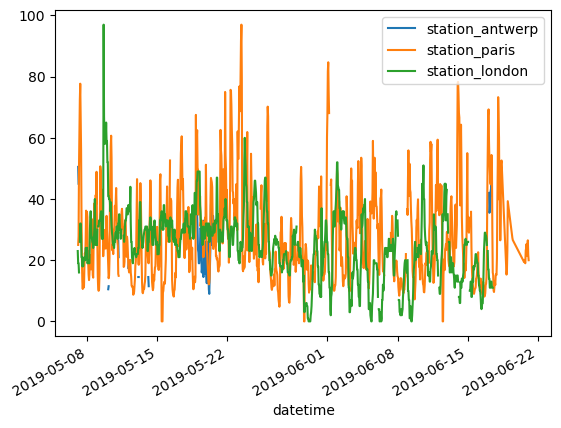
    


```python
# plot only the station_paris column
air_quality['station_paris'].plot()
```


    <AxesSubplot:xlabel='datetime'>


    
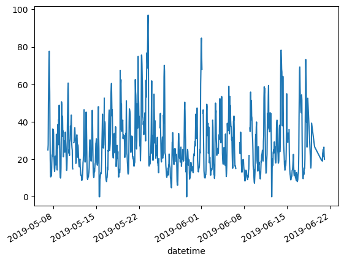
    


```python
# visually see the relationshops of NO2 values measured in London Vs Paris using scatter plot
air_quality.plot.scatter(x='station_london', y='station_paris', alpha=0.5)
```


    <AxesSubplot:xlabel='station_london', ylabel='station_paris'>


    
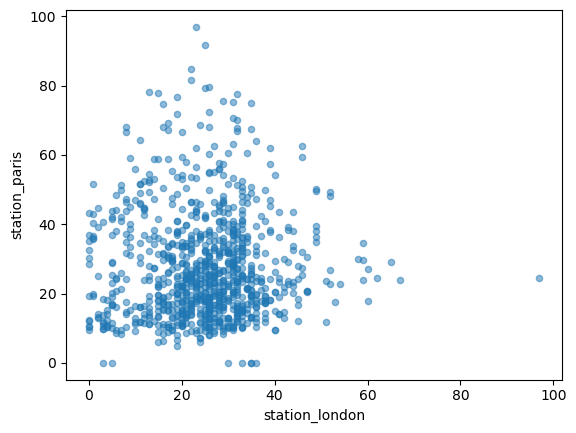
    


```python
# better comparison using line plot
two_series = pd.DataFrame({"London": air_quality['station_london'], "Paris": air_quality["station_paris"]})
```


```python
two_series.plot(marker='o', figsize=(8, 5), title="Comparison between London and Paris")
```


    <AxesSubplot:title={'center':'Comparison between London and Paris'}, xlabel='datetime'>


    
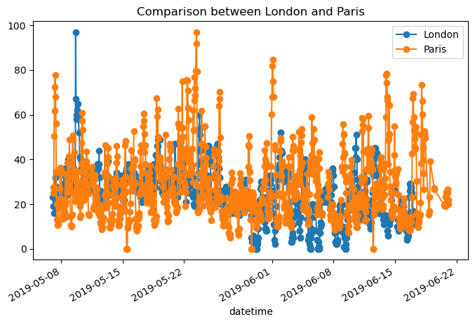
    


```python
# let's see all the plotting methods provided in plot module
for method_name in dir(air_quality.plot):
    if not method_name.startswith('_'):
        print(method_name)
```

    area
    bar
    barh
    box
    density
    hexbin
    hist
    kde
    line
    pie
    scatter


```python
# one liner
[name for name in dir(air_quality.plot) if not name.startswith('_')]
```


    ['area',
     'bar',
     'barh',
     'box',
     'density',
     'hexbin',
     'hist',
     'kde',
     'line',
     'pie',
     'scatter']


```python
# you can also use tab completion to display all the methods
air_quality.plot.box()
```


    <AxesSubplot:>


    
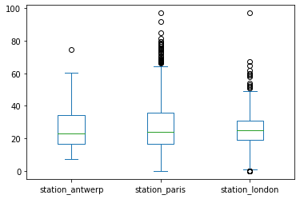
    


```python
air_quality.plot.barh()
```


    <AxesSubplot:ylabel='datetime'>


    
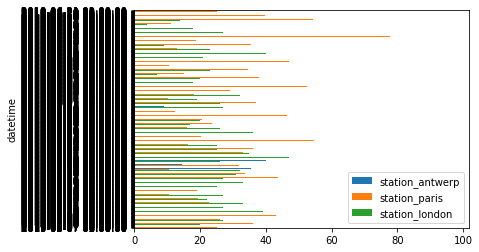
    


```python
# let's provide figsize for readability
air_quality.plot.barh(figsize=(18, 10))
```


    <AxesSubplot:ylabel='datetime'>


    

    


```python
# create area plot with separate subplots for each city
axs = air_quality.plot.area(figsize=(12, 4), subplots=True)
```


    
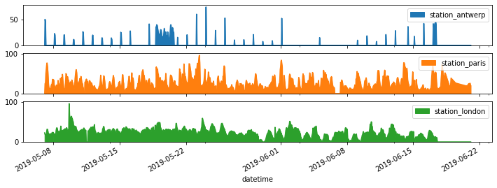
    


```python
# customize, extend and save the resulting plot
fig, axes = plt.subplots(figsize=(12, 4)) # create an empty matplotlib Fig and Axes
air_quality.plot.area(ax=axes) # use pands to put the area plot on the prepared Figure/Axes
axes.set_ylabel("$NO_2$ concentration") # do the customization; use LaTex $ $ syntax
fig.savefig("no2_concerntrations.png") # save the figure
```


    
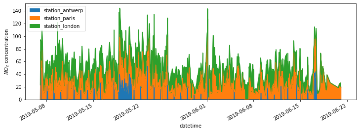
    


## handling time series data
- pandas makes it easy to work with datetime and time series data
- let's work with air_quality_no2_long.csv dataset to demostrate timeseries data


```python
no2_long_url = 'https://raw.githubusercontent.com/pandas-dev/pandas/master/doc/data/air_quality_no2_long.csv'
```


```python
air_quality_long = pd.read_csv(no2_long_url)
```


```python
air_quality_long.head()
```


<div>
<style scoped>
    .dataframe tbody tr th:only-of-type {
        vertical-align: middle;
    }

    .dataframe tbody tr th {
        vertical-align: top;
    }

    .dataframe thead th {
        text-align: right;
    }
</style>
<table border="1" class="dataframe">
  <thead>
    <tr style="text-align: right;">
      <th></th>
      <th>city</th>
      <th>country</th>
      <th>date.utc</th>
      <th>location</th>
      <th>parameter</th>
      <th>value</th>
      <th>unit</th>
    </tr>
  </thead>
  <tbody>
    <tr>
      <th>0</th>
      <td>Paris</td>
      <td>FR</td>
      <td>2019-06-21 00:00:00+00:00</td>
      <td>FR04014</td>
      <td>no2</td>
      <td>20.0</td>
      <td>µg/m³</td>
    </tr>
    <tr>
      <th>1</th>
      <td>Paris</td>
      <td>FR</td>
      <td>2019-06-20 23:00:00+00:00</td>
      <td>FR04014</td>
      <td>no2</td>
      <td>21.8</td>
      <td>µg/m³</td>
    </tr>
    <tr>
      <th>2</th>
      <td>Paris</td>
      <td>FR</td>
      <td>2019-06-20 22:00:00+00:00</td>
      <td>FR04014</td>
      <td>no2</td>
      <td>26.5</td>
      <td>µg/m³</td>
    </tr>
    <tr>
      <th>3</th>
      <td>Paris</td>
      <td>FR</td>
      <td>2019-06-20 21:00:00+00:00</td>
      <td>FR04014</td>
      <td>no2</td>
      <td>24.9</td>
      <td>µg/m³</td>
    </tr>
    <tr>
      <th>4</th>
      <td>Paris</td>
      <td>FR</td>
      <td>2019-06-20 20:00:00+00:00</td>
      <td>FR04014</td>
      <td>no2</td>
      <td>21.4</td>
      <td>µg/m³</td>
    </tr>
  </tbody>
</table>
</div>


```python
# rename date.utc to datetime
air_quality_long = air_quality_long.rename(columns={"date.utc": "datetime"})
```


```python
air_quality_long.head()
```


<div>
<style scoped>
    .dataframe tbody tr th:only-of-type {
        vertical-align: middle;
    }

    .dataframe tbody tr th {
        vertical-align: top;
    }

    .dataframe thead th {
        text-align: right;
    }
</style>
<table border="1" class="dataframe">
  <thead>
    <tr style="text-align: right;">
      <th></th>
      <th>city</th>
      <th>country</th>
      <th>datetime</th>
      <th>location</th>
      <th>parameter</th>
      <th>value</th>
      <th>unit</th>
    </tr>
  </thead>
  <tbody>
    <tr>
      <th>0</th>
      <td>Paris</td>
      <td>FR</td>
      <td>2019-06-21 00:00:00+00:00</td>
      <td>FR04014</td>
      <td>no2</td>
      <td>20.0</td>
      <td>µg/m³</td>
    </tr>
    <tr>
      <th>1</th>
      <td>Paris</td>
      <td>FR</td>
      <td>2019-06-20 23:00:00+00:00</td>
      <td>FR04014</td>
      <td>no2</td>
      <td>21.8</td>
      <td>µg/m³</td>
    </tr>
    <tr>
      <th>2</th>
      <td>Paris</td>
      <td>FR</td>
      <td>2019-06-20 22:00:00+00:00</td>
      <td>FR04014</td>
      <td>no2</td>
      <td>26.5</td>
      <td>µg/m³</td>
    </tr>
    <tr>
      <th>3</th>
      <td>Paris</td>
      <td>FR</td>
      <td>2019-06-20 21:00:00+00:00</td>
      <td>FR04014</td>
      <td>no2</td>
      <td>24.9</td>
      <td>µg/m³</td>
    </tr>
    <tr>
      <th>4</th>
      <td>Paris</td>
      <td>FR</td>
      <td>2019-06-20 20:00:00+00:00</td>
      <td>FR04014</td>
      <td>no2</td>
      <td>21.4</td>
      <td>µg/m³</td>
    </tr>
  </tbody>
</table>
</div>


```python
# get all the unique cities as an nd-array
air_quality_long.city.unique()
```


    array(['Paris', 'Antwerpen', 'London'], dtype=object)


```python
# let's change datetime colume datatype to Python datetime instead of plaintext
air_quality_long["datetime"] = pd.to_datetime(air_quality_long["datetime"])
```


```python
air_quality_long["datetime"]
```


    0      2019-06-21 00:00:00+00:00
    1      2019-06-20 23:00:00+00:00
    2      2019-06-20 22:00:00+00:00
    3      2019-06-20 21:00:00+00:00
    4      2019-06-20 20:00:00+00:00
                      ...           
    2063   2019-05-07 06:00:00+00:00
    2064   2019-05-07 04:00:00+00:00
    2065   2019-05-07 03:00:00+00:00
    2066   2019-05-07 02:00:00+00:00
    2067   2019-05-07 01:00:00+00:00
    Name: datetime, Length: 2068, dtype: datetime64[ns, UTC]


### Note: you can also use pd.read_csv(file, parse_dates=["list of column names"]) to parse data as datetime


```python
# find the latest and oldest dates
air_quality_long["datetime"].max(), air_quality_long['datetime'].min()
```


    (Timestamp('2019-06-21 00:00:00+0000', tz='UTC'),
     Timestamp('2019-05-07 01:00:00+0000', tz='UTC'))


```python
# find the delta
air_quality_long["datetime"].max() - air_quality_long['datetime'].min()
```


    Timedelta('44 days 23:00:00')


```python
# let's add a new column containing only the month to the DataFrame
air_quality_long["month"] = air_quality_long["datetime"].dt.month
```


```python
air_quality_long.head()
```


<div>
<style scoped>
    .dataframe tbody tr th:only-of-type {
        vertical-align: middle;
    }

    .dataframe tbody tr th {
        vertical-align: top;
    }

    .dataframe thead th {
        text-align: right;
    }
</style>
<table border="1" class="dataframe">
  <thead>
    <tr style="text-align: right;">
      <th></th>
      <th>city</th>
      <th>country</th>
      <th>datetime</th>
      <th>location</th>
      <th>parameter</th>
      <th>value</th>
      <th>unit</th>
      <th>month</th>
    </tr>
  </thead>
  <tbody>
    <tr>
      <th>0</th>
      <td>Paris</td>
      <td>FR</td>
      <td>2019-06-21 00:00:00+00:00</td>
      <td>FR04014</td>
      <td>no2</td>
      <td>20.0</td>
      <td>µg/m³</td>
      <td>6</td>
    </tr>
    <tr>
      <th>1</th>
      <td>Paris</td>
      <td>FR</td>
      <td>2019-06-20 23:00:00+00:00</td>
      <td>FR04014</td>
      <td>no2</td>
      <td>21.8</td>
      <td>µg/m³</td>
      <td>6</td>
    </tr>
    <tr>
      <th>2</th>
      <td>Paris</td>
      <td>FR</td>
      <td>2019-06-20 22:00:00+00:00</td>
      <td>FR04014</td>
      <td>no2</td>
      <td>26.5</td>
      <td>µg/m³</td>
      <td>6</td>
    </tr>
    <tr>
      <th>3</th>
      <td>Paris</td>
      <td>FR</td>
      <td>2019-06-20 21:00:00+00:00</td>
      <td>FR04014</td>
      <td>no2</td>
      <td>24.9</td>
      <td>µg/m³</td>
      <td>6</td>
    </tr>
    <tr>
      <th>4</th>
      <td>Paris</td>
      <td>FR</td>
      <td>2019-06-20 20:00:00+00:00</td>
      <td>FR04014</td>
      <td>no2</td>
      <td>21.4</td>
      <td>µg/m³</td>
      <td>6</td>
    </tr>
  </tbody>
</table>
</div>


## groupby
- grouping data by some column value and finding aggregate information
- find average $NO_2$ concentration for each day of the week for each of the measurement locations


```python
air_quality_long.groupby([air_quality_long["datetime"].dt.weekday, "location"])["value"].mean()
```


    datetime  location          
    0         BETR801               27.875000
              FR04014               24.856250
              London Westminster    23.969697
    1         BETR801               22.214286
              FR04014               30.999359
              London Westminster    24.885714
    2         BETR801               21.125000
              FR04014               29.165753
              London Westminster    23.460432
    3         BETR801               27.500000
              FR04014               28.600690
              London Westminster    24.780142
    4         BETR801               28.400000
              FR04014               31.617986
              London Westminster    26.446809
    5         BETR801               33.500000
              FR04014               25.266154
              London Westminster    24.977612
    6         BETR801               21.896552
              FR04014               23.274306
              London Westminster    24.859155
    Name: value, dtype: float64


### plot timeseries
- plot the typical $NO_2$ pattern during the day of time series of all stations together
    - what is the average value for each hour of the day?


```python
fig, axs = plt.subplots(figsize=(12, 4))
air_quality_long.groupby(air_quality_long["datetime"].dt.hour)["value"].mean().plot(kind='bar', rot=0, ax=axs)
plt.xlabel("Hour of the day")
plt.ylabel("$NO_2 (\mu g/m^3)$")
```


    Text(0, 0.5, '$NO_2 (\\mu g/m^3)$')


    
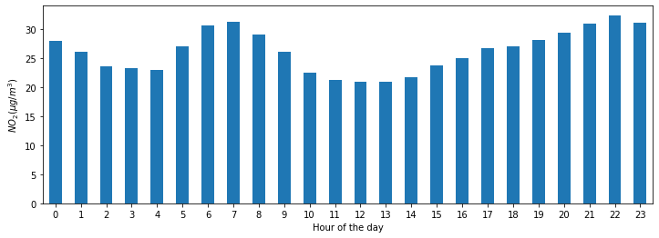
    


## Reshaping pandas DataFrame
- `pivot()` lets us reshape the data table
- let's use datetime as index and measurement locations as a separate columns
- DatetimeIndex class contains many time series related optimizations: https://pandas.pydata.org/docs/user_guide/timeseries.html#timeseries-datetimeindex


```python
no_2 = air_quality_long.pivot(index="datetime", columns="location", values="value")
```


```python
no_2.head()
# notice values from some indices and columns may not exist and are filled with NaN
```


<div>
<style scoped>
    .dataframe tbody tr th:only-of-type {
        vertical-align: middle;
    }

    .dataframe tbody tr th {
        vertical-align: top;
    }

    .dataframe thead th {
        text-align: right;
    }
</style>
<table border="1" class="dataframe">
  <thead>
    <tr style="text-align: right;">
      <th>location</th>
      <th>BETR801</th>
      <th>FR04014</th>
      <th>London Westminster</th>
    </tr>
    <tr>
      <th>datetime</th>
      <th></th>
      <th></th>
      <th></th>
    </tr>
  </thead>
  <tbody>
    <tr>
      <th>2019-05-07 01:00:00+00:00</th>
      <td>50.5</td>
      <td>25.0</td>
      <td>23.0</td>
    </tr>
    <tr>
      <th>2019-05-07 02:00:00+00:00</th>
      <td>45.0</td>
      <td>27.7</td>
      <td>19.0</td>
    </tr>
    <tr>
      <th>2019-05-07 03:00:00+00:00</th>
      <td>NaN</td>
      <td>50.4</td>
      <td>19.0</td>
    </tr>
    <tr>
      <th>2019-05-07 04:00:00+00:00</th>
      <td>NaN</td>
      <td>61.9</td>
      <td>16.0</td>
    </tr>
    <tr>
      <th>2019-05-07 05:00:00+00:00</th>
      <td>NaN</td>
      <td>72.4</td>
      <td>NaN</td>
    </tr>
  </tbody>
</table>
</div>


```python
no_2.index.year
```


    Int64Index([2019, 2019, 2019, 2019, 2019, 2019, 2019, 2019, 2019, 2019,
                ...
                2019, 2019, 2019, 2019, 2019, 2019, 2019, 2019, 2019, 2019],
               dtype='int64', name='datetime', length=1033)


```python
pd.unique(no_2.index.weekday), pd.unique(no_2.index.day)
```


    (array([1, 2, 3, 4, 5, 6, 0]),
     array([ 7,  8,  9, 10, 11, 12, 13, 14, 15, 16, 17, 18, 19, 20, 21, 22, 23,
            24, 25, 26, 27, 28, 29, 30, 31,  1,  2,  3,  4,  5,  6]))


### Plot between some date range
- create a plot of the $NO_2$ values in the different stations from the 20th May till the end of 21st of May


```python
no_2["2019-05-20":"2019-05-21"].plot()
```


    <AxesSubplot:xlabel='datetime'>


    
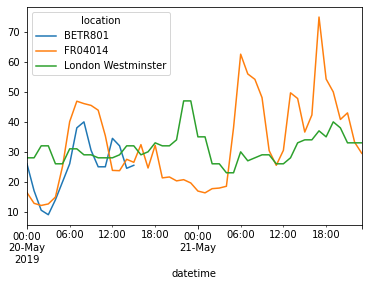
    


## Resampling a time series to another frequency
- aggregate the current hourly time series values to the monthly maximum value in each of the stations


```python
monthly_max = no_2.resample("M").max()
```


```python
monthly_max.head()
```


<div>
<style scoped>
    .dataframe tbody tr th:only-of-type {
        vertical-align: middle;
    }

    .dataframe tbody tr th {
        vertical-align: top;
    }

    .dataframe thead th {
        text-align: right;
    }
</style>
<table border="1" class="dataframe">
  <thead>
    <tr style="text-align: right;">
      <th>location</th>
      <th>BETR801</th>
      <th>FR04014</th>
      <th>London Westminster</th>
    </tr>
    <tr>
      <th>datetime</th>
      <th></th>
      <th></th>
      <th></th>
    </tr>
  </thead>
  <tbody>
    <tr>
      <th>2019-05-31 00:00:00+00:00</th>
      <td>74.5</td>
      <td>97.0</td>
      <td>97.0</td>
    </tr>
    <tr>
      <th>2019-06-30 00:00:00+00:00</th>
      <td>52.5</td>
      <td>84.7</td>
      <td>52.0</td>
    </tr>
  </tbody>
</table>
</div>


```python
# line plot of daily mean NO2 value in each stations
no_2.resample("D").mean().plot(style="-o", figsize=(10, 5));
```


    
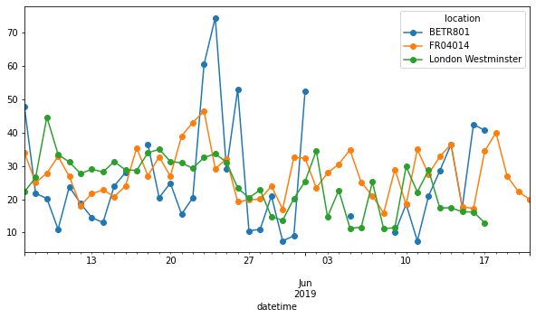
    


# Seaborn
- [https://seaborn.pydata.org/introduction.html](https://seaborn.pydata.org/introduction.html)
- library for making statistical graphics in Python
- builds on matplotlib and integrates closely with pandas data
- seaborn performs the necessary semantic mapping and statisticall aggregation to produce informative plots
- data-set oriented and declarative which lets you focus on the understanding the plots rather than how to draw them
- provides easy API access to various datasets to experiment with
- Kaggle's Data Visualization mini course dives mostly into Seaborn library


## Installation
- use pip or conda to insall Seaborn library
```bash
pip install seaborn
conda install seaborn
```

## Seaborn plots

### Trends 
- a trend is defined as a pattern of change
`sns.lineplot` - Line charts are best to show trends over a period of time, and multiple lines can be used to show trends in more than one group

### Relationship 
- There are many different chart types that you can use to understand relationships between variables in your data.

- `sns.relplot` - Scatter plot to visualize relationship between the features
- `sns.barplot` - Bar charts are useful for comparing quantities corresponding to different groups.
- `sns.heatmap` - Heatmaps can be used to find color-coded patterns in tables of numbers.
- `sns.scatterplot` - Scatter plots show the relationship between two continuous variables; if color-coded, we can also show the relationship with a third categorical variable.
- `sns.regplot` - Including a regression line in the scatter plot makes it easier to see any linear relationship between two variables.
- `sns.lmplot` - This command is useful for drawing multiple regression lines, if the scatter plot contains multiple, color-coded groups.
- `sns.swarmplot` - Categorical scatter plots show the relationship between a continuous variable and a categorical variable.

### Distribution 
- We visualize distributions to show the possible values that we can expect to see in a variable, along with how likely they are.
- `sns.distplot` - Histograms show the distribution of a single numerical variable.
- `sns.kdeplot` - KDE plots (or 2D KDE plots) show an estimated, smooth distribution of a single numerical variable (or two numerical variables).
`sns.jointplot` - This command is useful for simultaneously displaying a 2D KDE plot with the corresponding KDE plots for each individual variable.

### API reference
- https://seaborn.pydata.org/api.html
- seaborn.relplot
    - https://seaborn.pydata.org/generated/seaborn.relplot.html#seaborn.relplot
    
- Seaborn also provides load_dataset API to load some CSV data it provides
- see the datasets here: [https://github.com/mwaskom/seaborn-data](https://github.com/mwaskom/seaborn-data)


```python
! pip install seaborn
```

    Collecting seaborn
      Downloading seaborn-0.11.2-py3-none-any.whl (292 kB)
         |████████████████████████████████| 292 kB 2.2 MB/s            
    [?25hRequirement already satisfied: matplotlib>=2.2 in /Users/rbasnet/miniconda3/envs/ml/lib/python3.9/site-packages (from seaborn) (3.5.0)
    Requirement already satisfied: numpy>=1.15 in /Users/rbasnet/miniconda3/envs/ml/lib/python3.9/site-packages (from seaborn) (1.21.2)
    Requirement already satisfied: scipy>=1.0 in /Users/rbasnet/miniconda3/envs/ml/lib/python3.9/site-packages (from seaborn) (1.7.3)
    Requirement already satisfied: pandas>=0.23 in /Users/rbasnet/miniconda3/envs/ml/lib/python3.9/site-packages (from seaborn) (1.3.5)
    Requirement already satisfied: packaging>=20.0 in /Users/rbasnet/miniconda3/envs/ml/lib/python3.9/site-packages (from matplotlib>=2.2->seaborn) (21.3)
    Requirement already satisfied: pillow>=6.2.0 in /Users/rbasnet/miniconda3/envs/ml/lib/python3.9/site-packages (from matplotlib>=2.2->seaborn) (8.4.0)
    Requirement already satisfied: cycler>=0.10 in /Users/rbasnet/miniconda3/envs/ml/lib/python3.9/site-packages (from matplotlib>=2.2->seaborn) (0.11.0)
    Requirement already satisfied: fonttools>=4.22.0 in /Users/rbasnet/miniconda3/envs/ml/lib/python3.9/site-packages (from matplotlib>=2.2->seaborn) (4.25.0)
    Requirement already satisfied: pyparsing>=2.2.1 in /Users/rbasnet/miniconda3/envs/ml/lib/python3.9/site-packages (from matplotlib>=2.2->seaborn) (3.0.4)
    Requirement already satisfied: kiwisolver>=1.0.1 in /Users/rbasnet/miniconda3/envs/ml/lib/python3.9/site-packages (from matplotlib>=2.2->seaborn) (1.3.1)
    Requirement already satisfied: python-dateutil>=2.7 in /Users/rbasnet/miniconda3/envs/ml/lib/python3.9/site-packages (from matplotlib>=2.2->seaborn) (2.8.2)
    Requirement already satisfied: pytz>=2017.3 in /Users/rbasnet/miniconda3/envs/ml/lib/python3.9/site-packages (from pandas>=0.23->seaborn) (2021.3)
    Requirement already satisfied: six>=1.5 in /Users/rbasnet/miniconda3/envs/ml/lib/python3.9/site-packages (from python-dateutil>=2.7->matplotlib>=2.2->seaborn) (1.16.0)
    Installing collected packages: seaborn
    Successfully installed seaborn-0.11.2


```python
import seaborn as sns

# apply the default theme
sns.set_theme()
```


```python
# loat an example data sets, tips
tips = sns.load_dataset('tips')
```


```python
tips.info()
```

    <class 'pandas.core.frame.DataFrame'>
    RangeIndex: 244 entries, 0 to 243
    Data columns (total 7 columns):
     #   Column      Non-Null Count  Dtype   
    ---  ------      --------------  -----   
     0   total_bill  244 non-null    float64 
     1   tip         244 non-null    float64 
     2   sex         244 non-null    category
     3   smoker      244 non-null    category
     4   day         244 non-null    category
     5   time        244 non-null    category
     6   size        244 non-null    int64   
    dtypes: category(4), float64(2), int64(1)
    memory usage: 7.4 KB


```python
tips
```


<div>
<style scoped>
    .dataframe tbody tr th:only-of-type {
        vertical-align: middle;
    }

    .dataframe tbody tr th {
        vertical-align: top;
    }

    .dataframe thead th {
        text-align: right;
    }
</style>
<table border="1" class="dataframe">
  <thead>
    <tr style="text-align: right;">
      <th></th>
      <th>total_bill</th>
      <th>tip</th>
      <th>sex</th>
      <th>smoker</th>
      <th>day</th>
      <th>time</th>
      <th>size</th>
    </tr>
  </thead>
  <tbody>
    <tr>
      <th>0</th>
      <td>16.99</td>
      <td>1.01</td>
      <td>Female</td>
      <td>No</td>
      <td>Sun</td>
      <td>Dinner</td>
      <td>2</td>
    </tr>
    <tr>
      <th>1</th>
      <td>10.34</td>
      <td>1.66</td>
      <td>Male</td>
      <td>No</td>
      <td>Sun</td>
      <td>Dinner</td>
      <td>3</td>
    </tr>
    <tr>
      <th>2</th>
      <td>21.01</td>
      <td>3.50</td>
      <td>Male</td>
      <td>No</td>
      <td>Sun</td>
      <td>Dinner</td>
      <td>3</td>
    </tr>
    <tr>
      <th>3</th>
      <td>23.68</td>
      <td>3.31</td>
      <td>Male</td>
      <td>No</td>
      <td>Sun</td>
      <td>Dinner</td>
      <td>2</td>
    </tr>
    <tr>
      <th>4</th>
      <td>24.59</td>
      <td>3.61</td>
      <td>Female</td>
      <td>No</td>
      <td>Sun</td>
      <td>Dinner</td>
      <td>4</td>
    </tr>
    <tr>
      <th>...</th>
      <td>...</td>
      <td>...</td>
      <td>...</td>
      <td>...</td>
      <td>...</td>
      <td>...</td>
      <td>...</td>
    </tr>
    <tr>
      <th>239</th>
      <td>29.03</td>
      <td>5.92</td>
      <td>Male</td>
      <td>No</td>
      <td>Sat</td>
      <td>Dinner</td>
      <td>3</td>
    </tr>
    <tr>
      <th>240</th>
      <td>27.18</td>
      <td>2.00</td>
      <td>Female</td>
      <td>Yes</td>
      <td>Sat</td>
      <td>Dinner</td>
      <td>2</td>
    </tr>
    <tr>
      <th>241</th>
      <td>22.67</td>
      <td>2.00</td>
      <td>Male</td>
      <td>Yes</td>
      <td>Sat</td>
      <td>Dinner</td>
      <td>2</td>
    </tr>
    <tr>
      <th>242</th>
      <td>17.82</td>
      <td>1.75</td>
      <td>Male</td>
      <td>No</td>
      <td>Sat</td>
      <td>Dinner</td>
      <td>2</td>
    </tr>
    <tr>
      <th>243</th>
      <td>18.78</td>
      <td>3.00</td>
      <td>Female</td>
      <td>No</td>
      <td>Thur</td>
      <td>Dinner</td>
      <td>2</td>
    </tr>
  </tbody>
</table>
<p>244 rows × 7 columns</p>
</div>


```python
# create relation plot to visualize the realtionship between total_bill and 
# tip amount between two categories smoker and non-smoker of customers
sns.relplot(data=tips, x="total_bill", y="tip", col="time", hue="smoker", style="smoker", size="size")
```


    <seaborn.axisgrid.FacetGrid at 0x7fd9aa16cf40>


    
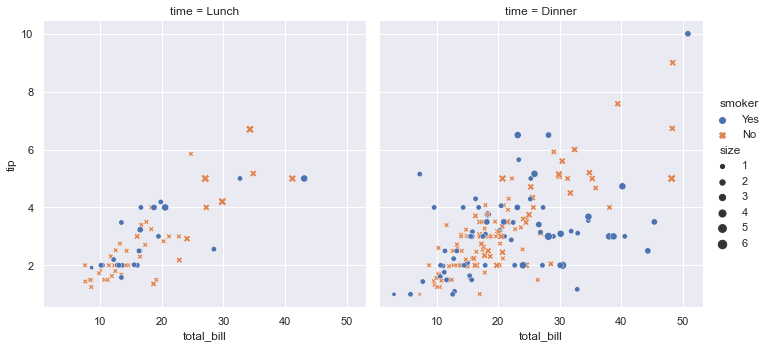
    


```python

```
