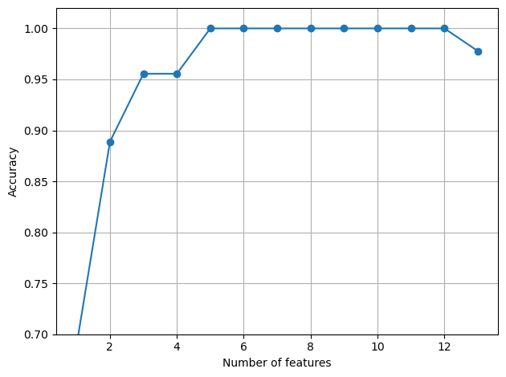
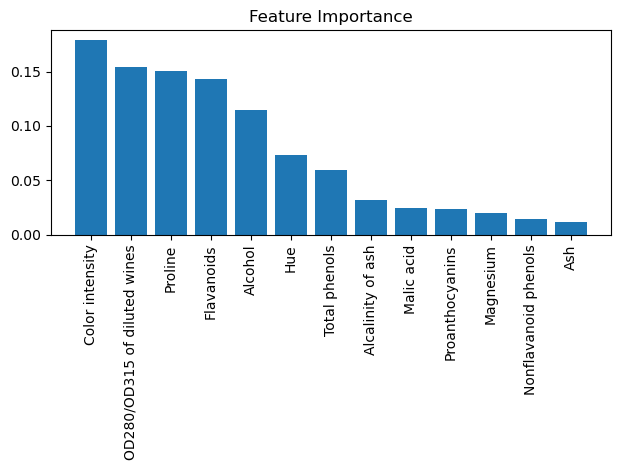

# Feature Engineering
- sample features are the keys to machine learning as they determine how well a ML algorithm can learn
- it is absolutely important that we examine and preprocess a dataset before we feed it to a ML algorithm
- feature engineering involves from feature processing to dealing with missing values to properly encoding features and selecting the best features
- the goal of feature engineering is simply to make your data better suited to the problem at hand plus:
    - improve a model's predictive performance
    - reduce computational or data needs
    - improve interpretability of the results

### Dealing with missing data
- it's not uncommon to miss certain feature values for many reasons
    - error in data collection process
    - certain measurements may not be applicable
    - particular fields  could have been simply left blank in survey
- missing values are usually missing or blank or NaN or NULL
- ML algorithm can result unpredictable results if we simply ignore missing values

#### Identify missing values
- first, identify missing values and deal with them


```python
import pandas as pd
from io import StringIO
import numpy as np
```


```python
csv_data = '''
A,B,C,D
1.0,2.0,3.0,4.0
5.0,6.0,,8.0
10.0,11.0,12.0,
'''

df = pd.read_csv(StringIO(csv_data))
# StringIO function let's us read csv_data as if it's a file
```


```python
df
```


<div>
<style scoped>
    .dataframe tbody tr th:only-of-type {
        vertical-align: middle;
    }

    .dataframe tbody tr th {
        vertical-align: top;
    }

    .dataframe thead th {
        text-align: right;
    }
</style>
<table border="1" class="dataframe">
  <thead>
    <tr style="text-align: right;">
      <th></th>
      <th>A</th>
      <th>B</th>
      <th>C</th>
      <th>D</th>
    </tr>
  </thead>
  <tbody>
    <tr>
      <th>0</th>
      <td>1.0</td>
      <td>2.0</td>
      <td>3.0</td>
      <td>4.0</td>
    </tr>
    <tr>
      <th>1</th>
      <td>5.0</td>
      <td>6.0</td>
      <td>NaN</td>
      <td>8.0</td>
    </tr>
    <tr>
      <th>2</th>
      <td>10.0</td>
      <td>11.0</td>
      <td>12.0</td>
      <td>NaN</td>
    </tr>
  </tbody>
</table>
</div>


```python
# find the # of null values per column
df.isnull().sum()
```


    A    0
    B    0
    C    1
    D    1
    dtype: int64


### Eliminating training examples or features with missing values
- one of the easiest way to deal with the missing data is simply to remove the feature (columns) or training examples (rows) from the dataset entirely
- this is usually done when there's plenty of examples and features


```python
# removing examples; return's new DataFrame objects after dropping all the rows in NaN
df.dropna(axis=0)
```


<div>
<style scoped>
    .dataframe tbody tr th:only-of-type {
        vertical-align: middle;
    }

    .dataframe tbody tr th {
        vertical-align: top;
    }

    .dataframe thead th {
        text-align: right;
    }
</style>
<table border="1" class="dataframe">
  <thead>
    <tr style="text-align: right;">
      <th></th>
      <th>A</th>
      <th>B</th>
      <th>C</th>
      <th>D</th>
    </tr>
  </thead>
  <tbody>
    <tr>
      <th>0</th>
      <td>1.0</td>
      <td>2.0</td>
      <td>3.0</td>
      <td>4.0</td>
    </tr>
  </tbody>
</table>
</div>


```python
df
```


<div>
<style scoped>
    .dataframe tbody tr th:only-of-type {
        vertical-align: middle;
    }

    .dataframe tbody tr th {
        vertical-align: top;
    }

    .dataframe thead th {
        text-align: right;
    }
</style>
<table border="1" class="dataframe">
  <thead>
    <tr style="text-align: right;">
      <th></th>
      <th>A</th>
      <th>B</th>
      <th>C</th>
      <th>D</th>
    </tr>
  </thead>
  <tbody>
    <tr>
      <th>0</th>
      <td>1.0</td>
      <td>2.0</td>
      <td>3.0</td>
      <td>4.0</td>
    </tr>
    <tr>
      <th>1</th>
      <td>5.0</td>
      <td>6.0</td>
      <td>NaN</td>
      <td>8.0</td>
    </tr>
    <tr>
      <th>2</th>
      <td>10.0</td>
      <td>11.0</td>
      <td>12.0</td>
      <td>NaN</td>
    </tr>
  </tbody>
</table>
</div>


```python
df.dropna(axis=1)
```


<div>
<style scoped>
    .dataframe tbody tr th:only-of-type {
        vertical-align: middle;
    }

    .dataframe tbody tr th {
        vertical-align: top;
    }

    .dataframe thead th {
        text-align: right;
    }
</style>
<table border="1" class="dataframe">
  <thead>
    <tr style="text-align: right;">
      <th></th>
      <th>A</th>
      <th>B</th>
    </tr>
  </thead>
  <tbody>
    <tr>
      <th>0</th>
      <td>1.0</td>
      <td>2.0</td>
    </tr>
    <tr>
      <th>1</th>
      <td>5.0</td>
      <td>6.0</td>
    </tr>
    <tr>
      <th>2</th>
      <td>10.0</td>
      <td>11.0</td>
    </tr>
  </tbody>
</table>
</div>


```python
# drop rows where all columns are NaN
df.dropna(how='all')
```


<div>
<style scoped>
    .dataframe tbody tr th:only-of-type {
        vertical-align: middle;
    }

    .dataframe tbody tr th {
        vertical-align: top;
    }

    .dataframe thead th {
        text-align: right;
    }
</style>
<table border="1" class="dataframe">
  <thead>
    <tr style="text-align: right;">
      <th></th>
      <th>A</th>
      <th>B</th>
      <th>C</th>
      <th>D</th>
    </tr>
  </thead>
  <tbody>
    <tr>
      <th>0</th>
      <td>1.0</td>
      <td>2.0</td>
      <td>3.0</td>
      <td>4.0</td>
    </tr>
    <tr>
      <th>1</th>
      <td>5.0</td>
      <td>6.0</td>
      <td>NaN</td>
      <td>8.0</td>
    </tr>
    <tr>
      <th>2</th>
      <td>10.0</td>
      <td>11.0</td>
      <td>12.0</td>
      <td>NaN</td>
    </tr>
  </tbody>
</table>
</div>


```python
# drop rows that have fewer than 4 real values
df.dropna(thresh=4)
```


<div>
<style scoped>
    .dataframe tbody tr th:only-of-type {
        vertical-align: middle;
    }

    .dataframe tbody tr th {
        vertical-align: top;
    }

    .dataframe thead th {
        text-align: right;
    }
</style>
<table border="1" class="dataframe">
  <thead>
    <tr style="text-align: right;">
      <th></th>
      <th>A</th>
      <th>B</th>
      <th>C</th>
      <th>D</th>
    </tr>
  </thead>
  <tbody>
    <tr>
      <th>0</th>
      <td>1.0</td>
      <td>2.0</td>
      <td>3.0</td>
      <td>4.0</td>
    </tr>
  </tbody>
</table>
</div>


```python
# drop rows where NaN appear in specific columns
df.dropna(subset=['C'])
```


<div>
<style scoped>
    .dataframe tbody tr th:only-of-type {
        vertical-align: middle;
    }

    .dataframe tbody tr th {
        vertical-align: top;
    }

    .dataframe thead th {
        text-align: right;
    }
</style>
<table border="1" class="dataframe">
  <thead>
    <tr style="text-align: right;">
      <th></th>
      <th>A</th>
      <th>B</th>
      <th>C</th>
      <th>D</th>
    </tr>
  </thead>
  <tbody>
    <tr>
      <th>0</th>
      <td>1.0</td>
      <td>2.0</td>
      <td>3.0</td>
      <td>4.0</td>
    </tr>
    <tr>
      <th>2</th>
      <td>10.0</td>
      <td>11.0</td>
      <td>12.0</td>
      <td>NaN</td>
    </tr>
  </tbody>
</table>
</div>


## Imputing missing values
- often dropping an entire feature column is not practicle
    - we may lose some valuable information
- we can use interploation techniques to estimate the missing values from other training examples

### mean imputation
- simply replace the missing value with the mean value of the entire feature column
- use `SimpleImputer` class from scikit-learn - https://scikit-learn.org/stable/modules/generated/sklearn.impute.SimpleImputer.html
- different strategies to fill missing values:
    - mean, most_frequet, median, constant


```python
from sklearn.impute import SimpleImputer
```


```python
# our original DataFrame
df
```


<div>
<style scoped>
    .dataframe tbody tr th:only-of-type {
        vertical-align: middle;
    }

    .dataframe tbody tr th {
        vertical-align: top;
    }

    .dataframe thead th {
        text-align: right;
    }
</style>
<table border="1" class="dataframe">
  <thead>
    <tr style="text-align: right;">
      <th></th>
      <th>A</th>
      <th>B</th>
      <th>C</th>
      <th>D</th>
    </tr>
  </thead>
  <tbody>
    <tr>
      <th>0</th>
      <td>1.0</td>
      <td>2.0</td>
      <td>3.0</td>
      <td>4.0</td>
    </tr>
    <tr>
      <th>1</th>
      <td>5.0</td>
      <td>6.0</td>
      <td>NaN</td>
      <td>8.0</td>
    </tr>
    <tr>
      <th>2</th>
      <td>10.0</td>
      <td>11.0</td>
      <td>12.0</td>
      <td>NaN</td>
    </tr>
  </tbody>
</table>
</div>


```python
# impute missing values via the column mean
si = SimpleImputer(missing_values=np.nan, strategy='mean')
si = si.fit(df.values)
imputed_data = si.transform(df.values)
```


```python
imputed_data
```


    array([[ 1. ,  2. ,  3. ,  4. ],
           [ 5. ,  6. ,  7.5,  8. ],
           [10. , 11. , 12. ,  6. ]])


```python
# another approach; returns a new DataFrame
df.fillna(df.mean())
```


<div>
<style scoped>
    .dataframe tbody tr th:only-of-type {
        vertical-align: middle;
    }

    .dataframe tbody tr th {
        vertical-align: top;
    }

    .dataframe thead th {
        text-align: right;
    }
</style>
<table border="1" class="dataframe">
  <thead>
    <tr style="text-align: right;">
      <th></th>
      <th>A</th>
      <th>B</th>
      <th>C</th>
      <th>D</th>
    </tr>
  </thead>
  <tbody>
    <tr>
      <th>0</th>
      <td>1.0</td>
      <td>2.0</td>
      <td>3.0</td>
      <td>4.0</td>
    </tr>
    <tr>
      <th>1</th>
      <td>5.0</td>
      <td>6.0</td>
      <td>7.5</td>
      <td>8.0</td>
    </tr>
    <tr>
      <th>2</th>
      <td>10.0</td>
      <td>11.0</td>
      <td>12.0</td>
      <td>6.0</td>
    </tr>
  </tbody>
</table>
</div>


```python
df
```


<div>
<style scoped>
    .dataframe tbody tr th:only-of-type {
        vertical-align: middle;
    }

    .dataframe tbody tr th {
        vertical-align: top;
    }

    .dataframe thead th {
        text-align: right;
    }
</style>
<table border="1" class="dataframe">
  <thead>
    <tr style="text-align: right;">
      <th></th>
      <th>A</th>
      <th>B</th>
      <th>C</th>
      <th>D</th>
    </tr>
  </thead>
  <tbody>
    <tr>
      <th>0</th>
      <td>1.0</td>
      <td>2.0</td>
      <td>3.0</td>
      <td>4.0</td>
    </tr>
    <tr>
      <th>1</th>
      <td>5.0</td>
      <td>6.0</td>
      <td>NaN</td>
      <td>8.0</td>
    </tr>
    <tr>
      <th>2</th>
      <td>10.0</td>
      <td>11.0</td>
      <td>12.0</td>
      <td>NaN</td>
    </tr>
  </tbody>
</table>
</div>


## Using transformed data using estimaters
- the whole data can be transformed first and split to train and test set
- new data must be tranformed using the same technique if the model is deployed


## Handling categorical data
- there are two types of categorical data
- **ordinal**
    - categorical values that can be sorted or ordered
    - e.g., T-shirt size: XS < S < M < L < XL < XXL
- **nominal**
    - categorical values that don't imply any order
    - e.g., color values: blue, green, etc.
    - gender: male or female


```python
df = pd.DataFrame([['green', 'M', 10.1, 'class2'],
                   ['red', 'L', 13.5, 'class1'],
                   ['blue', 'XL', 15.3, 'class2']])

df.columns = ['color', 'size', 'price', 'classlabel']
```


```python
df
```


<div>
<style scoped>
    .dataframe tbody tr th:only-of-type {
        vertical-align: middle;
    }

    .dataframe tbody tr th {
        vertical-align: top;
    }

    .dataframe thead th {
        text-align: right;
    }
</style>
<table border="1" class="dataframe">
  <thead>
    <tr style="text-align: right;">
      <th></th>
      <th>color</th>
      <th>size</th>
      <th>price</th>
      <th>classlabel</th>
    </tr>
  </thead>
  <tbody>
    <tr>
      <th>0</th>
      <td>green</td>
      <td>M</td>
      <td>10.1</td>
      <td>class2</td>
    </tr>
    <tr>
      <th>1</th>
      <td>red</td>
      <td>L</td>
      <td>13.5</td>
      <td>class1</td>
    </tr>
    <tr>
      <th>2</th>
      <td>blue</td>
      <td>XL</td>
      <td>15.3</td>
      <td>class2</td>
    </tr>
  </tbody>
</table>
</div>


### Mapping ordinal features
- no convenient function/API to derive the order of ordinal features
- just define the mapping manually and use the mapping


```python
size_mapping = {'M':1, 'L':2, 'XL':3}
df['size'] = df['size'].map(size_mapping)
```


```python
df
```


<div>
<style scoped>
    .dataframe tbody tr th:only-of-type {
        vertical-align: middle;
    }

    .dataframe tbody tr th {
        vertical-align: top;
    }

    .dataframe thead th {
        text-align: right;
    }
</style>
<table border="1" class="dataframe">
  <thead>
    <tr style="text-align: right;">
      <th></th>
      <th>color</th>
      <th>size</th>
      <th>price</th>
      <th>classlabel</th>
    </tr>
  </thead>
  <tbody>
    <tr>
      <th>0</th>
      <td>green</td>
      <td>1</td>
      <td>10.1</td>
      <td>class2</td>
    </tr>
    <tr>
      <th>1</th>
      <td>red</td>
      <td>2</td>
      <td>13.5</td>
      <td>class1</td>
    </tr>
    <tr>
      <th>2</th>
      <td>blue</td>
      <td>3</td>
      <td>15.3</td>
      <td>class2</td>
    </tr>
  </tbody>
</table>
</div>


```python
# get the original string representation
inv_size_mapping = {v: k for k, v in size_mapping.items()}
df['size'].map(inv_size_mapping)
```


    0     M
    1     L
    2    XL
    Name: size, dtype: object


## Encoding class labels
- scikit-learn classifiers convert class labels to integers internally
- best practice to encode class labels explictly as integers


```python
from sklearn.preprocessing import LabelEncoder

# Label encoding with sklearn's LabelEncoder
class_le = LabelEncoder()
y = class_le.fit_transform(df['classlabel'].values)
```


```python
y
```


    array([1, 0, 1])


### one-hot encoding on nominal features
- if nominal features encoded the same way as ordinal using numeric order ML classifiers may assume order in data and may lead to not optimal results
    - e.g. {'green': 1, 'red': 2, 'blue': 3}
- workaround is one-hot encoding
- create a new dummy feature for each unique value in the nominal feature column
    - use binary values for each feature; 1 represents the feature and 0 doesn't
- use `OneHotEncoder` function https://scikit-learn.org/stable/modules/generated/sklearn.preprocessing.OneHotEncoder.html


```python
from sklearn.preprocessing import OneHotEncoder
```


```python
X = df[['color', 'size', 'price']].values
```


```python
X
```


    array([['green', 1, 10.1],
           ['red', 2, 13.5],
           ['blue', 3, 15.3]], dtype=object)


```python
color_ohe = OneHotEncoder()
```


```python
color_ohe.fit_transform(X[:, 0].reshape(-1, 1)).toarray()
```


    array([[0., 1., 0.],
           [0., 0., 1.],
           [1., 0., 0.]])


```python
# use ColumnTransformer to transorm the whole dataset with multiple columns
from sklearn.compose import ColumnTransformer
```


```python
c_transf = ColumnTransformer([
    ('onehot', OneHotEncoder(), [0]),
    ('nothing', 'passthrough', [1, 2])
    ])
```


```python
X
```


    array([['green', 1, 10.1],
           ['red', 2, 13.5],
           ['blue', 3, 15.3]], dtype=object)


```python
c_transf.fit_transform(X).astype(float)
```


    array([[ 0. ,  1. ,  0. ,  1. , 10.1],
           [ 0. ,  0. ,  1. ,  2. , 13.5],
           [ 1. ,  0. ,  0. ,  3. , 15.3]])


```python
# more convenient way to create dummy features via one-hot encoding is us get_dummies method in pandas
pd.get_dummies(df[['price', 'color', 'size']])
```


<div>
<style scoped>
    .dataframe tbody tr th:only-of-type {
        vertical-align: middle;
    }

    .dataframe tbody tr th {
        vertical-align: top;
    }

    .dataframe thead th {
        text-align: right;
    }
</style>
<table border="1" class="dataframe">
  <thead>
    <tr style="text-align: right;">
      <th></th>
      <th>price</th>
      <th>size</th>
      <th>color_blue</th>
      <th>color_green</th>
      <th>color_red</th>
    </tr>
  </thead>
  <tbody>
    <tr>
      <th>0</th>
      <td>10.1</td>
      <td>1</td>
      <td>0</td>
      <td>1</td>
      <td>0</td>
    </tr>
    <tr>
      <th>1</th>
      <td>13.5</td>
      <td>2</td>
      <td>0</td>
      <td>0</td>
      <td>1</td>
    </tr>
    <tr>
      <th>2</th>
      <td>15.3</td>
      <td>3</td>
      <td>1</td>
      <td>0</td>
      <td>0</td>
    </tr>
  </tbody>
</table>
</div>


```python
df
```


<div>
<style scoped>
    .dataframe tbody tr th:only-of-type {
        vertical-align: middle;
    }

    .dataframe tbody tr th {
        vertical-align: top;
    }

    .dataframe thead th {
        text-align: right;
    }
</style>
<table border="1" class="dataframe">
  <thead>
    <tr style="text-align: right;">
      <th></th>
      <th>color</th>
      <th>size</th>
      <th>price</th>
      <th>classlabel</th>
    </tr>
  </thead>
  <tbody>
    <tr>
      <th>0</th>
      <td>green</td>
      <td>1</td>
      <td>10.1</td>
      <td>class2</td>
    </tr>
    <tr>
      <th>1</th>
      <td>red</td>
      <td>2</td>
      <td>13.5</td>
      <td>class1</td>
    </tr>
    <tr>
      <th>2</th>
      <td>blue</td>
      <td>3</td>
      <td>15.3</td>
      <td>class2</td>
    </tr>
  </tbody>
</table>
</div>


## Wine dataset
- let's apply preprocessing technqiues to Wine dataset found in UCI
- https://archive.ics.uci.edu/ml/datasets/Wine
- 178 wine samples with 13 features describing their different chemical properties
- classify wine to three different types


```python
url = 'https://archive.ics.uci.edu/ml/machine-learning-databases/wine/wine.data'
df_wine = pd.read_csv(url, header=None)
```


```python
df_wine
```


<div>
<style scoped>
    .dataframe tbody tr th:only-of-type {
        vertical-align: middle;
    }

    .dataframe tbody tr th {
        vertical-align: top;
    }

    .dataframe thead th {
        text-align: right;
    }
</style>
<table border="1" class="dataframe">
  <thead>
    <tr style="text-align: right;">
      <th></th>
      <th>0</th>
      <th>1</th>
      <th>2</th>
      <th>3</th>
      <th>4</th>
      <th>5</th>
      <th>6</th>
      <th>7</th>
      <th>8</th>
      <th>9</th>
      <th>10</th>
      <th>11</th>
      <th>12</th>
      <th>13</th>
    </tr>
  </thead>
  <tbody>
    <tr>
      <th>0</th>
      <td>1</td>
      <td>14.23</td>
      <td>1.71</td>
      <td>2.43</td>
      <td>15.6</td>
      <td>127</td>
      <td>2.80</td>
      <td>3.06</td>
      <td>0.28</td>
      <td>2.29</td>
      <td>5.64</td>
      <td>1.04</td>
      <td>3.92</td>
      <td>1065</td>
    </tr>
    <tr>
      <th>1</th>
      <td>1</td>
      <td>13.20</td>
      <td>1.78</td>
      <td>2.14</td>
      <td>11.2</td>
      <td>100</td>
      <td>2.65</td>
      <td>2.76</td>
      <td>0.26</td>
      <td>1.28</td>
      <td>4.38</td>
      <td>1.05</td>
      <td>3.40</td>
      <td>1050</td>
    </tr>
    <tr>
      <th>2</th>
      <td>1</td>
      <td>13.16</td>
      <td>2.36</td>
      <td>2.67</td>
      <td>18.6</td>
      <td>101</td>
      <td>2.80</td>
      <td>3.24</td>
      <td>0.30</td>
      <td>2.81</td>
      <td>5.68</td>
      <td>1.03</td>
      <td>3.17</td>
      <td>1185</td>
    </tr>
    <tr>
      <th>3</th>
      <td>1</td>
      <td>14.37</td>
      <td>1.95</td>
      <td>2.50</td>
      <td>16.8</td>
      <td>113</td>
      <td>3.85</td>
      <td>3.49</td>
      <td>0.24</td>
      <td>2.18</td>
      <td>7.80</td>
      <td>0.86</td>
      <td>3.45</td>
      <td>1480</td>
    </tr>
    <tr>
      <th>4</th>
      <td>1</td>
      <td>13.24</td>
      <td>2.59</td>
      <td>2.87</td>
      <td>21.0</td>
      <td>118</td>
      <td>2.80</td>
      <td>2.69</td>
      <td>0.39</td>
      <td>1.82</td>
      <td>4.32</td>
      <td>1.04</td>
      <td>2.93</td>
      <td>735</td>
    </tr>
    <tr>
      <th>...</th>
      <td>...</td>
      <td>...</td>
      <td>...</td>
      <td>...</td>
      <td>...</td>
      <td>...</td>
      <td>...</td>
      <td>...</td>
      <td>...</td>
      <td>...</td>
      <td>...</td>
      <td>...</td>
      <td>...</td>
      <td>...</td>
    </tr>
    <tr>
      <th>173</th>
      <td>3</td>
      <td>13.71</td>
      <td>5.65</td>
      <td>2.45</td>
      <td>20.5</td>
      <td>95</td>
      <td>1.68</td>
      <td>0.61</td>
      <td>0.52</td>
      <td>1.06</td>
      <td>7.70</td>
      <td>0.64</td>
      <td>1.74</td>
      <td>740</td>
    </tr>
    <tr>
      <th>174</th>
      <td>3</td>
      <td>13.40</td>
      <td>3.91</td>
      <td>2.48</td>
      <td>23.0</td>
      <td>102</td>
      <td>1.80</td>
      <td>0.75</td>
      <td>0.43</td>
      <td>1.41</td>
      <td>7.30</td>
      <td>0.70</td>
      <td>1.56</td>
      <td>750</td>
    </tr>
    <tr>
      <th>175</th>
      <td>3</td>
      <td>13.27</td>
      <td>4.28</td>
      <td>2.26</td>
      <td>20.0</td>
      <td>120</td>
      <td>1.59</td>
      <td>0.69</td>
      <td>0.43</td>
      <td>1.35</td>
      <td>10.20</td>
      <td>0.59</td>
      <td>1.56</td>
      <td>835</td>
    </tr>
    <tr>
      <th>176</th>
      <td>3</td>
      <td>13.17</td>
      <td>2.59</td>
      <td>2.37</td>
      <td>20.0</td>
      <td>120</td>
      <td>1.65</td>
      <td>0.68</td>
      <td>0.53</td>
      <td>1.46</td>
      <td>9.30</td>
      <td>0.60</td>
      <td>1.62</td>
      <td>840</td>
    </tr>
    <tr>
      <th>177</th>
      <td>3</td>
      <td>14.13</td>
      <td>4.10</td>
      <td>2.74</td>
      <td>24.5</td>
      <td>96</td>
      <td>2.05</td>
      <td>0.76</td>
      <td>0.56</td>
      <td>1.35</td>
      <td>9.20</td>
      <td>0.61</td>
      <td>1.60</td>
      <td>560</td>
    </tr>
  </tbody>
</table>
<p>178 rows × 14 columns</p>
</div>


```python
df_wine.columns = ['Class label', 'Alcohol', 'Malic acid', 'Ash',
                   'Alcalinity of ash', 'Magnesium', 'Total phenols',
                   'Flavanoids', 'Nonflavanoid phenols', 'Proanthocyanins',
                   'Color intensity', 'Hue', 'OD280/OD315 of diluted wines',
                   'Proline']
```


```python
print('Unique Class labels', np.unique(df_wine['Class label']))
```

    Unique Class labels [1 2 3]


```python
df_wine
```


<div>
<style scoped>
    .dataframe tbody tr th:only-of-type {
        vertical-align: middle;
    }

    .dataframe tbody tr th {
        vertical-align: top;
    }

    .dataframe thead th {
        text-align: right;
    }
</style>
<table border="1" class="dataframe">
  <thead>
    <tr style="text-align: right;">
      <th></th>
      <th>Class label</th>
      <th>Alcohol</th>
      <th>Malic acid</th>
      <th>Ash</th>
      <th>Alcalinity of ash</th>
      <th>Magnesium</th>
      <th>Total phenols</th>
      <th>Flavanoids</th>
      <th>Nonflavanoid phenols</th>
      <th>Proanthocyanins</th>
      <th>Color intensity</th>
      <th>Hue</th>
      <th>OD280/OD315 of diluted wines</th>
      <th>Proline</th>
    </tr>
  </thead>
  <tbody>
    <tr>
      <th>0</th>
      <td>1</td>
      <td>14.23</td>
      <td>1.71</td>
      <td>2.43</td>
      <td>15.6</td>
      <td>127</td>
      <td>2.80</td>
      <td>3.06</td>
      <td>0.28</td>
      <td>2.29</td>
      <td>5.64</td>
      <td>1.04</td>
      <td>3.92</td>
      <td>1065</td>
    </tr>
    <tr>
      <th>1</th>
      <td>1</td>
      <td>13.20</td>
      <td>1.78</td>
      <td>2.14</td>
      <td>11.2</td>
      <td>100</td>
      <td>2.65</td>
      <td>2.76</td>
      <td>0.26</td>
      <td>1.28</td>
      <td>4.38</td>
      <td>1.05</td>
      <td>3.40</td>
      <td>1050</td>
    </tr>
    <tr>
      <th>2</th>
      <td>1</td>
      <td>13.16</td>
      <td>2.36</td>
      <td>2.67</td>
      <td>18.6</td>
      <td>101</td>
      <td>2.80</td>
      <td>3.24</td>
      <td>0.30</td>
      <td>2.81</td>
      <td>5.68</td>
      <td>1.03</td>
      <td>3.17</td>
      <td>1185</td>
    </tr>
    <tr>
      <th>3</th>
      <td>1</td>
      <td>14.37</td>
      <td>1.95</td>
      <td>2.50</td>
      <td>16.8</td>
      <td>113</td>
      <td>3.85</td>
      <td>3.49</td>
      <td>0.24</td>
      <td>2.18</td>
      <td>7.80</td>
      <td>0.86</td>
      <td>3.45</td>
      <td>1480</td>
    </tr>
    <tr>
      <th>4</th>
      <td>1</td>
      <td>13.24</td>
      <td>2.59</td>
      <td>2.87</td>
      <td>21.0</td>
      <td>118</td>
      <td>2.80</td>
      <td>2.69</td>
      <td>0.39</td>
      <td>1.82</td>
      <td>4.32</td>
      <td>1.04</td>
      <td>2.93</td>
      <td>735</td>
    </tr>
    <tr>
      <th>...</th>
      <td>...</td>
      <td>...</td>
      <td>...</td>
      <td>...</td>
      <td>...</td>
      <td>...</td>
      <td>...</td>
      <td>...</td>
      <td>...</td>
      <td>...</td>
      <td>...</td>
      <td>...</td>
      <td>...</td>
      <td>...</td>
    </tr>
    <tr>
      <th>173</th>
      <td>3</td>
      <td>13.71</td>
      <td>5.65</td>
      <td>2.45</td>
      <td>20.5</td>
      <td>95</td>
      <td>1.68</td>
      <td>0.61</td>
      <td>0.52</td>
      <td>1.06</td>
      <td>7.70</td>
      <td>0.64</td>
      <td>1.74</td>
      <td>740</td>
    </tr>
    <tr>
      <th>174</th>
      <td>3</td>
      <td>13.40</td>
      <td>3.91</td>
      <td>2.48</td>
      <td>23.0</td>
      <td>102</td>
      <td>1.80</td>
      <td>0.75</td>
      <td>0.43</td>
      <td>1.41</td>
      <td>7.30</td>
      <td>0.70</td>
      <td>1.56</td>
      <td>750</td>
    </tr>
    <tr>
      <th>175</th>
      <td>3</td>
      <td>13.27</td>
      <td>4.28</td>
      <td>2.26</td>
      <td>20.0</td>
      <td>120</td>
      <td>1.59</td>
      <td>0.69</td>
      <td>0.43</td>
      <td>1.35</td>
      <td>10.20</td>
      <td>0.59</td>
      <td>1.56</td>
      <td>835</td>
    </tr>
    <tr>
      <th>176</th>
      <td>3</td>
      <td>13.17</td>
      <td>2.59</td>
      <td>2.37</td>
      <td>20.0</td>
      <td>120</td>
      <td>1.65</td>
      <td>0.68</td>
      <td>0.53</td>
      <td>1.46</td>
      <td>9.30</td>
      <td>0.60</td>
      <td>1.62</td>
      <td>840</td>
    </tr>
    <tr>
      <th>177</th>
      <td>3</td>
      <td>14.13</td>
      <td>4.10</td>
      <td>2.74</td>
      <td>24.5</td>
      <td>96</td>
      <td>2.05</td>
      <td>0.76</td>
      <td>0.56</td>
      <td>1.35</td>
      <td>9.20</td>
      <td>0.61</td>
      <td>1.60</td>
      <td>560</td>
    </tr>
  </tbody>
</table>
<p>178 rows × 14 columns</p>
</div>


```python
# let's check for null or missing values
df_wine.isnull().sum()
```


    Class label                     0
    Alcohol                         0
    Malic acid                      0
    Ash                             0
    Alcalinity of ash               0
    Magnesium                       0
    Total phenols                   0
    Flavanoids                      0
    Nonflavanoid phenols            0
    Proanthocyanins                 0
    Color intensity                 0
    Hue                             0
    OD280/OD315 of diluted wines    0
    Proline                         0
    dtype: int64


```python
df_wine.describe()
```


<div>
<style scoped>
    .dataframe tbody tr th:only-of-type {
        vertical-align: middle;
    }

    .dataframe tbody tr th {
        vertical-align: top;
    }

    .dataframe thead th {
        text-align: right;
    }
</style>
<table border="1" class="dataframe">
  <thead>
    <tr style="text-align: right;">
      <th></th>
      <th>Class label</th>
      <th>Alcohol</th>
      <th>Malic acid</th>
      <th>Ash</th>
      <th>Alcalinity of ash</th>
      <th>Magnesium</th>
      <th>Total phenols</th>
      <th>Flavanoids</th>
      <th>Nonflavanoid phenols</th>
      <th>Proanthocyanins</th>
      <th>Color intensity</th>
      <th>Hue</th>
      <th>OD280/OD315 of diluted wines</th>
      <th>Proline</th>
    </tr>
  </thead>
  <tbody>
    <tr>
      <th>count</th>
      <td>178.000000</td>
      <td>178.000000</td>
      <td>178.000000</td>
      <td>178.000000</td>
      <td>178.000000</td>
      <td>178.000000</td>
      <td>178.000000</td>
      <td>178.000000</td>
      <td>178.000000</td>
      <td>178.000000</td>
      <td>178.000000</td>
      <td>178.000000</td>
      <td>178.000000</td>
      <td>178.000000</td>
    </tr>
    <tr>
      <th>mean</th>
      <td>1.938202</td>
      <td>13.000618</td>
      <td>2.336348</td>
      <td>2.366517</td>
      <td>19.494944</td>
      <td>99.741573</td>
      <td>2.295112</td>
      <td>2.029270</td>
      <td>0.361854</td>
      <td>1.590899</td>
      <td>5.058090</td>
      <td>0.957449</td>
      <td>2.611685</td>
      <td>746.893258</td>
    </tr>
    <tr>
      <th>std</th>
      <td>0.775035</td>
      <td>0.811827</td>
      <td>1.117146</td>
      <td>0.274344</td>
      <td>3.339564</td>
      <td>14.282484</td>
      <td>0.625851</td>
      <td>0.998859</td>
      <td>0.124453</td>
      <td>0.572359</td>
      <td>2.318286</td>
      <td>0.228572</td>
      <td>0.709990</td>
      <td>314.907474</td>
    </tr>
    <tr>
      <th>min</th>
      <td>1.000000</td>
      <td>11.030000</td>
      <td>0.740000</td>
      <td>1.360000</td>
      <td>10.600000</td>
      <td>70.000000</td>
      <td>0.980000</td>
      <td>0.340000</td>
      <td>0.130000</td>
      <td>0.410000</td>
      <td>1.280000</td>
      <td>0.480000</td>
      <td>1.270000</td>
      <td>278.000000</td>
    </tr>
    <tr>
      <th>25%</th>
      <td>1.000000</td>
      <td>12.362500</td>
      <td>1.602500</td>
      <td>2.210000</td>
      <td>17.200000</td>
      <td>88.000000</td>
      <td>1.742500</td>
      <td>1.205000</td>
      <td>0.270000</td>
      <td>1.250000</td>
      <td>3.220000</td>
      <td>0.782500</td>
      <td>1.937500</td>
      <td>500.500000</td>
    </tr>
    <tr>
      <th>50%</th>
      <td>2.000000</td>
      <td>13.050000</td>
      <td>1.865000</td>
      <td>2.360000</td>
      <td>19.500000</td>
      <td>98.000000</td>
      <td>2.355000</td>
      <td>2.135000</td>
      <td>0.340000</td>
      <td>1.555000</td>
      <td>4.690000</td>
      <td>0.965000</td>
      <td>2.780000</td>
      <td>673.500000</td>
    </tr>
    <tr>
      <th>75%</th>
      <td>3.000000</td>
      <td>13.677500</td>
      <td>3.082500</td>
      <td>2.557500</td>
      <td>21.500000</td>
      <td>107.000000</td>
      <td>2.800000</td>
      <td>2.875000</td>
      <td>0.437500</td>
      <td>1.950000</td>
      <td>6.200000</td>
      <td>1.120000</td>
      <td>3.170000</td>
      <td>985.000000</td>
    </tr>
    <tr>
      <th>max</th>
      <td>3.000000</td>
      <td>14.830000</td>
      <td>5.800000</td>
      <td>3.230000</td>
      <td>30.000000</td>
      <td>162.000000</td>
      <td>3.880000</td>
      <td>5.080000</td>
      <td>0.660000</td>
      <td>3.580000</td>
      <td>13.000000</td>
      <td>1.710000</td>
      <td>4.000000</td>
      <td>1680.000000</td>
    </tr>
  </tbody>
</table>
</div>


```python
# let's find the baseline model performance without normalization
from sklearn.model_selection import train_test_split
from sklearn.linear_model import LogisticRegression
```


```python
X = df_wine.iloc[:, 1:].values
```


```python
X
```


    array([[1.423e+01, 1.710e+00, 2.430e+00, ..., 1.040e+00, 3.920e+00,
            1.065e+03],
           [1.320e+01, 1.780e+00, 2.140e+00, ..., 1.050e+00, 3.400e+00,
            1.050e+03],
           [1.316e+01, 2.360e+00, 2.670e+00, ..., 1.030e+00, 3.170e+00,
            1.185e+03],
           ...,
           [1.327e+01, 4.280e+00, 2.260e+00, ..., 5.900e-01, 1.560e+00,
            8.350e+02],
           [1.317e+01, 2.590e+00, 2.370e+00, ..., 6.000e-01, 1.620e+00,
            8.400e+02],
           [1.413e+01, 4.100e+00, 2.740e+00, ..., 6.100e-01, 1.600e+00,
            5.600e+02]])


```python
y = df_wine['Class label'].values
```


```python
y
```


    array([1, 1, 1, 1, 1, 1, 1, 1, 1, 1, 1, 1, 1, 1, 1, 1, 1, 1, 1, 1, 1, 1,
           1, 1, 1, 1, 1, 1, 1, 1, 1, 1, 1, 1, 1, 1, 1, 1, 1, 1, 1, 1, 1, 1,
           1, 1, 1, 1, 1, 1, 1, 1, 1, 1, 1, 1, 1, 1, 1, 2, 2, 2, 2, 2, 2, 2,
           2, 2, 2, 2, 2, 2, 2, 2, 2, 2, 2, 2, 2, 2, 2, 2, 2, 2, 2, 2, 2, 2,
           2, 2, 2, 2, 2, 2, 2, 2, 2, 2, 2, 2, 2, 2, 2, 2, 2, 2, 2, 2, 2, 2,
           2, 2, 2, 2, 2, 2, 2, 2, 2, 2, 2, 2, 2, 2, 2, 2, 2, 2, 2, 2, 3, 3,
           3, 3, 3, 3, 3, 3, 3, 3, 3, 3, 3, 3, 3, 3, 3, 3, 3, 3, 3, 3, 3, 3,
           3, 3, 3, 3, 3, 3, 3, 3, 3, 3, 3, 3, 3, 3, 3, 3, 3, 3, 3, 3, 3, 3,
           3, 3])


```python
# let's split the original dataset
X_train, X_test, y_train, y_test = train_test_split(X, y, 
                                     test_size=0.3, 
                                     random_state=0, 
                                     stratify=y)
```


```python
X_train.shape
```


    (124, 13)


```python
X_test.shape
```


    (54, 13)


```python
y_train.shape
```


    (124,)


```python
y_test.shape
```


    (54,)


```python
# let's train and test original dataset with LR
# try C=0.1, 0.2 ... 1
# penalty='l1' or 'l2'
lr = LogisticRegression(penalty='l2', C=0.5, solver='liblinear', multi_class='ovr')
# Note that C=1.0 is the default. You can increase
# or decrease it to make the regulariztion effect
# stronger or weaker, respectively.
lr.fit(X_train, y_train)
```


<style>#sk-container-id-5 {color: black;background-color: white;}#sk-container-id-5 pre{padding: 0;}#sk-container-id-5 div.sk-toggleable {background-color: white;}#sk-container-id-5 label.sk-toggleable__label {cursor: pointer;display: block;width: 100%;margin-bottom: 0;padding: 0.3em;box-sizing: border-box;text-align: center;}#sk-container-id-5 label.sk-toggleable__label-arrow:before {content: "▸";float: left;margin-right: 0.25em;color: #696969;}#sk-container-id-5 label.sk-toggleable__label-arrow:hover:before {color: black;}#sk-container-id-5 div.sk-estimator:hover label.sk-toggleable__label-arrow:before {color: black;}#sk-container-id-5 div.sk-toggleable__content {max-height: 0;max-width: 0;overflow: hidden;text-align: left;background-color: #f0f8ff;}#sk-container-id-5 div.sk-toggleable__content pre {margin: 0.2em;color: black;border-radius: 0.25em;background-color: #f0f8ff;}#sk-container-id-5 input.sk-toggleable__control:checked~div.sk-toggleable__content {max-height: 200px;max-width: 100%;overflow: auto;}#sk-container-id-5 input.sk-toggleable__control:checked~label.sk-toggleable__label-arrow:before {content: "▾";}#sk-container-id-5 div.sk-estimator input.sk-toggleable__control:checked~label.sk-toggleable__label {background-color: #d4ebff;}#sk-container-id-5 div.sk-label input.sk-toggleable__control:checked~label.sk-toggleable__label {background-color: #d4ebff;}#sk-container-id-5 input.sk-hidden--visually {border: 0;clip: rect(1px 1px 1px 1px);clip: rect(1px, 1px, 1px, 1px);height: 1px;margin: -1px;overflow: hidden;padding: 0;position: absolute;width: 1px;}#sk-container-id-5 div.sk-estimator {font-family: monospace;background-color: #f0f8ff;border: 1px dotted black;border-radius: 0.25em;box-sizing: border-box;margin-bottom: 0.5em;}#sk-container-id-5 div.sk-estimator:hover {background-color: #d4ebff;}#sk-container-id-5 div.sk-parallel-item::after {content: "";width: 100%;border-bottom: 1px solid gray;flex-grow: 1;}#sk-container-id-5 div.sk-label:hover label.sk-toggleable__label {background-color: #d4ebff;}#sk-container-id-5 div.sk-serial::before {content: "";position: absolute;border-left: 1px solid gray;box-sizing: border-box;top: 0;bottom: 0;left: 50%;z-index: 0;}#sk-container-id-5 div.sk-serial {display: flex;flex-direction: column;align-items: center;background-color: white;padding-right: 0.2em;padding-left: 0.2em;position: relative;}#sk-container-id-5 div.sk-item {position: relative;z-index: 1;}#sk-container-id-5 div.sk-parallel {display: flex;align-items: stretch;justify-content: center;background-color: white;position: relative;}#sk-container-id-5 div.sk-item::before, #sk-container-id-5 div.sk-parallel-item::before {content: "";position: absolute;border-left: 1px solid gray;box-sizing: border-box;top: 0;bottom: 0;left: 50%;z-index: -1;}#sk-container-id-5 div.sk-parallel-item {display: flex;flex-direction: column;z-index: 1;position: relative;background-color: white;}#sk-container-id-5 div.sk-parallel-item:first-child::after {align-self: flex-end;width: 50%;}#sk-container-id-5 div.sk-parallel-item:last-child::after {align-self: flex-start;width: 50%;}#sk-container-id-5 div.sk-parallel-item:only-child::after {width: 0;}#sk-container-id-5 div.sk-dashed-wrapped {border: 1px dashed gray;margin: 0 0.4em 0.5em 0.4em;box-sizing: border-box;padding-bottom: 0.4em;background-color: white;}#sk-container-id-5 div.sk-label label {font-family: monospace;font-weight: bold;display: inline-block;line-height: 1.2em;}#sk-container-id-5 div.sk-label-container {text-align: center;}#sk-container-id-5 div.sk-container {/* jupyter's `normalize.less` sets `[hidden] { display: none; }` but bootstrap.min.css set `[hidden] { display: none !important; }` so we also need the `!important` here to be able to override the default hidden behavior on the sphinx rendered scikit-learn.org. See: https://github.com/scikit-learn/scikit-learn/issues/21755 */display: inline-block !important;position: relative;}#sk-container-id-5 div.sk-text-repr-fallback {display: none;}</style><div id="sk-container-id-5" class="sk-top-container"><div class="sk-text-repr-fallback"><pre>LogisticRegression(C=0.5, multi_class=&#x27;ovr&#x27;, solver=&#x27;liblinear&#x27;)</pre><b>In a Jupyter environment, please rerun this cell to show the HTML representation or trust the notebook. <br />On GitHub, the HTML representation is unable to render, please try loading this page with nbviewer.org.</b></div><div class="sk-container" hidden><div class="sk-item"><div class="sk-estimator sk-toggleable"><input class="sk-toggleable__control sk-hidden--visually" id="sk-estimator-id-13" type="checkbox" checked><label for="sk-estimator-id-13" class="sk-toggleable__label sk-toggleable__label-arrow">LogisticRegression</label><div class="sk-toggleable__content"><pre>LogisticRegression(C=0.5, multi_class=&#x27;ovr&#x27;, solver=&#x27;liblinear&#x27;)</pre></div></div></div></div></div>


```python
print('Training accuracy:', lr.score(X_train, y_train))
print('Test accuracy:', lr.score(X_test, y_test))
```

    Training accuracy: 0.967741935483871
    Test accuracy: 0.9629629629629629


## Bringing features onto the same scale

- two common approaches to bringing different features onto the same scale
- normalize or standarize

### normalization

- rescaling the features to a range of [0, 1] (**min-max scaling**)
- to normalize the features we can simply apply the min-max scaling to each feature column
- new value, $x^{i}_{norm}$ of an example $x^i$ can be calculated as follows: 
    $x^{i}_{norm} = \frac {x^i - x_{min}}{x_{max} - x_{min}}$
- use `MinMaxScaler` implemented in scikit-learn - https://scikit-learn.org/stable/modules/generated/sklearn.preprocessing.MinMaxScaler.html
- let's noramalize and scale Wine dataset

### standarization
- some common ways are :**StandardScaler** and **RobustScaler**

#### StandardScaler
- https://scikit-learn.org/stable/modules/generated/sklearn.preprocessing.StandardScaler.html
- removes mean and scales features to unit variance
- for each sample: $\vec{x} = \frac{(\vec{x}-u)}{s}$ where $u$ = mean of feature values and $s$ = standard deviation of feature values
- applied StandardScaler in previous chapters

#### RobustScaler 
- https://scikit-learn.org/stable/modules/generated/sklearn.preprocessing.RobustScaler.html
- is robust to outliers and can be good choice if the dataset is prone to overfitting
- removes the median and scales the data according to the quantile range (defaults to IQR: Interquartile Range)
    - range between the 1st quartile (25th quantile) and the 3rd quartile (75th quantile)


```python
# let's experiment with bothn normalization and standarization techniques
from sklearn.preprocessing import MinMaxScaler
from sklearn.preprocessing import RobustScaler
```


```python
mms = MinMaxScaler()
X_norm = mms.fit_transform(X)
```


```python
X_norm
```


    array([[0.84210526, 0.1916996 , 0.57219251, ..., 0.45528455, 0.97069597,
            0.56134094],
           [0.57105263, 0.2055336 , 0.4171123 , ..., 0.46341463, 0.78021978,
            0.55064194],
           [0.56052632, 0.3201581 , 0.70053476, ..., 0.44715447, 0.6959707 ,
            0.64693295],
           ...,
           [0.58947368, 0.69960474, 0.48128342, ..., 0.08943089, 0.10622711,
            0.39728959],
           [0.56315789, 0.36561265, 0.54010695, ..., 0.09756098, 0.12820513,
            0.40085592],
           [0.81578947, 0.66403162, 0.73796791, ..., 0.10569106, 0.12087912,
            0.20114123]])


```python
from sklearn.model_selection import train_test_split
from sklearn.linear_model import LogisticRegression
```


```python
# let's split the normalized dataset
X_train_norm, X_test_norm, y_train_norm, y_test_norm = train_test_split(X_norm, y, 
                                     test_size=0.3, 
                                     random_state=0, 
                                     stratify=y)
```


```python
# let's traing and test normalized dataset with LR
lr1 = LogisticRegression(penalty='l2', C=1, solver='liblinear', multi_class='ovr')
# Note that C=1.0 is the default. You can increase
# or decrease it to make the regularization effect
# stronger or weaker, respectively.
lr1.fit(X_train_norm, y_train_norm)
print('Training accuracy:', lr1.score(X_train_norm, y_train_norm))
print('Test accuracy:', lr1.score(X_test_norm, y_test_norm))
```

    Training accuracy: 0.9596774193548387
    Test accuracy: 1.0


```python
# let's apply RobustScaler now
rs = RobustScaler()
X_robust = rs.fit_transform(X)
```


```python
# let's split the robust scaled dataset
X_train_robust, X_test_robust, y_train_robust, y_test_robust = train_test_split(X_robust, y, 
                                     test_size=0.3, 
                                     random_state=5, 
                                     stratify=y)
```


```python
# let's traing and test robust dataset with LR
lr2 = LogisticRegression(penalty='l1', C=1, solver='liblinear', multi_class='ovr')
lr2.fit(X_train_robust, y_train_robust)
print('Training accuracy:', lr2.score(X_train_robust, y_train_robust))
print('Test accuracy:', lr2.score(X_test_robust, y_test_robust))
```

    Training accuracy: 1.0
    Test accuracy: 0.9629629629629629


# Selecting meaningful features
- overfitting occurs when a model performs much better on a training dataset than the test dataset
    - the model has high variance
- common solutions to reduce the generalization errors are:
    1. collect more training data
    2. introduce a penalty for complexity via regularization
    3. choose a simpler model with fewer parameters
    4. reduce the dimensionality of the data
- for regularized models in scikit-learn that support L1 regularization, we can simply set the `penalty` parameter to `'l1'` to obtain a sparse solution
- `LogisticRegression` classifier is a regularized model
- https://scikit-learn.org/stable/modules/generated/sklearn.linear_model.LogisticRegression.html

## Sequential feature selection algorithms
- select subset of the original features based on criteria such as accuracy
- **dimensionality reduction** via feature selection is especially useful for unregularized models
- dimensionaliry reduction can have many advantages in real-world applications
    - cheaper to collect features
    - faster computation
    - avoid overfitting
    - reduce the generalization error
- sequential feature selection algorithms are a family of greedy search algorithms
- a classic selection algorithm is **sequential backward selection**
- two types of search algorithms can be employed
    1. **greedy algorithm** can be used locally optimal choices at each state of a combinatorial search problem
        - generally yields a suboptimal solution
    2. **exhaustive search algorithms** evaluates all possible combinations and are guaranteed to find the optimal solution
        - not feasible in practice due to computational complexity

### Sequential Backward Selection (SBS) algorithm
- can be called backward elimination
- sequentially remove features from the full features subset until the new feature subspace contains the desired number of features
- inorder to determine which feature is to be removed at each stage, we define a criterion function such as error rate, that we want to minimize

### Sequential Forward Selection (SFS) algorithm
- sequentially add features until the new feature subspace contains the desired number of features
- inorder to determine which feature to add at each stage, we define a criterion function such as accuracy that we want to maximize or error rate that we want to minimize

### SBS implementation
- scikit learn doesn't provide sequential feature selection algorithm
- we can implement one as shown below
- safe clone the estimator - deep copy of the estimator parameters without copying any associated data
- https://scikit-learn.org/0.16/modules/generated/sklearn.base.clone.html


```python
from sklearn.base import clone
from itertools import combinations
import numpy as np
from sklearn.metrics import accuracy_score
from sklearn.model_selection import train_test_split


class SBS():
    def __init__(self, estimator, k_features, scoring=accuracy_score,
                 test_size=0.25, random_state=0):
        """
        estimator = model
        k_features = minimum features
        """
        self.scoring = scoring
        self.estimator = clone(estimator)
        self.k_features = k_features
        self.test_size = test_size
        self.random_state = random_state
        self.scores_ = []

    def fit(self, X, y):
        
        X_train, X_test, y_train, y_test = \
            train_test_split(X, y, test_size=self.test_size,
                             random_state=self.random_state)

        dim = X_train.shape[1]
        self.indices_ = tuple(range(dim))
        self.subsets_ = [self.indices_]
        score = self._calc_score(X_train, y_train, 
                                 X_test, y_test, self.indices_)
        self.scores_ = [score]

        while dim > self.k_features:
            scores = []
            subsets = []

            for p in combinations(self.indices_, r=dim - 1):
                score = self._calc_score(X_train, y_train, 
                                         X_test, y_test, p)
                scores.append(score)
                subsets.append(p)

            best = np.argmax(scores)
            self.indices_ = subsets[best]
            self.subsets_.append(self.indices_)
            dim -= 1

            self.scores_.append(scores[best])
        self.k_score_ = self.scores_[-1]

        return self

    def transform(self, X):
        return X[:, self.indices_]

    def _calc_score(self, X_train, y_train, X_test, y_test, indices):
        self.estimator.fit(X_train[:, indices], y_train)
        y_pred = self.estimator.predict(X_test[:, indices])
        score = self.scoring(y_test, y_pred)
        return score
```


```python
# let's test SBS implemenation using the KNN classifier
import matplotlib.pyplot as plt
from sklearn.neighbors import KNeighborsClassifier

knn = KNeighborsClassifier(n_neighbors=5)

# selecting features
sbs = SBS(knn, k_features=1)
sbs.fit(X_robust, y)

# plotting performance of feature subsets
k_feat = [len(k) for k in sbs.subsets_]

plt.plot(k_feat, sbs.scores_, marker='o')
plt.ylim([0.7, 1.02])
plt.ylabel('Accuracy')
plt.xlabel('Number of features')
plt.grid()
plt.tight_layout()
# plt.savefig('images/04_08.png', dpi=300)
plt.show()
```


    

    


```python
# what is the smallest feature subset which yielded the 100% accuracy?
list(sbs.subsets_)
```


    [(0, 1, 2, 3, 4, 5, 6, 7, 8, 9, 10, 11, 12),
     (0, 1, 2, 3, 4, 5, 6, 8, 9, 10, 11, 12),
     (0, 1, 2, 3, 4, 5, 6, 8, 9, 10, 12),
     (0, 1, 2, 3, 4, 5, 6, 8, 9, 12),
     (0, 1, 2, 3, 4, 5, 6, 9, 12),
     (0, 1, 2, 3, 5, 6, 9, 12),
     (0, 1, 2, 3, 5, 9, 12),
     (0, 2, 3, 5, 9, 12),
     (0, 2, 3, 5, 9),
     (0, 3, 5, 9),
     (0, 5, 9),
     (0, 5),
     (0,)]


```python
# subset index 8 has 5 best feature subset
best = tuple(sbs.subsets_[8])
```


```python
best
```


    (0, 2, 3, 5, 9)


```python
# let's print the acutal column/feature names
print(df_wine.columns[1:][tuple([best])])
```

    Index(['Alcohol', 'Ash', 'Alcalinity of ash', 'Total phenols',
           'Color intensity'],
          dtype='object')


```python
knn = KNeighborsClassifier(n_neighbors=5)
```


```python
# let's evaluate the performance of the KNN classifier on the original robust dataset
knn.fit(X_train_robust, y_train_robust)
print('Training accuracy: %.4f'%knn.score(X_train_robust, y_train_robust))
```

    Training accuracy: 0.9839


```python
# let's use the selected best feature subset to see if the accuracy is improved...
knn.fit(X_train_robust[:, best], y_train_robust)
print('Training accuracy:', knn.score(X_train_robust[:, best], y_train_robust))
print('Test accuracy:', knn.score(X_test_robust[:, best], y_test_robust))
```

    Training accuracy: 0.967741935483871
    Test accuracy: 0.9444444444444444


## Scitkit-Learn - Sequential Feature Selector

- scikit-learn provides `SequentialFeatureSelector` API
- https://scikit-learn.org/stable/modules/generated/sklearn.feature_selection.SequentialFeatureSelector.html#sklearn.feature_selection.SequentialFeatureSelector
- a transformer that performs Sequential Feature Selection
- it adds (forward selection) or removes (backward selection) features to form a feature subset in a greedy fashion
- at each stage, this estimator chooses the best feature to add or remove based on the cross-validation score of an estimator


```python
from sklearn.feature_selection import SequentialFeatureSelector
from sklearn.neighbors import KNeighborsClassifier
from sklearn.datasets import load_wine # same data set as the wine datase above
from sklearn.model_selection import train_test_split
```


```python
wine = load_wine(as_frame=True)
```


```python
wine.feature_names
```


    ['alcohol',
     'malic_acid',
     'ash',
     'alcalinity_of_ash',
     'magnesium',
     'total_phenols',
     'flavanoids',
     'nonflavanoid_phenols',
     'proanthocyanins',
     'color_intensity',
     'hue',
     'od280/od315_of_diluted_wines',
     'proline']


```python
wine.target_names
```


    array(['class_0', 'class_1', 'class_2'], dtype='<U7')


```python
X, y = load_wine(return_X_y=True)
```


```python
X
```


    array([[1.423e+01, 1.710e+00, 2.430e+00, ..., 1.040e+00, 3.920e+00,
            1.065e+03],
           [1.320e+01, 1.780e+00, 2.140e+00, ..., 1.050e+00, 3.400e+00,
            1.050e+03],
           [1.316e+01, 2.360e+00, 2.670e+00, ..., 1.030e+00, 3.170e+00,
            1.185e+03],
           ...,
           [1.327e+01, 4.280e+00, 2.260e+00, ..., 5.900e-01, 1.560e+00,
            8.350e+02],
           [1.317e+01, 2.590e+00, 2.370e+00, ..., 6.000e-01, 1.620e+00,
            8.400e+02],
           [1.413e+01, 4.100e+00, 2.740e+00, ..., 6.100e-01, 1.600e+00,
            5.600e+02]])


```python
y
```


    array([0, 0, 0, 0, 0, 0, 0, 0, 0, 0, 0, 0, 0, 0, 0, 0, 0, 0, 0, 0, 0, 0,
           0, 0, 0, 0, 0, 0, 0, 0, 0, 0, 0, 0, 0, 0, 0, 0, 0, 0, 0, 0, 0, 0,
           0, 0, 0, 0, 0, 0, 0, 0, 0, 0, 0, 0, 0, 0, 0, 1, 1, 1, 1, 1, 1, 1,
           1, 1, 1, 1, 1, 1, 1, 1, 1, 1, 1, 1, 1, 1, 1, 1, 1, 1, 1, 1, 1, 1,
           1, 1, 1, 1, 1, 1, 1, 1, 1, 1, 1, 1, 1, 1, 1, 1, 1, 1, 1, 1, 1, 1,
           1, 1, 1, 1, 1, 1, 1, 1, 1, 1, 1, 1, 1, 1, 1, 1, 1, 1, 1, 1, 2, 2,
           2, 2, 2, 2, 2, 2, 2, 2, 2, 2, 2, 2, 2, 2, 2, 2, 2, 2, 2, 2, 2, 2,
           2, 2, 2, 2, 2, 2, 2, 2, 2, 2, 2, 2, 2, 2, 2, 2, 2, 2, 2, 2, 2, 2,
           2, 2])


```python
# let's apply RobustScaler now
rs = RobustScaler()
X_robust = rs.fit_transform(X)
```


```python
knn = KNeighborsClassifier(n_neighbors=5)
```


```python
sfs = SequentialFeatureSelector(knn, n_features_to_select=5, direction='forward')
```


```python
sfs.fit(X_robust, y)
```


<style>#sk-container-id-6 {color: black;background-color: white;}#sk-container-id-6 pre{padding: 0;}#sk-container-id-6 div.sk-toggleable {background-color: white;}#sk-container-id-6 label.sk-toggleable__label {cursor: pointer;display: block;width: 100%;margin-bottom: 0;padding: 0.3em;box-sizing: border-box;text-align: center;}#sk-container-id-6 label.sk-toggleable__label-arrow:before {content: "▸";float: left;margin-right: 0.25em;color: #696969;}#sk-container-id-6 label.sk-toggleable__label-arrow:hover:before {color: black;}#sk-container-id-6 div.sk-estimator:hover label.sk-toggleable__label-arrow:before {color: black;}#sk-container-id-6 div.sk-toggleable__content {max-height: 0;max-width: 0;overflow: hidden;text-align: left;background-color: #f0f8ff;}#sk-container-id-6 div.sk-toggleable__content pre {margin: 0.2em;color: black;border-radius: 0.25em;background-color: #f0f8ff;}#sk-container-id-6 input.sk-toggleable__control:checked~div.sk-toggleable__content {max-height: 200px;max-width: 100%;overflow: auto;}#sk-container-id-6 input.sk-toggleable__control:checked~label.sk-toggleable__label-arrow:before {content: "▾";}#sk-container-id-6 div.sk-estimator input.sk-toggleable__control:checked~label.sk-toggleable__label {background-color: #d4ebff;}#sk-container-id-6 div.sk-label input.sk-toggleable__control:checked~label.sk-toggleable__label {background-color: #d4ebff;}#sk-container-id-6 input.sk-hidden--visually {border: 0;clip: rect(1px 1px 1px 1px);clip: rect(1px, 1px, 1px, 1px);height: 1px;margin: -1px;overflow: hidden;padding: 0;position: absolute;width: 1px;}#sk-container-id-6 div.sk-estimator {font-family: monospace;background-color: #f0f8ff;border: 1px dotted black;border-radius: 0.25em;box-sizing: border-box;margin-bottom: 0.5em;}#sk-container-id-6 div.sk-estimator:hover {background-color: #d4ebff;}#sk-container-id-6 div.sk-parallel-item::after {content: "";width: 100%;border-bottom: 1px solid gray;flex-grow: 1;}#sk-container-id-6 div.sk-label:hover label.sk-toggleable__label {background-color: #d4ebff;}#sk-container-id-6 div.sk-serial::before {content: "";position: absolute;border-left: 1px solid gray;box-sizing: border-box;top: 0;bottom: 0;left: 50%;z-index: 0;}#sk-container-id-6 div.sk-serial {display: flex;flex-direction: column;align-items: center;background-color: white;padding-right: 0.2em;padding-left: 0.2em;position: relative;}#sk-container-id-6 div.sk-item {position: relative;z-index: 1;}#sk-container-id-6 div.sk-parallel {display: flex;align-items: stretch;justify-content: center;background-color: white;position: relative;}#sk-container-id-6 div.sk-item::before, #sk-container-id-6 div.sk-parallel-item::before {content: "";position: absolute;border-left: 1px solid gray;box-sizing: border-box;top: 0;bottom: 0;left: 50%;z-index: -1;}#sk-container-id-6 div.sk-parallel-item {display: flex;flex-direction: column;z-index: 1;position: relative;background-color: white;}#sk-container-id-6 div.sk-parallel-item:first-child::after {align-self: flex-end;width: 50%;}#sk-container-id-6 div.sk-parallel-item:last-child::after {align-self: flex-start;width: 50%;}#sk-container-id-6 div.sk-parallel-item:only-child::after {width: 0;}#sk-container-id-6 div.sk-dashed-wrapped {border: 1px dashed gray;margin: 0 0.4em 0.5em 0.4em;box-sizing: border-box;padding-bottom: 0.4em;background-color: white;}#sk-container-id-6 div.sk-label label {font-family: monospace;font-weight: bold;display: inline-block;line-height: 1.2em;}#sk-container-id-6 div.sk-label-container {text-align: center;}#sk-container-id-6 div.sk-container {/* jupyter's `normalize.less` sets `[hidden] { display: none; }` but bootstrap.min.css set `[hidden] { display: none !important; }` so we also need the `!important` here to be able to override the default hidden behavior on the sphinx rendered scikit-learn.org. See: https://github.com/scikit-learn/scikit-learn/issues/21755 */display: inline-block !important;position: relative;}#sk-container-id-6 div.sk-text-repr-fallback {display: none;}</style><div id="sk-container-id-6" class="sk-top-container"><div class="sk-text-repr-fallback"><pre>SequentialFeatureSelector(estimator=KNeighborsClassifier(),
                          n_features_to_select=5)</pre><b>In a Jupyter environment, please rerun this cell to show the HTML representation or trust the notebook. <br />On GitHub, the HTML representation is unable to render, please try loading this page with nbviewer.org.</b></div><div class="sk-container" hidden><div class="sk-item sk-dashed-wrapped"><div class="sk-label-container"><div class="sk-label sk-toggleable"><input class="sk-toggleable__control sk-hidden--visually" id="sk-estimator-id-14" type="checkbox" ><label for="sk-estimator-id-14" class="sk-toggleable__label sk-toggleable__label-arrow">SequentialFeatureSelector</label><div class="sk-toggleable__content"><pre>SequentialFeatureSelector(estimator=KNeighborsClassifier(),
                          n_features_to_select=5)</pre></div></div></div><div class="sk-parallel"><div class="sk-parallel-item"><div class="sk-item"><div class="sk-label-container"><div class="sk-label sk-toggleable"><input class="sk-toggleable__control sk-hidden--visually" id="sk-estimator-id-15" type="checkbox" ><label for="sk-estimator-id-15" class="sk-toggleable__label sk-toggleable__label-arrow">estimator: KNeighborsClassifier</label><div class="sk-toggleable__content"><pre>KNeighborsClassifier()</pre></div></div></div><div class="sk-serial"><div class="sk-item"><div class="sk-estimator sk-toggleable"><input class="sk-toggleable__control sk-hidden--visually" id="sk-estimator-id-16" type="checkbox" ><label for="sk-estimator-id-16" class="sk-toggleable__label sk-toggleable__label-arrow">KNeighborsClassifier</label><div class="sk-toggleable__content"><pre>KNeighborsClassifier()</pre></div></div></div></div></div></div></div></div></div></div>


```python
sfs.get_support()
```


    array([ True, False,  True,  True, False, False,  True, False, False,
           False, False,  True, False])


```python
# let's print the acutal column/feature names
print(np.array(wine.feature_names)[sfs.get_support()])
```

    ['alcohol' 'ash' 'alcalinity_of_ash' 'flavanoids'
     'od280/od315_of_diluted_wines']


```python
X_selected = sfs.transform(X_robust)
```


```python
X_selected.shape
```


    (178, 5)


```python
knn1 = KNeighborsClassifier(n_neighbors=5)
```


```python
 X_train, X_test, y_train, y_test = \
            train_test_split(X_selected, y, 
                             test_size=0.25, 
                             random_state=0, 
                             stratify=y)
```


```python
# let's evaluate the performance of the KNN classifier on the original robust dataset
knn1.fit(X_train, y_train)
print(f'Training accuracy: {knn1.score(X_train, y_train):.4f}')
print(f'Test accuracy: {knn1.score(X_test, y_test):.4f}')
```

    Training accuracy: 0.9699
    Test accuracy: 0.9556


## Feature ranking
- if the features are ranked based on their respective importances then the top features can be selected

### Tree-based feature ranking and selection
- there are several techniques for feature selection - https://scikit-learn.org/stable/modules/feature_selection.html
- tree-based estimaters and ensemble-based classifiers such as random forest can be used to compute impurity-based feature importances
- Random Forest can be used to measure the importance of features as the averaged impurity decrease computed from all decision trees in the forest
    - doesn't make any assumption on whether dataset is linearly separable
- RF implentation of scikit-learn provides `feature_importances_` attribute after fitting `RandomForestClassifier`
- the code below trains RF of 500 tress on Wine dataset and rank the 13 features by their respective importance measures


```python
from sklearn.ensemble import RandomForestClassifier

X_train, X_test, y_train, y_test = \
            train_test_split(X, y, test_size=0.25,
                             random_state=0)
    
feat_labels = df_wine.columns[1:]

forest = RandomForestClassifier(n_estimators=500,
                                random_state=1)

forest.fit(X_train, y_train)
importances = forest.feature_importances_

indices = np.argsort(importances)[::-1]

# print all the features and their importances in highest to lowest importance
for f in range(X_train.shape[1]):
    print("%2d) %-*s %f" % (f + 1, 30, 
                            feat_labels[indices[f]], 
                            importances[indices[f]]))

# plot the histogram bar chart
plt.title('Feature Importance')
plt.bar(range(X_train.shape[1]), 
        importances[indices],
        align='center')

plt.xticks(range(X_train.shape[1]), 
           feat_labels[indices], rotation=90)
plt.xlim([-1, X_train.shape[1]])
plt.tight_layout()
#plt.savefig('images/04_09.png', dpi=300)
plt.show()
```

     1) Color intensity                0.179029
     2) OD280/OD315 of diluted wines   0.154317
     3) Proline                        0.150456
     4) Flavanoids                     0.143490
     5) Alcohol                        0.114356
     6) Hue                            0.073214
     7) Total phenols                  0.059528
     8) Alcalinity of ash              0.031771
     9) Malic acid                     0.024163
    10) Proanthocyanins                0.023449
    11) Magnesium                      0.020306
    12) Nonflavanoid phenols           0.014162
    13) Ash                            0.011758


    

    


```python
# comparing with SBS best features
print(df_wine.columns[1:][tuple([best])])
```

    Index(['Alcohol', 'Ash', 'Alcalinity of ash', 'Total phenols',
           'Color intensity'],
          dtype='object')


### RF feature ranking Gotcha
- if two or more features are highly correlated, one feature may be ranked very highly while the information on the other feature(s) may not be fully captured
- on the other hand, we don't need to be concerned about this problem if we are merely interested in the predictive performance of a model rather than the interpretation of feature importance values


### Scikit-learn SelectFromModel Class

- scikit-learn provides `SelectFromModel` class that selects features based on a user-specified threshold after model fitting
- one caveat is you should know the threshold
- e.g. we could use threshold to `0.1` and keep features whose importance is greater or equal to the feature
    - RF would keep reduce the feature set to the five most important features for the Wine dataset


```python
from sklearn.feature_selection import SelectFromModel

sfm = SelectFromModel(forest, threshold=0.1, prefit=True)
X_selected = sfm.transform(X_train)
```


```python
X_selected.shape
```


    (133, 5)


```python
print('Number of features that meet this (0.1) threshold criterion:', 
      X_selected.shape[1])
```

    Number of features that meet this (0.1) threshold criterion: 5


```python
# print the top features meeting the threshold criterion
for f in range(X_selected.shape[1]):
    print("%2d) %-*s %f" % (f + 1, 30, 
                            feat_labels[indices[f]], 
                            importances[indices[f]]))
```

     1) Color intensity                0.179029
     2) OD280/OD315 of diluted wines   0.154317
     3) Proline                        0.150456
     4) Flavanoids                     0.143490
     5) Alcohol                        0.114356


```python

```
